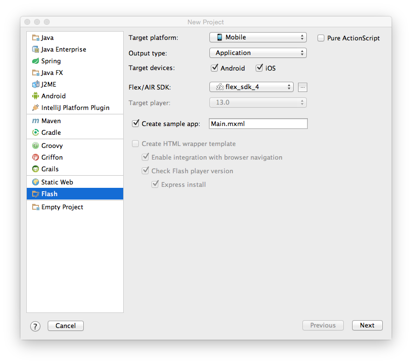
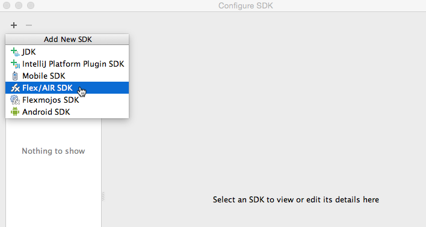
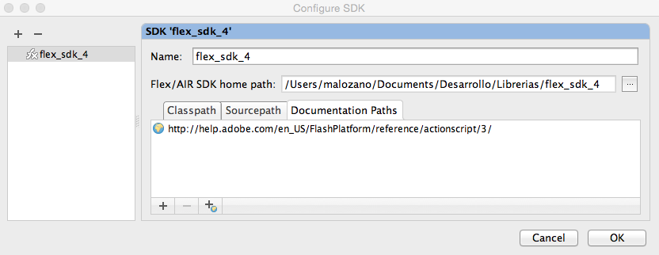
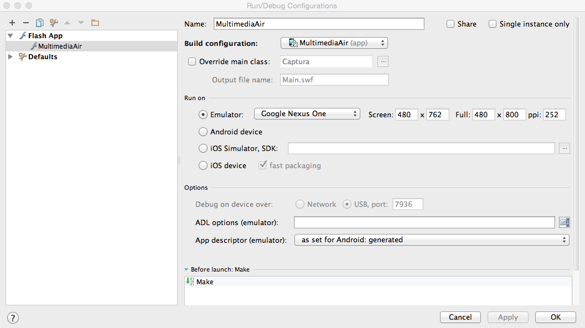
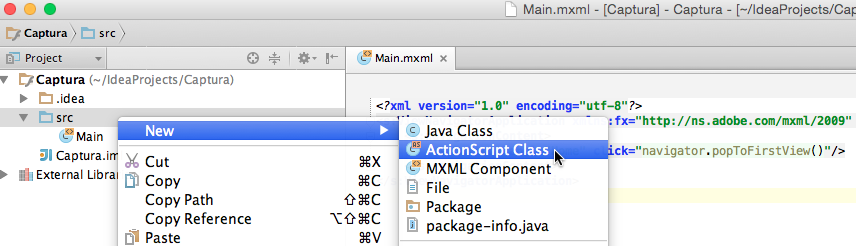
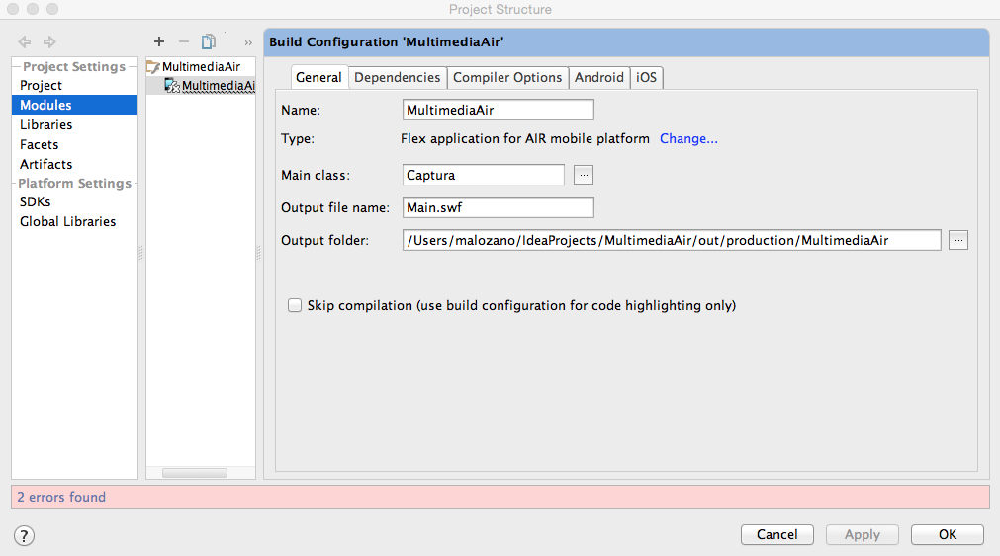

# Aplicaciones Adobe Air

Adobe Air es una tecnología multiplataforma que nos permite llevar las aplicaciones Flash y ActionScript a distintos dispositivos. Tenemos la opción de crear estas aplicaciones con la herramienta Flash, o bien utilizar el compilador abierto Flex. Vamos a centrarnos en el desarrollo de aplicaciones Adobe AIR con Flex SDK.

## Instalación de Flex y AIR SDK

Vamos a ver los pasos que deberemos seguir para instalar los SDK de Flex y Adobe AIR:

* En primer lugar deberemos descargar Apache Flex SDK:

http://flex.apache.org

* Ejecutaremos el instalador, y éste se encargará de descargar todos los elementos necesarios, incluyendo Adobe AIR y Flex SDK. 

* Introduciremos el directorio `$FLEX_SDK_HOME/bin` en el `PATH` para así tener el compilador accesible. Esto podemos hacerlo editando el fichero `.bash_profile` de nuestra carpeta personal (`$HOME`) e introduciendo al comienzo la siguiente línea:
```bash
export PATH=$PATH:/ruta/a/flex_sdk/bin/
```

<!--
* Tras esto descargaremos Adobe Air SDK:

http://www.adobe.com/devnet/air/air-sdk-download.html
> Importante: Es necesario descargar la versión original de Air SDK sin el nuevo compilador para poder utilizarla con Flex (la podemos encontrar en la parte inferior de la página).

* Una vez hayamos descargado ambos SDKs, los descomprimiremos y deberemos mezclarlos en un mismo directorio. Supongamos que tenemos Adobe AIR en un directorio `AdobeAIRSDK` y Flex en `flex_sdk`. Copiaremos todos los contenidos de AIR SDK al directorio de Flex SDK ejecutando el siguiente comando desde un _Terminal_ en MacOS:
```bash
ditto AdobeAIRSDK flex_sdk
```
Tras esto tendremos todo lo necesario en `flex_sdk`, y podremos borrar el otro directorio (`AdobeAIRSDK`).

* Introduciremos el directorio `flex_sdk/bin` en el `PATH` para así tener el compilador accesible. Esto podemos hacerlo editando el fichero `.bash_profile` de nuestra carpeta personal (`$HOME`) e introduciendo al comienzo la siguiente línea:
```bash
export PATH=$PATH:/ruta/a/flex_sdk/bin/
```
-->

Con esto ya podremos utilizar las herramientas de desarrollo de Flex y Adobe AIR desde línea de comando.

## Aplicaciones Adobe AIR desde línea de comando

Vamos a ver en primer lugar la forma de crear una aplicación Adobe AIR en línea de comando, y posteriormente estudiaremos la forma de hacerlo desde un entorno integrado como IntelliJ.

### Creación de un proyecto en línea de comando

* En primer lugar crearemos un fichero XML descriptor de la aplicación como el siguiente, al que llamaremos `HolaMundo-app.xml`:
```xml
<?xml version="1.0" encoding="UTF-8"?>
<application xmlns="http://ns.adobe.com/air/application/2.7">
    <id>es.ua.eps.HolaMundo</id>
    <versionNumber>1.0</versionNumber>
    <filename>HolaMundo</filename>
    <initialWindow>
        <content>HolaMundo.swf</content>
    </initialWindow>
    <supportedProfiles>mobileDevice</supportedProfiles>
</application>
```

* Tras definir el descriptor, introduciremos el código _ActionScript_ de la clase principal de la aplicación. Por ejemplo, podríamos crear un fichero `HolaMundo.as` como el siguiente:
```actionscript
package
{
    import flash.display.Sprite;
    import flash.text.TextField;

    public class HolaMundo extends Sprite
    {
        public function HolaMundo()
        {
            var textField:TextField = new TextField();
            textField.text = "Hola mundo!";
            stage.addChild(textField);
        }
    }
}
```

### Construcción de un proyecto en línea de comando

Una vez creado un proyecto, deberemos construirlo utilizando las herramientas en línea de comando de Flex SDK:

* En primer lugar compilaremos el código de nuestra aplicación. Los fuentes podrán ser clases _ActionScript_ (`.as`) o fichero MXML (`.mxml`). En cualquiera de los dos casos deberemos compilarlos con `amxmlc`:
```bash
amxmlc HolaMundo.as
```
Esto generará un fichero SWF (en el ejemplo anterior `HolaMundo.swf`).

* Una vez compilado podemos lanzar la aplicación con la herramienta `adl`, especificando el descriptor XML:
```bash
adl HolaMundo-app.xml
```
En el fichero XML se indica que la ventana inicial está en un fichero `HolaMundo.swf`, que es el fichero que hemos generado como resultado de la compilación en el paso anterior, y será el que se ejecute.

Por último, deberemos crear un APK o IPA para poder instalar la aplicación en dispositivos Android o iOS.

#### Creación de un APK para Android

Para crear el APK en primer lugar deberemos crear un certificado con el que firmar la aplicación:
```bash
adt -certificate -validityPeriod 25 -cn SelfSigned 1024-RSA cert.pfx mipassword
```

Esto deberemos hacerlo una única vez. Una vez tengamos un certificado, podremos generar el APK firmado con el siguiente comando:
```bash
adt -package -target apk -storetype pkcs12 -keystore cert.p12 HolaMundo.apk HolaMundo-app.xml HolaMundo.swf
```

Podremos copiar este fichero APK a dispositivos Android para instalar la aplicación en ellos.

#### Creación de un IPA para iOS

En el caso de iOS tendremos que generar un IPA firmado con nuestro certificado de desarrollador. Para ello deberemos exportar el certificado (y la clave privada) desde _Acceso a llaveros_ a un fichero `.p12`, protegiéndolo con una contraseña. Al crear el IPA deberemos proporcionar este fichero `.p12`, su contraseña, y el perfil de aprovisionamiento `.mobileprovision`:

```bash
adt -package -target ipa-debug
    -keystore cert.p12 -storetype pkcs12 -storepass mipassword
    -provisioning-profile ios.mobileprovision
    HolaMundo.ipa HolaMundo-app.xml HolaMundo.swf iconos Default.png
```

Una vez generado el fichero IPA podremos probarlo en un dispositivo móvil copiándolo a iTunes y sincronizando con el dispositivo.

### Aplicaciones Adobe AIR con IntelliJ

Podemos crear aplicaciones Adobe AIR desde el entorno IntelliJ.

#### Creación de un proyecto

Para crea un proyecto AIR en primer lugar seleccionaremos la opción _Archivo > New Project..._ y el tipo de proyecto _Flash_. Dentro de este tipo configuraremos el proyecto de la siguiente forma:



* Como _Target platform_ indicaremos _Mobile_
* Como _Output type_ indicaremos _Application_
* Marcamos las plataformas para las que queremos generar la aplicación (Android e iOS).
* Si marcamos la casilla _Create sample app_ nos creará un fichero `.mxml` como plantilla inicial de la aplicación.
* Debemos indicar el SDK de Flex y Adobe AIR a utilizar. Si no tenemos ninguno configurado todavía deberemos pulsar sobre el botón `...` junto a este campo para configurar uno. Este proceso de configuración del SDK se explica en el siguiente apartado.

#### Configuración del SDK

Si no tenemos configurado todavía un SDK, pulsaremos sobre el botón `...` junto al campo de selección de SDK para configurar uno nuevo. Esto tendremos que hacerlo sólo la primera vez que vayamos a crear un proyecto Adobe AIR.

En la pantalla _Configure SDK_ añadiremos un SDK del tipo _Flex/AIR SDK_:



Seleccionaremos en el disco el directorio donde tenemos combinados Flex SDK y AIR SDK.

Es recomendable también que en la pestaña _Documentation Paths_ del SDK que acabamos de añadir introduzcamos la URL en la que podemos encontrar la referencia de la API de _ActionScript_:



> Referencia API _ActionScript 3_:
http://help.adobe.com/en_US/FlashPlatform/reference/actionscript/3/

#### Ejecución del proyecto

Una vez creado el proyecto, podemos ejecutarlo en el escritorio mediante la opción _Run > Run 'Nombre del proyecto'_ o pulsando el botón de reproducción en la barra superior derecha:


Podemos también configurar el perfil de ejecución del proyecto para indicar si queremos ejecutar en emuladores, dispositivos reales, Android o iOS. Esto lo haremos con la opción _Run > Edit Configurations..._. Nos aparecerá una pantalla como la siguiente:



#### Creación de artefactos

Podemos añadir al proyecto tanto ficheros _ActionScript_ como ficheros MXML, pulsando sobre él con el botón derecho y seleccionando la opción _New > ActionScript Class_ o _New > MXML Component_:



Si añadimos una clase ActionScript podríamos introducir el código del _Hola Mundo_ que realizamos en un apartado anterior.

Podemos hacer que la clase que hemos creado sea la clase principal de la aplicación entrando en _File > Project Structure... > Modules_ y modificando el campo _Main class_ de nuestro módulo:




## Aplicaciones multimedia con Adobe AIR

### Reproducción de vídeo

Podemos reproducir vídeo con un objeto de tipo `Video`. En primer lugar, podemos instanciar un objeto de este tipo y añadirlo a la pantalla con `addChild`. En este ejemplo se muestra este componente abarcando todo el espacio de la escena (_stage_):

```actionscript
video_playback=new Video(stage.width, stage.height);
video_playback.x=0;
video_playback.y=0;
addChild(video_playback);
```

Una vez creado el visor de vídeo, creamos una conexión para acceder al vídeo remoto. En caso de querer acceder a video HTTP por descarga progresiva o vídeo local estableceremos la conexión pasando `null` como parámetro a `connect`. Sólo pasaremos una dirección cuando vayamos a conectar con un _Flash Media Server_:

```actionscript
nc = new NetConnection();
nc.connect(null);
```

Tras crear la conexión, crearemos a partir de ella un `NetStream`

```actionscript
ns_playback=new NetStream(nc);
ns_playback.addEventListener(AsyncErrorEvent.ASYNC_ERROR, asyncErrorHandler);
```

Tenemos que proporcionar obligatoriamente un método para tratar los objetos de error, aunque los ignoremos, ya que de no hacerlo así obtendremos un error:

```actionscript
function asyncErrorHandler(event:AsyncErrorEvent):void
{
}
```

Por último, vinculamos el `NetStream` con el reproductor de vídeo y comenzamos la reproducción proporcionando la URL del vídeo a reproducir:

```actionscript
video_playback.attachNetStream(ns_playback);
ns_playback.play("http://jtech.ua.es/dadm/video.mp4");
```

A continuación vemos el ejemplo completo del reproductor de vídeo:

```actionscript
public class Reproductor extends Sprite {
    private var nc:NetConnection;
    private var ns_playback:NetStream;
    private var video_playback:Video;

    public function Reproductor() {

        // Mantiene la pantalla siempre encendida
        NativeApplication.nativeApplication.systemIdleMode = SystemIdleMode.KEEP_AWAKE;

        playbackNetStream();
    }

    private function playbackNetStream():void {

        // Crea reproductor de video
        video_playback=new Video(stage.width,stage.height);
        video_playback.x=0;
        video_playback.y=0;
        addChild(video_playback);

        // Crea flujo de video
        nc = new NetConnection();
        nc.connect(null);

        ns_playback=new NetStream(nc);
        ns_playback.addEventListener(AsyncErrorEvent.ASYNC_ERROR, asyncErrorHandler);

        // Muestra el flujo en el reproductor
        video_playback.attachNetStream(ns_playback);
        ns_playback.play("http://jtech.ua.es/dadm/video.mp4");
    }

    function asyncErrorHandler(event:AsyncErrorEvent):void
    {
    }
}
}
```

### Reproductor desde _Flash Media Server_

La reproductor de vídeo proveniente de un _Flash Media Server_ difiere del caso anterior en que previamente debemos establecer la conexión con este servidor.

En primer lugar realizaremos la conexión y definiremos un método de _callback_ para que nos avise cuando la conexión esté establecida:

```actionscript
nc = new NetConnection();
nc.addEventListener(NetStatusEvent.NET_STATUS, netStatusHandler);

nc.connect(connectionURL);
```

Implementaremos el _callback_ `netStatusHandler` de forma que cuando se haya establecido la conexión comience la reproducción del vídeo:

```actionscript
private function netStatusHandler(event:NetStatusEvent):void {
    switch (event.info.code) {
        case "NetConnection.Connect.Success" :
            // Se ha establecido la conexión
            playbackVideo();
            break;
    }
}
```

La reproducción del vídeo se hará de forma similar al caso anterior:

```actionscript
private function playbackVideo():void {
    video_playback=new Video(cam.width,cam.height);
    video_playback.x=cam.width+20;
    video_playback.y=10;
    addChild(video_playback);

    ns_playback=new NetStream(nc);
    ns_playback.addEventListener(NetStatusEvent.NET_STATUS, netStatusHandler);

    video_playback.attachNetStream(ns_playback);
    ns_playback.play("mp4:sample.mp4");
}
```

En este caso, en el método `play` indicaremos el nombre del vídeo a reproducir dentro del _Flash Media Server_


### Captura desde la cámara

Podemos de forma sencilla reproducir en pantalla vídeo capturado con la cámara. En primer lugar crearemos un objeto `Camera`:

```actionscript
cam=Camera.getCamera();
```

Este método obtiene la cámara por defecto del dispositivo. Con `Camera.names` podríamos ver los nombres de todas las cámaras disponibles, y con `Camera.getCamera(nombre)` podríamos obtener cualquiera de ellas.

También podemos configurar la calidad del vídeo capturado por la cámara:

```actionscript
cam.setMode(320,240,15);
cam.setQuality(200000,0);
cam.setKeyFrameInterval(15);
```

De la misma forma, también podríamos especificar la captura del micrófono, en este caso mediante un objeto `Microphone`:

```actionscript
mic = Microphone.getMicrophone();

mic.rate = 8;
mic.setSilenceLevel(0,-1);
```

Una vez hecho esto, podemos vincular con `attachCamera` la cámara al visor de vídeo, y con esto comenzará a mostrarse en pantalla:

```actionscript
video_playback=new Video(stage.width,stage.height);
video_playback.x=0;
video_playback.y=0;

addChild(video_playback);

video_playback.attachCamera(cam);
```

Podemos ver el ejemplo completo a continuación:

```actionscript
private function cameraPlayback():void {
    cam=Camera.getCamera();

    cam.setMode(320,240,15);
    cam.setQuality(200000,0);
    cam.setKeyFrameInterval( 15 );

    video_playback=new Video(stage.width,stage.height);
    video_playback.x=0;
    video_playback.y=0;

    addChild(video_playback);

    video_playback.attachCamera(cam);
}
```

### Emisión vía _streaming_ RTMP

Una vez visto como mostrar vídeo de una URL, de un servidor _Flash Media Server_, y de la cámara, vamos a ver cómo podemos capturar vídeo de la cámara y enviarlo a un servidor RTMP.

Lo primero que deberemos hacer es establecer la conexión con el servidor RTMP:

```actionscript
nc = new NetConnection();
nc.addEventListener(NetStatusEvent.NET_STATUS, netStatusHandler);
nc.connect("rtmp://www.eps.ua.es:1935/live");
```

Definimos el siguiente _callback_ con el que estaremos pendientes del momento en el que se establece la conexión con el servidor, para empezar a publicar, y del momento en el que comienza la publicación, para comenzar a mostrar un _preview_ en nuestra aplicación:

```actionscript
private function netStatusHandler(event:NetStatusEvent):void {

	switch (event.info.code) {
		case "NetConnection.Connect.Success" :
		    // Se ha establecido la conexión
			publishVideo();
			break;
		case "NetStream.Publish.Start" :
		    // Ha comenzado la emisión
			playbackVideo();
			break;
	}
}
```

Cuando se haya establecido la conexión podremos comenzar la publicación de vídeo. Esto lo haremos con el método `publish` de la clase `NetStream`. Antes podremos configurar la calidad del vídeo que vamos a retransmitir:

```actionscript
private function publishVideo():void {
	ns_publish=new NetStream(nc);

	var h264Settings:H264VideoStreamSettings = new H264VideoStreamSettings();
	h264Settings.setProfileLevel( H264Profile.BASELINE, H264Level.LEVEL_3_1 );
	ns_publish.videoStreamSettings = h264Settings;

	ns_publish.addEventListener(NetStatusEvent.NET_STATUS, netStatusHandler);

	cam=Camera.getCamera();

	cam.setMode(320,240,15);
	cam.setQuality(200000,0);
	cam.setKeyFrameInterval( 15 );

	mic = Microphone.getMicrophone();

    mic.rate = 8;
	mic.setSilenceLevel(0,-1);

	ns_publish.attachCamera(cam);
	ns_publish.attachAudio(mic);
	ns_publish.publish("miCanal.stream");
}
```

Una vez detectemos que la publicación ha comenzado, podríamos reproducir el vídeo publicado en el servidor:

```actionscript
private function playbackVideo():void {

	video_playback=new Video(stage.width,stage.height);
	video_playback.x=0;
	video_playback.y=0;
	addChild(video_playback);

	ns_playback=new NetStream(nc);
	ns_playback.addEventListener(NetStatusEvent.NET_STATUS, netStatusHandler);

	video_playback.attachNetStream(ns_playback);
	ns_playback.play("miCanal.stream");
}
```

A continuación se muestra el ejemplo completo:

```actionscript

public class MiStream extends Sprite {
	private var connectionURL:String="rtmp://www.eps.ua.es/live";
	private var videoURL:String="miCanal.stream";
	private var nc:NetConnection;
	private var ns_publish:NetStream;
	private var ns_playback:NetStream;
	private var video_playback:Video;
	private var cam:Camera;
	private var mic:Microphone;

	public function MiStream() {

		// Mantiene la pantalla siempre encendida
		NativeApplication.nativeApplication.systemIdleMode = SystemIdleMode.KEEP_AWAKE;

        // Establece conexion con la URL

        nc = new NetConnection();
		nc.addEventListener(NetStatusEvent.NET_STATUS, netStatusHandler);
		nc.connect(connectionURL);
	}

	private function netStatusHandler(event:NetStatusEvent):void {

		switch (event.info.code) {
			case "NetConnection.Connect.Success" :
			    // Se ha establecido la conexión
				publishVideo();
				break;
			case "NetStream.Publish.Start" :
			    // Ha comenzado la emisión
				playbackVideo();
				break;
		}
	}

	private function publishVideo():void {
		ns_publish=new NetStream(nc);

		var h264Settings:H264VideoStreamSettings = new H264VideoStreamSettings();
		h264Settings.setProfileLevel( H264Profile.BASELINE, H264Level.LEVEL_3_1 );
		ns_publish.videoStreamSettings = h264Settings;

		ns_publish.addEventListener(NetStatusEvent.NET_STATUS, netStatusHandler);

		cam=Camera.getCamera();

		cam.setMode(320,240,15);
		cam.setQuality(200000,0);
		cam.setKeyFrameInterval( 15 );

		mic = Microphone.getMicrophone();

	    mic.rate = 8;
		mic.setSilenceLevel(0,-1);

		ns_publish.attachCamera(cam);
		ns_publish.attachAudio(mic);
		ns_publish.publish(videoURL);
	}

	private function playbackVideo():void {
    	video_playback=new Video(stage.width,stage.height);
    	video_playback.x=0;
    	video_playback.y=0;
    	addChild(video_playback);

    	ns_playback=new NetStream(nc);
    	ns_playback.addEventListener(NetStatusEvent.NET_STATUS, netStatusHandler);

    	video_playback.attachNetStream(ns_playback);
    	ns_playback.play(videoURL);
	}
}
```

### Autenticación de la fuente de vídeo

Si requerimos usuario y _password_ para poder publicar vídeo RTMP en Wowza desde nuestra aplicación Adobe AIR, estas credenciales se pueden proporcionar como parámetros del método `NetConnection.connect`:

```actionscript
nc.connect(connectionURL, "publisher", "mastermoviles");
```

Sin embargo, en Wowza no podremos utilizar la configuración de autenticación estándar en RTMP, sino que necesitaremos añadir un módulo adicional. De hecho, deberemos dejar abierto el acceso a la aplicación vía RTMP desde la interfaz de Wowza para poder utilizar dicho módulo. Para ello:

* Entramos en el administrador de Wowza, en la página de nuestra aplicación, por ejemplo `live`.
* Entramos en la sección _Source Security_ y editamos la configuración.
* En _RTMP Sources_ indicamos _Open (no authentication required)_.

Incorporaremos ahora la autenticación RTMP mediante el módulo adicional `moduleOnConnectAuthenticate`. Dicho módulo se encuentra dentro de una colección de módulos adicionales que se proporcionan para Wowza en la siguiente página:

http://www.wowza.com/forums/content.php?113-Module-Collection

Para instalar y configurar el módulo de autenticación deberemos:

* Descargar e instalar la colección de módulos anterior. Deberemos copiar el fichero `wms-plugin-collection.jar` en el directorio `${WOWZA_HOME}/lib`, siendo `${WOWZA_HOME}` el directorio de instalación de Wowza.
* Añadimos la configuración del módulo al fichero `Application.xml` de la aplicación a configurar. Por ejemplo, si queremos configurar la aplicación `live`, buscaremos dicho fichero en `${WOWZA_HOME}/conf/live`. En el fichero `Application.xml`, introduciremos la siguiente configuración dentro de la etiqueta `<Modules> ... </Modules>`:
```xml
<Module>
	<Name>moduleOnConnectAuthenticate</Name>
	<Description>Authenticates Flash connections.</Description>
	<Class>com.wowza.wms.plugin.collection.module.ModuleOnConnectAuthenticate</Class>
</Module>
```
* Por defecto buscará la lista de usuarios en el fichero `${WOWZA_HOME}/conf/connect.password`. Podemos copiar el fichero `publish.password` que se encuentra en el mismo directorio para utilizar los mismos usuarios para publicación que hemos configurado en Wowza.

Después de hacer esto reiniciaremos el servidor y tendremos habilitada la autentificación de fuentes RTMP con compatibilidad para el método `NetConnection.connect`.


### Configuración de la aplicación Android

En el descriptor XML de la aplicación podemos especificar todos los permisos que necesitaríamos para esta aplicación en la plataforma Android. Podríamos tener algo como lo siguiente:

```xml
<application xmlns="http://ns.adobe.com/air/application/13.0">
    <id>es.ua.eps.MiStream</id>
    <versionNumber>0.0.1</versionNumber>
    <filename>MiStream</filename>
    <initialWindow>
        <content>MiStream.swf</content>
        <fullScreen>true</fullScreen>
        <aspectRatio>any</aspectRatio>
    </initialWindow>
    <supportedProfiles>mobileDevice</supportedProfiles>

    <android>
    <manifestAdditions>
        <![CDATA[
            <manifest>
				<uses-feature android:name="android.hardware.camera"/>
				<uses-feature android:name="android.hardware.microphone"/>
				<uses-feature android:name="android.hardware.camera.autofocus"/>
				<uses-permission android:name="android.permission.ACCESS_CHECKIN_PROPERTIES"/>
				<uses-permission android:name="android.permission.ACCESS_NETWORK_STATE"/>
				<uses-permission android:name="android.permission.CAMERA"/>
				<uses-permission android:name="android.permission.CHANGE_WIFI_MULTICAST_STATE"/>
				<uses-permission android:name="android.permission.DISABLE_KEYGUARD"/>
				<uses-permission android:name="android.permission.INTERNET"/>
				<uses-permission android:name="android.permission.MODIFY_AUDIO_SETTINGS"/>
				<uses-permission android:name="android.permission.RECORD_AUDIO"/>
				<uses-permission android:name="android.permission.VIBRATE"/>
				<uses-permission android:name="android.permission.WAKE_LOCK"/>
				<uses-permission android:name="android.permission.WRITE_EXTERNAL_STORAGE"/>
				<uses-permission android:name="com.google.android.glass.permission.DEVELOPMENT"/>

				<application>
					<activity>
						<intent-filter>
          					<action android:name="android.intent.action.MAIN"/>
          					<category android:name="android.intent.category.LAUNCHER"/>
        				</intent-filter>
						<intent-filter>
							<action android:name="android.intent.action.VIEW"/>
							<category android:name="android.intent.category.BROWSABLE"/>
							<category android:name="android.intent.category.DEFAULT"/>
							<data android:scheme="ggstream"/>
						</intent-filter>
					</activity>
				</application>

            </manifest>
        ]]>
    </manifestAdditions>
	</android>
</application>
```


### Documentación de Adobe AIR

Para más información sobre Adobe AIR, guías y tutoriales, se puede acceder a la documentación oficial de la plataforma:

http://www.adobe.com/devnet/air/documentation.html

