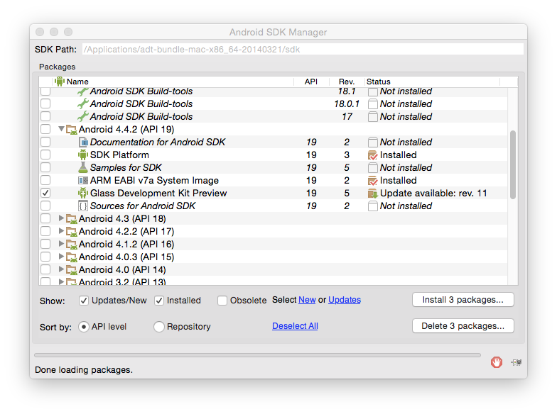
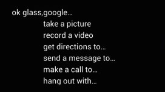
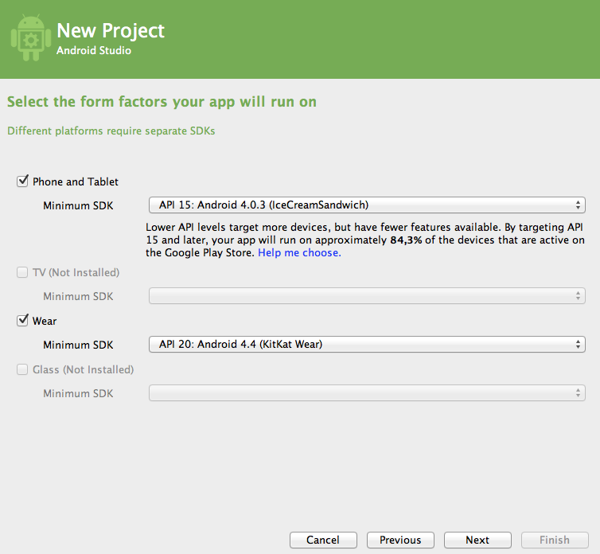
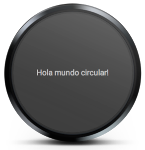

# Dispositivos vestibles

Existen distintos tipos de dispositivos que actúan como complementos a los teléfonos móviles y _tables_, como por ejemplo relojes y gafas, que son conocidos como dispositivos vestibles (_wearable devices_).

Estos dispositivos cuentan con una interfaz más limitada, con una pantalla más reducida y sin la posibilidad de mostrar un teclado táctil, pero nos permiten tener un acceso más rápido a información básica, como por ejemplo a notificaciones que recibamos en el móvil.

Vamos a estudiar estos dispositivos mediante dos ejemplos: los relojes Android y las _Google Glass_. En ambos casos, suple las limitaciones de la interfaz con:

* **Comandos de voz** que podemos utilizar para lanzar las aplicaciones.
* Interfaz basadas en **tarjetas** (_cards_).
* **Gestos** para navegar por la aplicación.

## Google Glass

El desarrollo de aplicaciones para _Google Glass_ se realiza utilizando _Glass Development Kit (GDK)_ que se encuentra bajo la API 19.

En primer lugar deberemos entrar en _Android SDK Manager_ y nos aseguramos de que en el bloque _Android 4.4.2 (API 19) tengamos instalado el _item_ _Glass Development Kit Preview_. En caso de no tenerlo instalado, lo instalaremos.



Una vez instalado GDK, para crear un proyecto para _Glass_ deberemos crear un nuevo _Android Application Project_ y en el bloque _Compile With_ seleccionaremos _Glass Development Kit Preview (Google Inc.) (API 19)_.


> Aunque el proyecto para Google Glass se puede crear con Eclipse + ADT como hemos visto, tendremos mayores facilidades si utilizamos Android Studio, ya que nos permite crear una plantilla específica para este tipo de proyectos.

Al desarrollar aplicaciones con GDK contaremos con la API de Android y con algunas clases adicionales incluidas en GDK como por ejemplo reconocer los gestos habituales en las aplicaciones para estos dispositivos, crear y mostrar tarjetas, o lanzar actividades con comandos de voz.

Vamos a ver a continuación los elementos principales que debería tener una aplicación destinada a las _Google Glass_.

### _Triggers_ de voz

Dado que una de las ventajas de las _Google Glass_ es poder utilizarlas sin ocupar las manos, será importante dar la posibilidad de lanzar nuestras actividades mediante comandos de voz. Esto se hará pronunciando _"Ok glass"_ seguido de la aplicación que queremos ejecutar.




Para implementar esta funcionalidad, en la declaración de nuestra actividad en `AndroidManifest.xml` añadiremos un `<intent-filter>` de tipo `VOICE_TRIGGER`, y una etiqueta `<meta-data>` con la que indicaremos cuál será el comando de voz que podrá lanzar la actividad:

```xml
<activity
    android:name="ua.es.jtech.glass.MainActivity"
    android:label="@string/app_name" >
    <intent-filter>
        <action android:name="com.google.android.glass.action.VOICE_TRIGGER" />
    </intent-filter>

    <meta-data
        android:name="com.google.android.glass.VoiceTrigger"
        android:resource="@xml/voice_trigger_start" />
</activity>
```

Los datos sobre el _trigger_ a utilizar se definen en el fichero `res/xml/voice_trigger_start.xml`:

```xml
<?xml version="1.0" encoding="utf-8"?>
<trigger command="START_BROADCASTING" />
```

Tenemos una serie de _triggers_ predefinidos para lanzar la aplicación. Por ejemplo, en el caso anterior nuestra actividad se abrirá cuando pronunciemos _"Ok glass"_ seguido del comando _"Start broadcasting"_.

Podemos obtener la lista de posibles comandos de voz consultando la lista de elementos de la enumeración `VoiceTriggers.Command` de GDK:

https://developers.google.com/glass/develop/gdk/reference/com/google/android/glass/app/VoiceTriggers.Command

### Tarjetas

La interfaz de las aplicaciones Google Glass normalmente se componen de una serie de tarjetas, que habitualmente tienen fondo negro y texto blanco. Podemos definirlas en XML o de forma programada mediante `CardBuilder`


#### Tarjetas con `CardBuilder`

La clase `CardBuilder` nos permite construir tarjetas que se ajusten a la disposición recomendada. Tenemos definidos diferentes posibles _layouts_ en `CardBuilder.Layout` que podremos aplicar a las tarjetas en el momento de su creación.

```java
View view = new CardBuilder(context, CardBuilder.Layout.TEXT)
    .setText("Texto del contenido de la tarjeta")
    .setFootnote("Nota a pie")
    .setTimestamp("ahora")
    .getView();
```

Una vez obtenida la vista de la tarjeta, podremos añadirla como contenido a la actividad o bien a un objeto `CardScrollView` para así poder navegar a través de varias tarjetas mediante _scroll_.

#### Tarjetas en XML

Si ninguno de los _layout_ definidos en `CardBuilder.Layout` se ajusta a nuestras necesidades, podemos crear nuestras propias tarjetas en XML.

Para definir el _layout_ de las tarjetas en XML podemos definir una serie de dimensiones estándar en el fichero `res/values/dimens.xml`:

```xml
<?xml version="1.0" encoding="utf-8"?>

<resources>

    <!-- Margen recomendado para los bordes de la tarjeta. -->
    <dimen name="glass_card_margin">40px</dimen>

    <!-- Margen recomendado entre la parte inferior de la tarjeta
         y el pie. Se ajusta de forma que la linea de base del texto
         del pie se situe a 40px de la parte inferior de la tarjeta.
    -->
    <dimen name="glass_card_footer_margin">33px</dimen>

    <!-- Margen recomendado para la columna izquierda. -->
    <dimen name="glass_card_two_column_margin">30px</dimen>

    <!-- Maxima altura del contenido del cuerpo de la tarjeta. -->
    <dimen name="glass_card_body_height">240px</dimen>

    <!-- Anchura de la columna izquierda. -->
    <dimen name="glass_card_left_column_width">240px</dimen>

</resources>
```

Una vez definidas estas dimensiones, podemos utilizar el siguiente _layout_ como plantilla para las tarjetas:

```xml
<?xml version="1.0" encoding="utf-8"?>
<FrameLayout xmlns:android="http://schemas.android.com/apk/res/android"
    xmlns:tools="http://schemas.android.com/tools"
    android:id="@+id/layout"
    android:layout_width="match_parent"
    android:layout_height="match_parent"
    >

    <RelativeLayout
        android:id="@+id/body_layout"
        android:layout_width="match_parent"
        android:layout_height="@dimen/glass_card_body_height"
        android:layout_marginLeft="@dimen/glass_card_margin"
        android:layout_marginTop="@dimen/glass_card_margin"
        android:layout_marginRight="@dimen/glass_card_margin"
        tools:ignore="UselessLeaf"
        >

        <!-- Introducir aquí el contenido de la tarjeta. -->

    </RelativeLayout>

    <LinearLayout
        android:id="@+id/footer_container"
        android:layout_width="match_parent"
        android:layout_height="wrap_content"
        android:layout_gravity="bottom|left"
        android:layout_marginLeft="@dimen/glass_card_margin"
        android:layout_marginBottom="@dimen/glass_card_footer_margin"
        android:layout_marginRight="@dimen/glass_card_margin"
        android:orientation="horizontal"
        >

        <TextView
            android:id="@+id/footer"
            android:layout_width="0dip"
            android:layout_height="wrap_content"
            android:layout_weight="1"
            android:ellipsize="end"
            android:singleLine="true"
            android:textAppearance="?android:attr/textAppearanceSmall"
            />

        <TextView
            android:id="@+id/timestamp"
            android:layout_width="wrap_content"
            android:layout_height="wrap_content"
            android:layout_marginLeft="@dimen/glass_card_margin"
            android:ellipsize="end"
            android:singleLine="true"
            android:textAppearance="?android:attr/textAppearanceSmall"
            />

    </LinearLayout>

</FrameLayout>
```

En este _layout_ tenemos una sección principal de contenido, y además también podemos introducir un pie y un _timestamp_.

Podemos también crear tarjetas con dos columnas utilizando la siguiente plantilla:

```xml
<?xml version="1.0" encoding="utf-8"?>
<RelativeLayout xmlns:android="http://schemas.android.com/apk/res/android"
    xmlns:tools="http://schemas.android.com/tools"
    android:layout_width="match_parent"
    android:layout_height="match_parent"
    >

    <RelativeLayout
        android:id="@+id/left_column"
        android:layout_width="@dimen/glass_card_left_column_width"
        android:layout_height="match_parent"
        >

        <!-- Introducir contenido de la columna izquierda. -->

    </RelativeLayout>

    <RelativeLayout
        android:layout_width="wrap_content"
        android:layout_height="@dimen/glass_card_body_height"
        android:layout_alignParentRight="true"
        android:layout_alignParentTop="true"
        android:layout_marginLeft="@dimen/glass_card_two_column_margin"
        android:layout_marginRight="@dimen/glass_card_margin"
        android:layout_marginTop="@dimen/glass_card_margin"
        android:layout_toRightOf="@+id/left_column"
        tools:ignore="UselessLeaf"
        >

        <!-- Introducir contenido de la columna derecha. -->

    </RelativeLayout>

    <LinearLayout
        android:id="@+id/footer_container"
        android:layout_width="wrap_content"
        android:layout_height="wrap_content"
        android:layout_alignParentBottom="true"
        android:layout_alignParentRight="true"
        android:layout_gravity="bottom|left"
        android:layout_marginBottom="@dimen/glass_card_footer_margin"
        android:layout_marginLeft="@dimen/glass_card_two_column_margin"
        android:layout_marginRight="@dimen/glass_card_margin"
        android:layout_toRightOf="@+id/left_column"
        android:orientation="horizontal"
        >

        <TextView
            android:id="@+id/footer"
            android:layout_width="0dip"
            android:layout_height="wrap_content"
            android:layout_weight="1"
            android:ellipsize="end"
            android:singleLine="true"
            android:textAppearance="?android:attr/textAppearanceSmall"
            />

        <TextView
            android:id="@+id/timestamp"
            android:layout_width="wrap_content"
            android:layout_height="wrap_content"
            android:layout_marginLeft="@dimen/glass_card_margin"
            android:ellipsize="end"
            android:singleLine="true"
            android:textAppearance="?android:attr/textAppearanceSmall"
            />

    </LinearLayout>

</RelativeLayout>
```

#### Gestos

En las aplicaciones _Google Glass_ encontramos una serie de gestos estándar:

* El barrido lateral a la izquierda o la derecha nos permite movernos entre las diferentes tarjetas disponibles.
* El barrido hacia abajo nos permite salir de la actividad actual.
* El _tap_ nos permite seleccionar la tarjeta actual.

Podemos utilizar el objeto `GestureDetector` para reconocer los diferentes gestos disponibles:

```java
public class MainActivity extends Activity {

    private final GestureDetector.BaseListener mBaseListener = new GestureDetector.BaseListener() {
        @Override
        public boolean onGesture(Gesture gesture) {
            if (gesture == Gesture.TAP) {
                mAudioManager.playSoundEffect(Sounds.TAP);

                // Realizar acción

                return true;
            } else {
                return false;
            }
        }
    };

    private AudioManager mAudioManager;

    private GestureDetector mGestureDetector;

	@Override
	protected void onCreate(Bundle savedInstanceState) {
		super.onCreate(savedInstanceState);
		setContentView(R.layout.activity_main);

        mAudioManager = (AudioManager) getSystemService(Context.AUDIO_SERVICE);
        mGestureDetector = new GestureDetector(this).setBaseListener(mBaseListener);
	}

}
```


## Relojes

Para el desarrollo de aplicaciones para este tipo de dispositivos utilizaremos Android 4.4W (versión para _wearables_), y la librería de soporte _v4_ (o _v13_) que incluye soporte para _wearables_.

Las aplicaciones para _wearables_ desarrolladas con esta versión de la API siempre deberán distribuirse dentro de una aplicación para dispositivos móviles. Durante el desarrollo podemos instalar la aplicación _wear_ directamente en el dispositivo o emulador del _wearable_, pero cuando la distribuyamos siempre deberá instalarse como complemento de la aplicación móvil.


Entre los dispositivos soportados por esta API, encontramos relojes que tienen pantalla rectangular y también tenemos relojes con pantalla circular. Esto supondrá una dificultad ya que elementos que se ven correctamente en una pantalla cuadrada pueden aparecer cortados en una circular.


### Creación del emulador

Para crear un emulador de un dispositivos _wear_ deberemos especificar los siguientes datos:

* **Target**: _Android 4.4W_
* **Device**: _Android Wear Round_ o _Android Wear Square_, según si queremos emulador un reloj con pantalla rectangular o circular.

Se podrá emparejar el emulador o dispositivo _wearable_ con un dispositivo móvil, instalando en este último la aplicación _Android Wear_.

### Creación de un proyecto

Es recomendable utilizar Android Studio para la creación de proyectos _wear_, ya que está preparado para generar plantillas para este tipo de proyectos.



Al crear un proyecto se deberá crear la aplicación móvil y la aplicación _wear_ adjunta. Tendremos que especificar:

* Para teléfono/tablet el SDK mínimo será la API 9 (2.3)
* Para dispositivo _wear_ el SDK mínimo será la API 20 (4.4W)

Podremos crear una actividad inicial tanto para la aplicación móvil como para la aplicación _wear_. El entorno nos da la opción de crear una plantilla de una actividad _wear_ vacía:


De la actividad _wear_ se creará un _layout_ general, y dos _layouts_ alternativos según si el dispositivo es rectángular o circular:


### Comandos de voz

Al igual que en el caso de _Glass_, podemos utilizar una serie de comandos de voz predefinidos para lanzar las aplicaciones. En este caso, con estos comandos el sistema lanzará un _intent_ que nuestra aplicación puede capturar para ejecutarse cuando se produzca. Por ejemplo tenemos:

```xml
<activity android:name="MiTaxiActivity">
  <intent-filter>
      <action android:name="com.google.android.gms.actions.RESERVE_TAXI_RESERVATION" />
  </intent-filter>
</activity>
```

Cuando digamos _“Ok google, get me a taxi”_ se producirá el _intent_ `RESERVE_TAXI_RESERVATION` que lanzará la actividad anterior, al haber incluido dicha acción como `<intent-filter>`.

Podemos ver la lista completa de comandos de voz en:

http://developer.android.com/training/wearables/apps/voice.html

Si ninguno de los comandos disponibles se adapta a nuestra aplicación, podemos lanzarla simplemente diciendo _“Ok google, start [nombre de la aplicación]”_. Para ello definiremos en la actividad principal una etiqueta `android:label` en la que indicaremos el nombre que deberemos pronunciar para ejecutar nuestra aplicación:

```xml
<application>
  <activity android:name="MainActivity" android:label="Vision">
      <intent-filter>
          <action android:name="android.intent.action.MAIN" />
          <category android:name="android.intent.category.LAUNCHER" />
      </intent-filter>
  </activity>
</application>
```

En esta caso anterior la aplicación se ejecutará cuando digamos _“Ok google, start Vision”_.

Dentro de nuestras actividades también podremos utilizar el sistema de reconocimiento del habla de Android para poder manejarlas mediante voz.


### Interfaz de usuario

Como hemos comentado anteriormente, la existencia de relojes circulares y rectángulares puede ser una complicación a la hora de diseñar la interfaz de nuestras aplicaciones _wear_. Existen dos enfoques para hacer que las aplicaciones se adapten correctamente a cada forma:

* Utilizar _layouts_ alternativos para cada tipo de dispositivo
* Utilizar un _layout_ que adapte de forma automática los márgenes

#### Layouts alternativos

Una posible solución consiste en especificar diferentes _layouts_ según si tenemos pantallas rectangulares o circulares. Para ello utilizamos un elemento `WatchViewStub` en el _layout_, en el cual especificamos dos _layouts_ alternativos según el tipo de forma del dispositivo:

```xml
<?xml version="1.0" encoding="utf-8"?>
<android.support.wearable.view.WatchViewStub
    xmlns:android="http://schemas.android.com/apk/res/android"
    xmlns:app="http://schemas.android.com/apk/res-auto"
    xmlns:tools="http://schemas.android.com/tools"
    android:id="@+id/watch_view_stub"
    android:layout_width="match_parent"
    android:layout_height="match_parent"
    app:rectLayout="@layout/rect_activity_mi_actividad_wear"
    app:roundLayout="@layout/round_activity_mi_actividad_wear"
    tools:context=".MiActividadWear"
    tools:deviceIds="wear">
</android.support.wearable.view.WatchViewStub>
```

Por ejemplo, el _layout_ para dispositivos rectangulares podría ser como el siguiente:

```xml
<?xml version="1.0" encoding="utf-8"?>
<LinearLayout xmlns:android="http://schemas.android.com/apk/res/android"
    xmlns:tools="http://schemas.android.com/tools"
    android:layout_width="match_parent"
    android:layout_height="match_parent"
    android:orientation="vertical"
    tools:context=".MiActividadWear"
    tools:deviceIds="wear_square">

    <TextView
        android:id="@+id/text"
        android:layout_width="wrap_content"
        android:layout_height="wrap_content"
        android:text="@string/hello_square" />
</LinearLayout>
```


Por otro lado, para dispositivos circulares podríamos tener:

```xml
<?xml version="1.0" encoding="utf-8"?>
<RelativeLayout xmlns:android="http://schemas.android.com/apk/res/android"
    xmlns:tools="http://schemas.android.com/tools"
    android:layout_width="match_parent"
    android:layout_height="match_parent"
    tools:context=".MiActividadWear"
    tools:deviceIds="wear_round">

    <TextView
        android:id="@+id/text"
        android:layout_width="wrap_content"
        android:layout_height="wrap_content"
        android:layout_centerHorizontal="true"
        android:layout_centerVertical="true"
        android:text="@string/hello_round" />
</RelativeLayout>
```




#### Adaptación automática de los márgenes

Contamos con el _layout_ `BoxInsetLayout` que permite adaptar la interfaz a ambos tipos de pantallas:

```xml
<android.support.wearable.view.BoxInsetLayout
    xmlns:android="http://schemas.android.com/apk/res/android"
    xmlns:app="http://schemas.android.com/apk/res-auto"
    android:background="@drawable/fondo"
    android:layout_height="match_parent"
    android:layout_width="match_parent"
    android:padding="15dp">

    <FrameLayout
        android:id="@+id/frame_layout"
        android:layout_width="match_parent"
        android:layout_height="match_parent"
        android:padding="5dp"
        app:layout_box="all">

        <!-- Introducir contenido del layout -->

    </FrameLayout>
</android.support.wearable.view.BoxInsetLayout>
```

Este _layout_ permitirá ajustar los márgenes de su contenido de forma que queden dentro del espacio de la pantalla. Con el atributo `app:layout_box="all"` haremos que el marco del _layout_ quede dentro de todos los límites (superior, inferior, derecho e izquierdo) de la pantalla del reloj.
> En Android 4.4W2 existe un _bug_ que cause que `BoxInsetLayout` no funcione correctamente en dispositivos redondos.

#### Tarjetas

Podemos añadir tarjetas a un _layout_ como el anterior con las clase `CardFragment`. Las tarjetas creadas con esta clase tendrán un título, descripción e icono.

```java
FragmentManager fragmentManager = getFragmentManager();
FragmentTransaction fragmentTransaction = fragmentManager.beginTransaction();
CardFragment cardFragment = CardFragment.create("Titulo",
                                                "Descripcion",
                                                R.drawable.icono);
fragmentTransaction.add(R.id.frame_layout, cardFragment);
fragmentTransaction.commit();
```

Con `CardFrame` podemos añadir la tarjeta directamente en el _layout_ XML. Podemos también introducir esta tarjeta en un cuadro con _scroll_, utilizando el elemento `CardScrollView`.

```xml
<android.support.wearable.view.BoxInsetLayout
xmlns:android="http://schemas.android.com/apk/res/android"
xmlns:app="http://schemas.android.com/apk/res-auto"
android:background="#aaf"
android:layout_height="match_parent"
android:layout_width="match_parent">

    <android.support.wearable.view.CardScrollView
        android:id="@+id/card_scroll_view"
        android:layout_height="match_parent"
        android:layout_width="match_parent"
        app:layout_box="bottom">

        <android.support.wearable.view.CardFrame
            android:layout_height="wrap_content"
            android:layout_width="fill_parent">

            <LinearLayout
                android:layout_height="wrap_content"
                android:layout_width="match_parent"
                android:orientation="vertical"
                android:paddingLeft="5dp">
                <TextView
                    android:layout_height="wrap_content"
                    android:layout_width="match_parent"
                    android:text="Titulo"
                    android:textColor="@color/black"
                    android:textSize="20sp"/>
                <TextView
                    android:layout_height="wrap_content"
                    android:layout_width="match_parent"
                    android:text="Descripción"
                    android:textColor="@color/black"
                    android:textSize="14sp"/>
            </LinearLayout>
        </android.support.wearable.view.CardFrame>
    </android.support.wearable.view.CardScrollView>
</android.support.wearable.view.BoxInsetLayout>
```

#### Listas

Para introducir una lista utilizaremos la vista `WearableListView`. Al igual que en el caso de `ListView` será necesario crear un _layout_ para los _items_ (que implementará `WearableListView.Item`), y un adaptador (de tipo `WearableListView.Adapter`) para poblar la lista.

También tenemos `GridViewPager` para crear un selector 2D.

#### Pantallas de confirmación

Contamos con actividad `ConfirmationActivity` que podemos utilizar para mostrar confirmaciones de alguna acción que se ha desarrollado. Esta será la forma estándar de mostrar confirmaciones en este tipo de dispositivos. Para poder utilizar esta actividad deberemos declararla en el _manifest_, aunque no la tengamos que crear nosotros:

```xml
<activity
    android:name="android.support.wearable.activity.ConfirmationActivity">
</activity>
```

Una vez declarada, podremos lanzarla mediante un _intent_:

```java
Intent intent = new Intent(this, ConfirmationActivity.class);
intent.putExtra(ConfirmationActivity.EXTRA_ANIMATION_TYPE,
                ConfirmationActivity.SUCCESS_ANIMATION);
intent.putExtra(ConfirmationActivity.EXTRA_MESSAGE,
                "Enviado");
startActivity(intent);
```

También podemos la vista `DelayedConfirmationView` para dar al usuario un tiempo para cancelar la acción antes de que se confirme.


## Aplicaciones para televisores

Además de aplicaciones para dispositivos vestibles, Android también nos permite crear aplicaciones para dispositivos de TV.

Las aplicaciones para televisores se crean utilizando la API 21 (Android 5.0). Se pueden utilizar además de forma opcional librerías de soporte para TV, como la librería _v17_ (_leanback_), que depende de las librerías _v4_ y _v7_, y nos proporciona elementos y estilos orientados a este tipo de pantallas.

Una actividad se marca como destinada a televisores mediante la categoría `LEANBACK_LAUNCHER`:

```xml
<activity
android:name="es.ua.eps.MainActivity"
android:label="@string/app_name" >

<intent-filter>
  <action android:name="android.intent.action.MAIN" />
  <category android:name="android.intent.category.LEANBACK_LAUNCHER" />
</intent-filter>
</activity>
```

Los televisores carecen de gran parte del _hardware_ con el que contamos en dispositivos móviles. Si queremos hacer una aplicación que sirva tanto para teléfonos móviles como para televisores, deberemos declarar que dichas características no son requeridas (pantalla táctil, cámara, teléfono, etc) para que de esta manera pueda instalarse en ambos tipos de dispositivos:

```xml
<uses-feature android:name="android.hardware.touchscreen"
          android:required="false" />
<uses-feature android:name="android.hardware.telephony"
        android:required="false"/>
<uses-feature android:name="android.hardware.camera"
        android:required="false"/>
<uses-feature android:name="android.hardware.nfc"
        android:required="false"/>
<uses-feature android:name="android.hardware.gps"
        android:required="false"/>
<uses-feature android:name="android.hardware.microphone"
        android:required="false"/>
```

Deberemos comprobar en código si dichas características están disponibles antes de intentar utilizarlas, para así conseguir aplicaciones compatibles con distintos tipos de dispositivos.

### Navegación

La aplicación para TV deberá manejarse mediante un _pad_ direccional (un mando de videojuegos o un mando a distancia). Para ello es importante que en los botones proporcionemos diferentes aspectos según si está seleccionado, pulsado, o no pulsado, y que en el _layout_ especifiquemos de forma correcta el orden en el que recibirán el foco los distintos elementos de la interfaz..

### Estilo

El aspecto estándar recomendado para las aplicaciones de TV es _leanback_, perteneciente a la librería v17:

```xml
<activity
  android:name="es.ua.eps.MiTVActividad"
  android:label="@string/app_name"
  android:theme="@style/Theme.Leanback">
```

En cualquier caso, será importante que el tema que utilicemos no tenga barra de título. Si queremos utilizar otro estilo como tema, deberemos siempre utilizar uno que no tenga barra de título ni _action bar_:

```xml
<activity
  android:name="es.ua.eps.MiTVActividad"
  android:label="@string/app_name"
  android:theme="@android:style/Theme.NoTitleBar">
```

### Contenido

Los principales usos de las aplicaciones de TV son los videojuegos y la reproducción de medios. Dentro de la librería _v17_ encontramos diferentes componentes orientados a las aplicaciones de TV, como por ejemplo _browsers_ para el catálogo de medios y fichas para mostrar los metadatos de los medios en reproducción.

Para el _browser_ de medios se puede utilizar el tipo de fragmento `BrowseFragment`, que nos mostrará la lista de contenidos, y para ver los detalles de cada contenido tenemos `DetailsFragment`.

Podemos también mostrar una ficha con los datos de la reproducción actual mediente el objeto `MediaSession`. Con su método `setMetadata()` podremos introducir los metadatos del medio en reproducción y así aparecerán en la ficha de _reproducción actual_.

