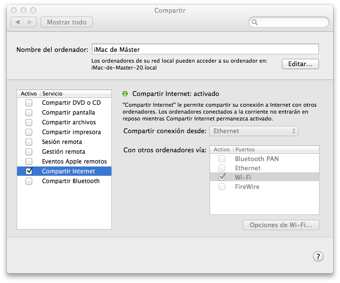

# Proyecto multimedia

## Plataforma de televisión _online_

Como proyecto de la asignatura vamos a implementar una plataforma de televisión _online_ que constará de las siguientes aplicaciones:

* Aplicación iOS para el acceso a radio, videoclub, y emisiones en directo.
* Aplicación Android para retransmitir vídeo en directo a los canales

### Aplicación iOS

En la aplicación iOS veremos 4 secciones diferentes:

* **Radio**: Mostrará una lista de contenidos de audio (música, programas de radio, etc) que podremos reproducir en el dispositivo. Seleccionando uno de ellos se reproducirá el audio en el dispositivo. Estos contenidos estarán almacenados de forma local en el dispositivo.
* **Videoclub**: Mostrará una lista de contenidos de vídeo (series, películas, programas, etc) bajo demanda. Seleccionando un elemento se reproducirá el vídeo en el dispositivo. A estos vídeos se accederá a través de un servidor que nos proporcione vídeo bajo demando vía _streaming_.
* **Directo**: Mostrará una lista de canales de televisión. Al seleccionar uno de ellos veremos sus emisiones en directo. Estas emisiones se realizarán desde un dispositivo Android.
* **Acerca de**: Debe mostrar una pantalla con el nombre de la aplicación y el nombre del autor, y una gráfica de _tarta_ generada de forma dinámica en la que se muestre la proporción de vídeo en directo, video bajo demanda, y audio que ofrece nuestra plataforma.

¿Qué tipo de navegación consideras más adecuada en iOS para definir las secciones anteriores?

### Aplicación Android

Tendremos también una aplicación Android que nos permitirá hacer emisiones en directo. Tendremos una serie de canales de televisión predefinidos, y desde la pantalla principal podremos:

* Mostrar la pantalla "Acerca de" con el nombre de la aplicación y del autor.
* Configurar la emisión. En la pantalla de configuración deberemos poder modificar la IP del servidor de _streaming_, el canal en el que vamos a emitir, y la calidad del vídeo a emitir.
* Comenzar la emisión. Lanzará una pantalla en la que se enviará vídeo capturado desde la cámara al servidor de _streaming_, mostrando una previsualización del vídeo emitido.


## Video bajo demanda en Wowza (sesión de 20-10-2015)

Vamos a publicar vídeo bajo demanda en el servidor Wowza, para así poderlo reproducir en dispositivos móviles vía _streaming_.

* Copia los vídeos que quieras ofrecer como contenido bajo demanda en la carpeta de contenido VOD de Wowza.
* Comprueba en el _Test Player_ de Wowza que los vídeos se ven correctamente.
* Copia las direcciones para reproducir los vídeos en iOS y en Android. Podemos probarlo introduciendo esta dirección en el cuadro de dirección del navegador del móvil. Según si vamos a reproducir en emuladores o dispositivos reales el procedimiento cambiará.

### Prueba en emuladores

La prueba en emuladores/simuladores dependerá de si utilizamos el simulador iOS o el emulador Android, ya que el primero es una aplicación más que se ejecuta en nuestra máquina local, mientras que el segundo se ejecuta dentro de una máquina virtual:

* En el **simulador de iOS** podemos utilizar la dirección que nos proporciona Wowza directamente.
* En el **emulador de Android** deberemos utilizar la IP del _host_ en el que se ejecuta la máquina virtual que emula el dispositivo. Esta IP es `10.0.2.2` (equivale a la dirección de _loopback_ en la máquina _host_). Sustituiremos la IP de la dirección que nos ha proporcionado Wowza por dicha IP.

### Prueba en dispositivos reales

Para probar en dispositivos reales debemos hacer que nuestros dispositivos estén en la misma red que el servidor Wowza. Para ello deberemos activar en el Mac la opción de compartir Internet, siguiendo los siguientes pasos:

* Entramos en _Manzana > Preferencia del Sistema > Compartir_
* Con la casilla _Compartir Internet_ desmarcada seleccionamos la opción _Wi-Fi_.
* Entramos en _Opciones de Wi-Fi …_.
* Ponemos como SSID nuestro _login_ de Campus Virtual (para evitar conflictos entre redes), y elegimos un password propio.
* Conectamos el móvil a la WiFi del Mac con la que se comparte Internet. Ahora los dispositivos estarán conectados a la misma red.




Ahora podremos probar el enlace en el móvil directamente, ya que al estar en la misma red debe poder ver la dirección donde está escuchando Wowza.

## Creación de la aplicación iOS (sesión de 22-10-2015)

Vamos a crear la aplicación iOS para nuestra plataforma de televisión _online_.

### Creación de la aplicación

Recordemos que la aplicación debe tener las siguientes secciones:

* **Radio**
* **Videoclub**
* **Directo**
* **Acerca de**

Para ello **creamos una aplicación basada en _Tab Bar_**. Esto nos creará una aplicación con dos controladores: _First View Controller_ y _Second View Controller_.

Más adelante definiremos una pestaña para cada sección de la aplicación en el _Tab Bar_. De momento aprovecharemos las que nos ha creado la plantilla.


### Tipos de datos

Creamos una clase `UAMedio` que nos sirva para encapsular los datos de cada medio, de los que debemos tener
 * título (`NSString`)
 * artista (`NSString`)
 * album (`NSString`)
 * portada (`UIImage`)
 * url (`NSURL`)

Crearemos una clase `UAFuenteDatos` que haga de _fuente de datos_, y nos proporcione acceso a la lista de medios de cada tipo de forma centralizada. Podemos utilizar el patrón _singleton_ para dicha clase.

Para implementar el patrón _singleton_ en Objective-C podemos utilizar un método de clase como el siguiente:

```objectivec
+ (UAFuenteDatos*) sharedFuenteDatos {
    static UAFuenteDatos *datos = nil;
    if(nil == datos) {
        datos = [[UAFuenteDatos alloc] init];
    }
    return datos;
```

La clase `UAFuenteDatos` debe proporcionarnos 3 listados:
* Lista de audios
* Lista de videos bajo demanda
* Lista de emisiones en directo

Todos ellos serán _arrays_ de objetos de tipo `UAMedio`. 

> Las listas de audio y vídeo serán fijas, podemos crearlas directamente desde código. En otras asignaturas veremos cómo obtenerlas de una base de datos o de servicios en la red.


### Acerca de

Crearemos una pantalla _"Acerca de..."_ para la aplicación iOS en la que veremos el nombre de la aplicación, el nombre del autor, y una vista propia creada con Core Graphics que mostrará un gráfico de tipo _tarta_ que indicará la proporción de cada tipo de medio (directo, VOD y audio) disponible en la plataforma (a partir de los datos que proporciona `UAFuenteDatos`).

Para crear esta pantalla aprovecharemos el controlador _First View Controller_. Podemos cambiar su nombre para que pase a ser _"Acerca de"_. 

Como posibles mejores se propone:

* Añadir alguna animación utilizando Core Animation.
* Añadir alguna gráfica alternativa. 


### Estructura de la aplicación

Vamos a crear el resto de la estructura de la aplicación, con una pestaña para cada sección. Para ello:

1. Eliminamos _Second View Controller_ del _storyboard_

2. Arrastramos tres _Table View Controller_ sobre el _storyboard_

3. Podemos darles a estos controladores un nombre identificativo (_Radio, Videoclub, Directo_)

4. Conectamos cada controlador con el _Tab Bar Controller_ con un _segue_ de tipo _Relationship_, para que aparezcan como pestañas del mismo (seleccionamos el _Table View Controller_, y desde la pestaña _Connections_ del inspector conectamos el _segue relationship_ con el controlador _Tab Bar_.

5. Introducimos cada _Table View Controller_ dentro de un Navigation Controller, seleccionándolo en el _storyboard_ y pulsando _Editor > Embed In > Navigation Controller_.

6. En cada controlador establecemos el nombre e icono para su pestaña.
> Podemos encontrar _packs_ de iconos de estilo _line_ gratuitos para la aplicación iOS:
http://www.iconbeast.com
http://www.flaticon.com/packs/line-icon-set

7. Creamos una clase que herede de `UITableViewController` para cada controlador, y las conectamos desde el inspector de identidades estos controladores.

8. En cada controlador creamos una propiedad que almacene una lista de medios. Inicializaremos dicha lista en el método `viewDidLoad`, a partir de las listas de objetos `UAMedio` que nos proporciona `UAFuenteDatos`. Poblaremos las tablas con los datos obtenidos de estas listas de medios en cada una de las pantallas ("Radio", "Videoclub" y "Directo").


## Reproducción de medios en iOS (sesión de 27-10-2015)

### Reproducción de audio

Al pulsar sobre un elemento de la lista de audios deberemos comenzar su reproducción. Para ello:

* En la clase del controlador de la pantalla de "Radio", crearemos una propiedad  de tipo `AVAudioPlayer` que utilizaremos como reproductor de audio.
* En el evento de pulsación de un elemento de la tabla `tableView:didSelectRowAtIndexPath` comenzaremos la reproducción del audio seleccionado.
> Los audios los almacenaremos en el dispositivo. Podéis descargar música MP3 gratuita desde diferentes repositorios:
http://freemusicarchive.org

* El audio debe continuar reproduciéndose aunque se bloquee la pantalla, se silencie el teléfono, o se pase a otra aplicación. Introduce la configuración necesaria para conseguir este comportamiento.


Como posibles mejoras se propone:

* Introduce información del audio que se está reproduciendo en `MPNowPlayingInfoCenter` para que así se muestre información en la pantalla de bloqueo.
* Haz que la aplicación responda ante el control remoto del audio, permitiendo pausar o reanudar la reproducción actual desde la pantalla de bloqueo o desde el botón de los auriculares.
* Haz que el desconectar los auriculares se detenga automáticamente la reproducción del audio.


### Reproducción de VOD

Accederemos a los vídeos mediante Wowza (debemos tener publicados vídeos en VOD). Más adelante publicaremos fuentes de emisión en directo.

Al seleccionar un vídeo de la lista mostraremos el controlador del reproductor asignándole la URL correspondiente.

Como mejora se proponer crear un controlador de reproducción de vídeo propio, que en caso de estar en orientación vertical muestre un fondo decorativo para la parte de la pantalla que queda en negro.

> **IMPORTANTE**: A partir de iOS 9 sólo se permite acceder a los vídeos mediante HTTPS, mientras que Wowza por defecto funciona sobre HTTP. Como solución temporal, se puede añadir la siguiente configuración a `Info.plist` para permitir vídeos por HTTP, aunque lo recomendable es disponer de los contenidos mediante HTTPS:
```xml
<key>NSAppTransportSecurity</key>
<dict>
    <key>NSAllowsArbitraryLoads</key>
    <true/>
</dict>
```


## Emisión de vídeo en directo desde Android (sesión de 3-11-2015)

Vamos a desarrollar una aplicación Android que utilice la librería _libstreaming_ para enviar vídeo por RTSP desde un móvil Android a Wowza. Consideramos que podremos tener una lista predeterminada de canales en el servidor, todos ellos bajo la aplicación `live`, por ejemplo:

```
/live/canalA.stream
/live/canalB.stream
/live/canalC.stream
/live/canalD.stream
```

En la pantalla principal de la aplicación Android tendremos un menú con las siguientes opciones:

* _Configurar la emisión_
* _Comenzar la emisión_
* _Acerca de_

### Configurar la emisión

Nos permitirá:

* Establecer el canal en el que emitir entre la lista de canales predeterminados que vayamos a considerar para nuestra aplicación.
* Establecer la calidad del vídeo a emitir, entre una serie de posibles _presets_ que deberemos definir.

### Comenzar la emisión

Lanzará una pantalla que establecerá la conexión con la URL del servidor Wowza (la URL dependerá del canal que hayamos seleccionado), y una vez haya conectado mostraremos una previsualización del vídeo que se esté emitiendo. Deberá mostrar también un botón para detener la emisión, con el que además volveremos al menú principal.

### Acerca de

Mostrará el nombre de la aplicación y del autor de la misma. Debe permitir volver al menú principal.


## Recepción en iOS

Deberemos actualizar la aplicación iOS para que en la sección de _directos_ muestre la lista de posibles canales que hayamos predefinido. Al pulsar sobre alguno de ellos mostrará un reproductor de vídeo que conectará a la URL adecuada para mostrar el directo mediante _HTTP Live Streaming_.

## Entrega del proyecto

El proyecto deberá entregarse antes del **lunes 16 de noviembre a las 23:55**, a través de la **plataforma Moodle**. Deberá compartirse también el repositorio de _bitbucket_ en el que se encuentre con el usuario `entregas-mastermoviles`.

El proyecto se puntuará de 0 a 10, con el siguiente reparto:

* **7 puntos**: Funcionamiento correcto de los requisitos básicos del proyecto y seguimiento del trabajo.
* **3 puntos**: Implementación de mejoras adicionales propuestas, mejoras adicionales propias, y acabado estético.