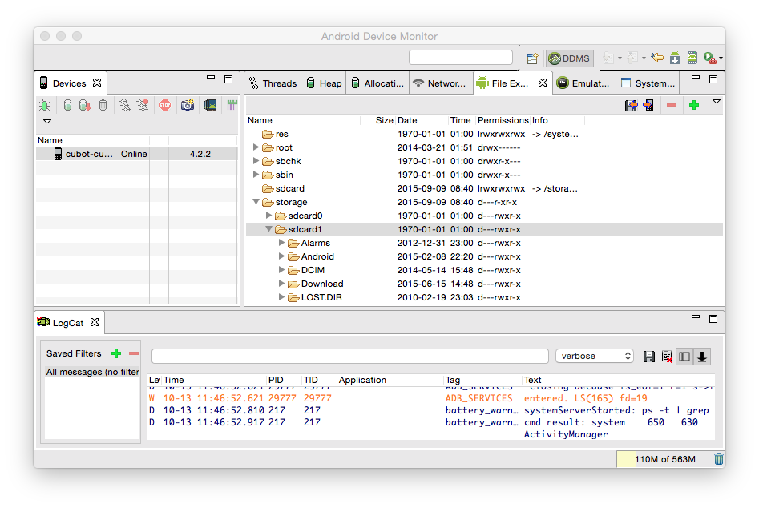

# Formatos de audio y vídeo

Una de las principales características de los dispositivos móviles es la gran heterogeneidad que existe entre los dispositivos existentes. Una de las repercusiones de este hecho es la necesidad de diseñar interfaces que se adapten a los diferentes tipos de pantalla (conocido como diseño _responsive_). Esto también tiene una fuerte repercusión en las funcionalidades multimedia de las aplicaciones. Deberemos ser capaces de proporcionar audio y vídeo compatible y de calidad.


## Audio y vídeo en dispositivos móviles

Existen diferentes formas de llevar audio y vídeo a los dispositivos móviles:

* _Streaming_: El contenido multimedia se reproduce de forma remota. Se obtienen pequeños fragmentos del medio conforme se reproduce, pero nunca se llega a descargar un fichero entero.
* Descarga progresiva: Descargamos un fichero de audio o vídeo mediante HTTP. El contenido multimedia se puede reproducir mientras se descarga el fichero.
* _Podcast_: Contienen contenido episódico. Encontramos diferentes aplicaciones que nos permiten suscribirnos a _podcasts_, y que se encargarán de descargar los últimos episodios de forma automática cuando contemos con red WiFi. De esta forma podremos reproducirlos _offline_ posteriormente.
* Incluido en la aplicación: Podemos distribuir ficheros de audio y vídeo con nuestras aplicaciones. En este caso no hará falta conectar a Internet para reproducir los medios, estarán almacenados localmente.

En esta lista podemos ver ordenadas las formas de suministrar el contenido multimedia desde la más remota a la más local. Independientemente de cuál de estos mecanismos vayamos a utilizar, en primer lugar lo más importante será establecer un formato adecuado para el audio y el vídeo.

**Copiar vídeos a la tarjeta SD**

En esta sección veremos la manera de añadir archivos a la tarjeta de memoria de nuestro dispositivo virtual Android, de tal forma que podamos almacenar clips de vídeo. Se deben seguir los siguientes pasos:


* En primer lugar el emulador debe encontrarse en funcionamiento, y por supuesto, el dispositivo emulado debe hacer uso de una tarjeta SD.
* En Android Studio debemos abrir la ventana _Android Device Monitor_ . Para ello hacemos uso de la opción _Tools > Android > Android Device Monitor_



* A continuación, en dicha ventana, seleccionamos la pestaña _File Explorer_. El contenido de la tarjeta de memoria se halla (normalmente) en la carpeta `/mnt/sdcard` o `storage/sdcard`.
* Dentro de dicha carpeta deberemos introducir nuestros archivos de vídeo, dentro del directorio _DCIM_. Al hacer esto ya podrán reproducirse desde la aplicación nativa de
reproducción de vídeo y también desde nuestras propias aplicaciones.  Podemos introducir un archivo de video con el ratón, arrastrando un fichero desde otra carpeta al interior de
la carpeta _DCIM_, aunque también podemos hacer uso de los controles que aparecen en la parte superior derecha de la perspectiva _DDMS_, cuando la pestaña
_File Explorer_ está seleccionada. La función de estos botones es, respectivamente: guardar en nuestra máquina real algún archivo de la tarjeta de memoria virtual, guardar en
la tarjeta de memoria virtual un archivo, y eliminar el archivo seleccionado.


> A veces es necesario volver a arrancar el terminal emulado para poder acceder a los vídeos insertados en la tarjeta de memoria desde la aplicación _Galería_ de Android.


## Formatos soportados

En primer lugar vamos a estudiar los formatos soportados por cada plataforma, sus características, y cuáles son los más adecuados a utilizar en cada caso.

### Formatos de audio en iOS

Entre los formatos de audio soportados en iOS encontramos formatos con un sistema de compresión complejo para el cual contamos con hardware específico que se encarga de realizar la descompresión, y de esta forma liberar la CPU de esta tarea. Estos formatos son:

* AAC (MPEG-4 Advanced Audio Coding)
* ALAC (Apple Lossless)
* HE-AAC (MPEG-4 High Efficiency AAC, sin descompresor _software_)
* MP3 (MPEG-1 audio layer 3)

Con estos formatos podemos conseguir un alto nivel de compresión, y gracias al _hardware_ de descompresión con el que está equipado el dispositivo pueden reproducirse de forma eficiente sin bloquear otras tareas. Sin embargo, dicho _hardware_ sólo puede soportar la reproducción simultánea de un fichero de audio.

Si queremos reproducir varios ficheros simultáneamente, el resto de ficheros deberán ser descomprimidos por _software_, lo cuál supone una gran carga para la CPU. Debemos evitar que esto ocurra. Por lo tanto, los formatos anteriores deberán ser utilizados únicamente cuando no se vaya a reproducir más de un fichero de estos tipos simultáneamente.

Por otro lado, contamos con soporte para formatos sin compresión, o con una compresión sencilla. Estos formatos son:

* Linear PCM (sin compresión)
* IMA4 (IMA/ADPCM)
* iLBC (internet Low Bitrate Codec, formato para transmisión del habla)
* µ-law and a-law

En estos casos no hay ningún problema en reproducir varios ficheros simultáneamente, ya que o no es
necesarios descomprimirlos, como el caso de PCM, o su descompresión no supone apenas carga para la CPU,
como el resto de casos.

Si no tenemos problemas de espacio, el formato PCM será el más adecuado, concretamente el tipo LEI16
(_Little-Endian Integer 16-bit_). En caso contrario, podemos
utilizar AAC para la música de fondo (una única instancia simultánea, ya que se descodifica por _hardware_),
e IMA4 para los efectos especiales, ya que nos permite reproducir varias instancias simultáneas con un bajo
coste.

Podemos utilizar también diferentes tipos de fichero para el audio, como `.wav`,
`.mp3`, `.aac`, `.aiff` o `.caf`. El tipo de fichero
preferido es este último (`.caf`, _Core Audio File Format_), ya que puede contener cualquier codificación de audio
de las vistas anteriormente.


### Formatos de vídeo en iOS

Los formatos de video soportados
son todos aquellos ficheros con extension `mov`, `mp4`, `m4v`, y `3gp`
que cumplan las siguientes restricciones de codificación:

* H.264, hasta 1.5 Mbps, 640 x 480, 30 fps, versión de baja complejidad del H.264 _Baseline Profile_ con
audio AAC-LC de hasta 160 Kbps, 48 kHz, stereo
* H.264, hasta 768 Kbps, 320 x 240, 30 fps, _Baseline Profile_ hasta nivel 1.3 con audio AAC-LC de hasta
160 Kbps, 48 kHz, stereo
* MPEG-4, hasta 2.5 Mbps, 640 x 480, 30 frames per second, _Simple Profile_ con audio AAC-LC de hasta 160 Kbps,
48 kHz, stereo

Estos formatos están soportados por todos los dispositivos iOS. A partir de iPhone 4 y iPad se soportan además:

* H.264 hasta 720p, 30 fps, Main Profile nivel 3.1. Audio AAC-LC de hasta 160 Kbps, 48kHz, stereo.

A partir de iPhone 5 se añade:

* H.264 hasta 1080p, 30 fps, High Profile nivel 4.1. Audio AAC-LC de hasta 160 Kbps, 48kHz, stereo.

Se dispone de más información en la documentación sobre iOS Media Layer:

https://developer.apple.com/library/ios/documentation/Miscellaneous/Conceptual/iPhoneOSTechOverview/MediaLayer/MediaLayer.html

### Formatos de audio y vídeo en Android

Android incorpora la posibilidad de reproducir tanto audio como vídeo en diversos formatos. Los formatos de audio soportados son los siguientes:

* AAC LC/LT
* HE-AACv1 (AAC+)
* HE-AACv2 (Enhanced ACC+)
* AAC ELD
* AMR-NB
* AMR-WB
* FLAC
* MP3
* MIDI
* Ogg Vorbis
* PCM/Wave

Con respecto al vídeo, los formatos soportados son:

* H.263
* H.264 AVC
* MPEG-4 SP
* VP8

Para más información sobre los formatos de audio y vídeo soportados en Android se puede consultar la siguiente página:

https://developer.android.com/guide/appendix/media-formats.html


## Perfiles de audio y vídeo

A partir de la información anterior es difícil establecer un perfil general de vídeo que esté soportado por todos los dispositivos y al mismo tiempo aproveche sus características, pero si que podemos obtener una serie de perfiles orientados a determinadas familia de dispositivos.

Podemos observar que la codificación de vídeo y audio que mayor compatibilidad y calidad nos proporciona es H.264 y AAC respectivamente. Por lo tanto, basaremos los perfiles en estos _codecs_.

### Perfil general

Si queremos tener vídeo compatible con la mayoría de los dispositivos actuales podemos utilizar un perfil como el siguiente:

* Vídeo H.264 Baseline profile
** Resolución de 480 x 320
** _Framerate_ de 30 fps
** _Bitrate de 1500 kbps
* Audio AAC
** _Sample rate_ de 44100 kHz
** _Bitrate_ de 128 kbps

### Perfil de alta calidad

El perfil anterior no aprovechará las características de aquellos dispositivos que soporten vídeo HD. Por ello es conveniente definir otro perfil para los dispositivos más avanzados:

* Vídeo H.264 Baseline profile
** Resolución de 1280 x 720
** _Framerate_ de 30 fps
** _Bitrate de 5000 kbps
* Audio AAC
** _Sample rate_ de 48000 kHz
** _Bitrate_ de 160 kbps

### Perfil para dispositivos _legacy_

Normalmente con los dos perfiles anteriores debería ser suficiente, pero en algunos casos puede interesarnos también dirigirnos a dispositivos _legacy_ (no _smartphones_). En este caso podemos crear un perfil limitado como el siguiente:

* Vídeo 3GP, codificación MPEG-4 (parte 2)
** Resolución entre 176 x 144 y 320 x 240
** _Framerate_ entre 5 y 15 fps
** _Bitrate entre 52 y 192 kbps
* Audio AAC-LC (_Low Complexity_)
** _Sample rate_ de 16000 kHz
** _Bitrate_ entre 16 y 24 kbps

## Conversión de formato

Vamos a ver ahora cómo convertir el audio y vídeo al formato deseado.

### Conversión de audio con `afconvert`

En MacOS contamos con la herramienta `afconvert`, que nos permite convertir el audio a los diferentes formatos soportados por la plataforma. Se trata de una herramienta en línea de comando que se utiliza de la siguiente forma:

```bash
afconvert -d [out data format] -f [out file format] [in file] [out file]
```

Por ejemplo, en caso de querer convertir el audio al formato preferido (PCM LEI16 en un fichero `.caf`),
utilizaremos el siguiente comando:

```bash
afconvert -f caff -d LEI16 sonido.wav sonido.caf
```

También podemos utilizar esta herramienta para convertir a formatos con compresión. En tal caso, deberemos
especificar el _bit-rate_ del fichero resultante:

```bash
afconvert -f caff -d aac -b 131072 musica.caf musica.caf
```

También contamos con herramientas para reproducir audio en línea de comando, y para obtener información sobre un fichero de audio. Estas herramientas son `afplay` y `afinfo`.

### Conversión con VLC

Podemos utilizar VLC para convertir audio y vídeo tanto mediante un asistente de la aplicación como mediante línea de comando. En primer lugar mostramos diferentes _codecs_ de audio y vídeo y formatos de encapsulamiento que podemos utilizar:

_Codecs_ de video:

|`vcodec`    | Codec de vídeo |
|:-----------|:---------------|
|`mp1v`      |MPEG-1          |
|`mp2v`      |MPEG-2          |
|`mp4v`      |MPEG-4          |
|`h263`      |H.263           |
|`h264`      |H.264           |
|`theo`      |Theora          |
|`VP8`       |VP8 Video       |

_Codecs_ de audio:

|`acodec`    | Codec de audio |
|:-----------|:---------------|
|`mpga`      |MPEG Audio      |
|`mp3`       |MPEG Layer 3    |
|`mp4a`      |MP4 Audio       |
|`vorb`      |Vorbis          |

Formatos de fichero (encapsulamiento):

|`mux`       | Formato de fichero |
|:-----------|:---------------|
|`mpg1`      |MPEG-1          |
|`ts`        |MPEG-TS         |
|`ps`        |MPEG-PS         |
|`mp4`       |MPEG-4          |
|`avi`       |AVI             |
|`ogg`       |OGG             |
|`dummy`     |MP3             |
|`wav`       |WAVE            |

Podemos realizar la conversión en línea de comando de la siguiente forma:

```bash
vlc -I dummy /<ruta_origen>/video.mpg :sout='#transcode{vcodec=mp2v, 
vb=4096,acodec=mp2a,ab=192,scale=1,channels=2,deinterlace,audio-
sync}:std{access=file,mux=ps,dst=/<ruta_destino>/video.mpg' vlc://quit
```

Donde `ab` indica el _bitrate_ de audio, y `vb` el _bitrate_ de vídeo.

También podemos hacer la conversión desde la aplicación VLC, con la opción _Archivo > Convertir / Emitir ..._.

### Conversión con `ffmpeg`

Una de las aplicaciones que mayor flexibilidad nos da para convertir audio y vídeo es `ffmpeg`. La forma más básica de lanzar esta herramienta es como se muestra a continuación:

```bash
ffmpeg -i entrada.ext salida.ext
```

En este caso la codificación de audio y vídeo se induce a partir de la extensión especificada en el nombre del fichero de salida.

Podemos especificar con precisión el formato del fichero de salida con los siguientes parámetros:

|Característica             |Parámetro         |
|:--------------------------|:-----------------|
|Formato de fichero         |`-f avi`          |
|Resolución                 |`-s 640x480`      |
|Fotogramas por segundo     |`-r 24`           |
|_Codec_ de audio           |`-c:a / -acodec aac` |
|_Codec_ de vídeo           |`-c:v / vcodec h264` |
|_Bitrate_ de audio         |`-b:a 128k`       |
|_Bitrate_ de vídeo         |`-b:v 1500k`      |
|Frecuencia de audio        |`-ar 44100`       |
|Canales de audio           |`-ac 2`           |
|Perfil                     |`-profile:v baseline` |

Podemos ver todos los formatos de fichero disponibles con:

```bash
ffmpeg -formats
```

También podemos ver los códecs disponibles con:

```bash
ffmpeg -codecs
```

En caso de utilizar vídeo H.264 podemos especificar también el perfil y su nivel:

|Perfil         |Parámetros         |
|:--------------|:------------------|
|Baseline 3.0   |`-profile:v baseline -level 3.0`   |
|Baseline 3.1   |`-profile:v baseline -level 3.1`   |
|Main 3.1       |`-profile:v main -level 3.1`       |
|Main 4.0       |`-profile:v main -level 4.0`       |
|High 4.0       |`-profile:v high -level 4.0`       |
|High 4.1       |`-profile:v high -level 4.1`       |

El siguiente ejemplo convierte un vídeo MPEG-2 a formato H.264/AAC con perfil _baseline_ 3.0:

```bash
ffmpeg -i entrada.m2ts
       -strict -2
       -vcodec h264
       -s 480x320
       -b:v 1500k
       -profile:v baseline -level 3.0
       -acodec aac
       -ar 22050
       -b:a 128k
       -ac 2
       salida.mp4
```


## Ejercicios

### Conversión de vídeos

En los recursos de la sesión encontramos una serie de vídeos que podremos utilizar en nuestras aplicaciones. Todos estos vídeos se encuentran en 1080p, por lo que para poder reproducirlos correctamente en cualquier móvil antes deberemos convertirlos a un formato adecuado.

Utiliza un perfil estándar que nos permita suministrar estos vídeos a la gran mayoría de dispositivos utilizados en la actualidad. Prueba a reproducir estos vídeos desde el dispositivo Android introduciéndolos en la tarjeta SD.

> Ayuda: Puedes copiar los vídeos a la tarjeta SD desde _Android Device Monitor_. Dentro de esta ventana, selecciona la pestaña _File Explore_ en la ventana central y ahí podrás subir o descargar ficheros del dispositivo.

Por ejemplo, puedes copiar el video en la carpeta `/mnt/sdcard` (o similar). En tal caso, para abrirlo puedes ir al navegador del dispositivo y poner como URL:

```
file:///mnt/sdcard/video.mp4
```

> ATENCIÓN: El acceso a las URLs de tipo `file:` está soportado a partir de Android 2.1.
