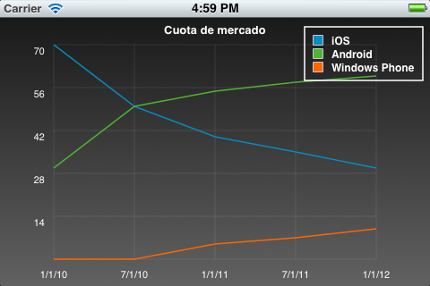

# Gráficos y animaciones en iOS

Hasta este momento hemos visto cómo crear la interfaz de usuario de nuestra aplicación utilizando una serie de componentes predefinidos de la plataforma iOS, con la posibilidad de personalizarlos. Vamos a ver ahora cómo crear nuestros propios tipos de vistas y dibujar en ellas. Veremos también cómo animar estas vistas para así crear una interfaz más dinámica y atractiva para el usuario.

En primer lugar repasaremos las diferentes APIs que encontramos en la plataforma para crear gráficos y animaciones, y las situaciones en las que conviene utilizar cada una de ellas. Tras esto, pasaremos a estudiar la forma de utilizar estas APIs para implementar funcionalidades que necesitaremos habitualmente en las aplicaciones móviles.

##APIs para gráficos y animación

En iOS encontramos dos formas principales de crear aplicaciones con gráficos y animación:

* **OpenGL ES**: Se trata de una API multiplataforma para gráficos 2D y 3D. Es una versión reducida de la API OpenGL, diseñada para dispositivos limitados. Encontramos implementaciones de esta API en las diferentes plataformas móviles: iOS, Android, e incluso en algunos
dispositivos Java ME.
* APIs nativas: Se trata de APIs propias de las plataforma iOS y MacOS para mostrar gráficos 2D y animaciones. Estas APIs son **Quartz 2D** y **Core Animation (CA)**. Muchas veces encontraremos referenciada la API Quartz 2D como Core Graphics (**GC**), ya que son prácticamente
equivalentes. Realmente, Quartz 2D es una parte de Core Graphics. Core Graphics se compone de Quartz 2D, que es la API para dibujar gráficos 2D, y Quartz Compositor, que es el motor utilizado para componer en pantalla el contenido generado por las diferentes APIs gráficas.


OpenGL ES resultará apropiada cuando tengamos aplicaciones con una fuerte carga gráfica, gráficos 3D, y/o la necesidad de conseguir elevadas tasas de fotogramas. Este es claramente el caso de los videojuegos.

Sin embargo, si lo que queremos es tener una aplicación con una interfaz vistosa y dinámica, en la que podamos introducir tanto componentes nativos como componentes propios (como podría ser por ejemplo una gráfica), la opción más adecuada será utilizar Quartz 2D y Core Animation. En esta sesión vamos a centrarnos en esta segunda opción. En próximas asignaturas abordaremos la programación de videojuegos.


##Gráficos con Quartz 2D

Las funciones y estructuras de la librería Quartz 2D (Core Graphics) tienen todas el prefijo `CG`. Hay que resaltar que en esta API no encontramos objetos Objective-C, sino que los datos que manejamos son registros de C (`struct`) y los manipularemos con una serie de funciones y macros de la librería.

En algunas ocasiones podremos también utilizar los objetos de UIKit para dibujar contenido, lo cual resultará notablemente más sencillo que utilizar los elementos de Core Graphics a bajo nivel. En muchos casos encontramos objetos de Core Graphics relacionados con objetos de UIKit (`CGImage` y `UIImage`, o `CGColor` y `UIColor`).


###Contexto gráfico

Al igual que ocurría en el caso de Java y Android, Core Graphics nos ofrece una API con la que dibujar en un contexto gráfico. Este contexto podrá ser una región de la pantalla, pero también podría ser una imagen en segundo plano, o un PDF por ejemplo. Esto nos permitirá reutilizar nuestro código de dibujado para generar gráficos en diferentes contextos.

El tipo de contexto gráfico que se utiliza más habitualmente es el contexto referente a una vista `UIView`, que nos permite dibujar en su área rectangular en pantalla. Esto lo haremos en el método `drawRect:` de la vista. Para ello deberemos crear una subclase de `UIView` y redefinir dicho método:

```objectivec
- (void)drawRect:(CGRect)rect {
    CGContextRef context = UIGraphicsGetCurrentContext();

    // Aquí ya podemos dibujar en el contexto
    ...
}
```

Este método será invocado por el sistema cuando necesite pintar el contenido de la vista. Cuando eso ocurra, el contexto gráfico actual estará establecido al contexto para dibujar en la vista. Podremos obtener una referencia al contexto actualmente activo con la función de UIKit ` UIGraphicsGetCurrentContext`. Podemos observar que el contexto gráfico es de tipo `CGContextRef`, y que no se trata de un objeto, sino de una estructura, como todos los elementos de Core Graphics.

Si llamamos manualmente al método anterior con otro contexto activo, dibujará el contenido en dicho contexto. Más adelante veremos cómo establecer otros contextos gráficos de forma manual.

Una vez tenemos el contexto, podemos establecer en él una serie de atributos para especificar la forma en la que se va a dibujar. Estos atributos son por ejemplo el área de recorte, el color del relleno o del trazo, el grosor y tipo de la línea, antialiasing, el tipo de fuente, o la transformación a aplicar.

Con estos atributos establecidos, podremos dibujar diferentes elementos en el contexto, como primitivas geométricas, texto, e imágenes. Esta forma de trabajar es la misma que se utiliza en Java y Android para dibujar el contenido de las vistas.

Si queremos que se actualice en contenido de nuestra vista, por ejemplo en el caso de que hayamos cambiado algunas propiedades de los gráficos a mostrar, en algunos casos deberemos llamar al método `setNeedsDisplay` del objeto `UIView`:


```objectivec
[self setNeedsDisplay];
```

Esto hará que se invalide el contenido actual de la vista, y se tenga que volver a llamar otra vez a `drawRect:` para repintarla.


###Sistema de coordenadas

El sistema de coordenadas de Core Graphics puede resultar en ocasiones algo confuso, debido a que el eje _y_ aparece invertido respecto a UIKit.


Si bien el sistema de coordenadas de UIKit con el que dibujamos las vistas tiene su origen en la esquina superior izquierda, siendo las _y_ positivas hacia abajo, en Core Graphics el origen está en la esquina inferior izquierda y las _y_ son positivas hacia arriba.

Además, el sistema de coordenadas está basado en puntos, no en píxeles. Es decir, dibujamos en un sistema de coordenadas lógico, que es independiente del sistema de coordenadas físico (en pixels) del dispositivo. De esta forma podremos dibujar de forma independiente a la resolución real de la pantalla. Es decir, por ejemplo podremos utilizar el mismo código y las mismas coordenadas para dibujar en la pantalla de un iPhone 3G, en un iPhone 4 con pantalla retina, y en un iPhone 6 plus, a pesar de que el segundo tiene el doble de resolución, y el tercero el triple. El contenido dibujado se verá con las mismas dimensiones, con la única diferencia de que en las pantallas con mayor resolución aparecerá con mayor nitidez.

Para convertir las dimensiones en puntos a dimensiones en pixels, veremos que muchos componentes tienen un factor de escala. Podemos consultar el factor de escala de la pantalla en la propiedad `[UIScreen mainScreen].scale`. La resolución en pixels será igual a la dimensión en puntos multiplicada por el factor de escala. Por ejemplo, en los dispositivos básicos el factor de escala es `1.0`, por lo que la resolución lógica y física coinciden. Sin embargo, en dispositivos con pantalla retina la escala es `2.0`,
por lo que su resolución en pixels es exactamente el doble que las dimensiones en puntos (640 x 960 en el caso del iPhone). Para los iphone 6 plus, la escala es `3.0`.

El mayor inconveniente del sistema de coordenadas es que el eje _y_ se encuentre invertido. Podemos cambiar esto aplicando una transformación al contexto. Podemos establecer como atributo una matriz de transformación (_Current Transform Matrix_, CTM), que se aplicará a todo el contenido que dibujemos. Podemos aprovechar esta matriz de transformación para cambiar el origen de coordenadas e invertir el eje _y_:

```objectivec
CGContextTranslateCTM(context, 0.0, rect.size.height);
CGContextScaleCTM(context, 1.0, -1.0);
```

En el ejemplo anterior primero aplicamos al contexto una translación para mover el origen de coordenadas a la esquina superior izquierda, y tras esto aplicamos un escalado `-1.0` al eje _y_ para invertirlo. De esta forma podemos trabajar con el mismo sistema de coordenadas que en UIKit.


###Atributos del pincel

En el punto anterior hemos visto como podemos aplicar al contexto atributos de transformación, modificando la matriz de transformación actual (CTM) mediante una serie de funciones. Vamos a ver a continuación otras funciones que podemos aplicar sobre el contexto para establecer otros tipos de atributos para el dibujado.

En primer lugar, vamos a ver cómo establecer el color con el que dibujaremos. Los colores en Core Graphics se definen mediante la clase `CGColor`, aunque podemos ayudarnos de `UIColor` para crearlos de forma más sencilla. Esta última clase tiene una propiedad `CGColor` con la que podremos obtener el color en el formato Core Graphics.

```objectivec
UIColor *color = [UIColor redColor]

CGContextSetStrokeColorWithColor(context, color.CGColor);
CGContextSetFillColorWithColor(context, color.CGColor);
```

Podemos observar que tenemos funciones para establecer el color de relleno y el color del trazo. Según si dibujamos sólo el contorno de una figura, o de si dibujamos su relleno, se aplicará un color u otro.

En el caso de que vayamos a dibujar el contorno de una figura, o simplemente una polilínea, podemos establecer una serie de atributos del trazo. Por ejemplo, podemos establecer el grosor de la línea con:

```objectivec
CGContextSetLineWidth(c, 0.1f);
```

Encontramos también funciones para establecer líneas punteadas, o para establecer la forma de dibujar los extremos o los puntos de unión de las líneas.


###Primitivas geométricas

Una de las primitivas geométricas más sencillas que podemos dibujar es el rectángulo. En primer lugar debemos definir la posición y dimensiones del rectángulo mediante un objeto de tipo `CGRect` (encontramos la macro `CGRectMake` con la que podemos inicializarlo).

Tras crear el rectángulo, podemos dibujar su relleno (_fill_) o su contorno (_stroke_), o bien dibujar el contorno sobre el relleno:

```objectivec
CGRect rectangulo = CGRectMake(60, 40, 200, 400);

CGContextStrokeRect(context, rectangulo);
CGContextFillRect(context, rectangulo);
```

De forma similar, podemos dibujar una elipse proporcionando el rectángulo que la contiene. Un elemento más complejo, pero que nos proporciona mayor libertad es la trayectoria (_path_). Para dibujar una trayectoria primero debemos añadir al contexto todos los elementos que la forman, y una vez añadidos los dibujaremos en pantalla en una única operación. La trayectoria puede estar formada por diferentes elementos, como líneas, rectángulo y arcos. Los distintos elementos pueden no estar conectados entre sí. Por ejemplo, podemos crear y dibujar una trayectoria de la siguiente forma:

```objectivec
CGContextMoveToPoint(c, 10, 10);
CGContextAddLineToPoint(c, 20, 30);
CGContextAddLineToPoint(c, 30, 45);

CGContextStrokePath(c);
```

El contexto recuerda el último punto en el que se quedó la trayectoria, y añade los elementos a partir de ese punto. Podemos mover el punto actual con `CGContextMoveToPoint`, lo cual suele ser necesario siempre al comenzar a dibujar la trayectoria. Tras esto, podemos ir añadiendo elementos con una serie de métodos `CGContextAdd-`. En el ejemplo anterior hemos añadido dos segmentos de línea, aunque podríamos añadir otros elementos como rectángulos o arcos. Tras añadir todos los elementos necesarios, podemos dibujar la trayectoria definida con `CGContextStrokePath`.

Al finalizar la trayectoria también podemos indicar que se cierre, para así conectar el punto final con el inicial. Podemos rellenar la figura generada:

```objectivec
CGContextMoveToPoint(c, 10, 10);
CGContextAddLineToPoint(c, 20, 30);
CGContextAddLineToPoint(c, 30, 10);
CGContextClosePath(c);

CGContextFillPath(c);
```


###Imágenes

Podemos dibujar imágenes con Core Graphics mediante la función `CGContextDrawImage`:

```objectivec
CGRect area = CGRectMake(0, 0, 320, 480);
CGImageRef imagen = [UIImage imageNamed: @"imagen.png"].CGImage;

CGContextDrawImage (contexto, area, imagen);
```

Debemos pasar como parámetro el rectángulo dentro del cual se debe dibujar la imagen, y la imagen como dato de tipo `CGImageRef`. Podemos obtener esta representación mediante la propiedad `CGImage` de la clase `UIImage`. Encontramos también diferentes funciones en Core Graphics para crear las imágenes directamente a partir de diferentes fuentes, en lugar de tener que pasar por `UIImage`.

Sin embargo, será más sencillo utilizar la clase `UIImage` directamente. Esta clase tiene un método que nos permite dibujar la imagen en el contexto actual de forma más sencilla:

```objectivec
CGRect area = CGRectMake(0, 0, 320, 480);
UIImage *imagen = [UIImage imageNamed: @"imagen.png"];

[imagen drawInRect:area];
```


###Texto

Podemos dibujar texto directamente con Core Graphics. Se puede establecer una fuente con `CGContextSelectFont` y el modo en el que se dibujará el texto con `CGContextSetTextDrawingMode`: trazo, relleno, relleno y trazo, o invisible (más adelante veremos la utilidad de dibujar el texto como invisible).

```objectivec
CGContextSelectFont(context, "Helvetica-Bold", 12, kCGEncodingMacRoman);
CGContextSetTextDrawingMode(context, kCGTextFill);
```

Cuando dibujemos el texto dentro del contexto gráfico de una vista, encontraremos el problema de que el texto sale invertido, por la diferencia que existe entre los sistemas de coordenadas que hemos comentado anteriormente. Por ello, en este caso deberemos aplicar una transformación al sistema de coordenadas con el que se dibuja el texto. Esto lo haremos con el método `CGContextSetTextMatrix`:

```objectivec
CGAffineTransform transform = CGAffineTransformMakeScale(1, -1);
CGContextSetTextMatrix(context, transform);
```

Una vez hemos terminado de configurar la forma en la que se dibujará el texto, podemos dibujar una cadena en una posición del contexto con `CGContextShowTextAtPoint`, pasando la cadena como una cadena C (no como `NSString`) con cualquier tipo de codificación, por ejemplo MacOSRoman:

```objectivec
NSString *cadena = @"Texto de prueba";

CGContextShowTextAtPoint(context, x, y,
    [cadena cStringUsingEncoding: NSMacOSRomanStringEncoding],
    [cadena length]);
```

En algunas ocasiones nos puede interesar medir el texto, para así poder ubicar el resto de elementos en concordancia con las dimensiones del texto. Una vez dibujada la cadena, podemos obtener la posición _x_ donde ha finalizado el texto con:

```objectivec
CGPoint position = CGContextGetTextPosition(context);
```

Si queremos obtener las dimensiones del texto sin tener que mostrarlo, podemos dibujarlo con el modo `kCGTextInvisible`, y tras hacer esto consultar la posición en la que se ha quedado tras dibujarlo:

```objectivec
CGContextSetTextDrawingMode(context, kCGTextInvisible);
CGContextShowTextAtPoint(context, 0, 0,
    [cadena cStringUsingEncoding: NSMacOSRomanStringEncoding],
    [cadena length]);
CGPoint ancho = CGContextGetTextPosition(context);
```

Esta es la forma con la que podemos dibujar texto con Core Graphics. Sin embargo, resulta bastante más sencillo utilizar las facilidades de la clase `NSString`, aunque sea algo menos eficiente que el método anterior. Con esta clase tenemos un mayor control sobre el área en la que se dibuja el texto y la forma de alinearlo. Además, con el método anterior tendremos ciertos problemas de codificación si necesitamos determinados caracteres especiales, ya que estamos limitados a utilizar la codificación MacOS Roman. Por ejemplo, con el método anterior el símbolo del euro no se muestra correctamente.

Vamos a ver ahora una alternativa más sencilla para dibujar texto que evita los problemas con la codificación. Esta alternativa consiste en utilizar el método `drawInRect:withFont:` de la clase `NSString` (concretamente de su categoría `UIStringDrawing`), o cualquiera de sus variantes. Este método dibujará el texto en el contexto gráfico activo.


```objectivec
NSString *cadena = @"Texto de prueba";
UIFont *font = [UIFont boldSystemFontOfSize: 12];
CGRect area = CGRectMake(10, 10, 100, 20);

[cadena drawInRect: area withFont:font
                    lineBreakMode:UILineBreakModeClip
                    alignment:UITextAlignmentRight];
```

La propia clase `NSString` también nos proporciona información sobre las métricas del texto, de una forma mucho más sencilla que el método visto anteriormente con Core Graphics, mediante el método `sizeWithFont:` y sus variantes.

Si necesitamos tener un mayor control sobre la forma de dibujar texto, y evitar los problemas de codificación de Core Graphics, podemos utilizar Core Text.


###Gradientes

Un elemento muy utilizado en las aplicaciones es el gradiente. Por ejemplo, muchas aplicaciones decoran el fondo de las celdas de las tablas haciendo que tengan un degradado. Para dibujar un gradiente con Core Graphics primero deberemos definirlo mediante el tipo `CGGradientRef`. Para crear este tipo deberemos proporcionar los colores que forman el gradiente. El rango de posiciones (_locations_) del gradiente va de `0` a `1`, y podremos especificar los colores que debe tener en los extremos y en los puntos intermedios que consideremos necesarios. El resto del rango se generará por interpolación de los colores especificados. Por ejemplo, si en la posición `0` ponemos color negro, y en `1` ponemos el blanco, tendremos un degradado de negro a blanco conforme avanzamos de `0` a `1`, pasando por todos los grises intermedios.

Además, al crear el gradiente debemos especificar el espacio de colores que vamos a utilizar para establecer los colores del gradiente. El espacio de color puede ser RGB, CMYK o gris. En cualquiera de estos casos, para cada color deberemos especificar sus componentes ([R, G, B], [C, M, Y, K] o [gris]) como valores en el rango `[0.0, 1.0]`. Además tendrá un canal alpha adicional para indicar el nivel de opacidad (`0.0` es transparente, y `1.0` totalmente opaco). Por ejemplo, si establecemos el espacio de color como RGB con `CGColorSpaceCreateDeviceRGB`, para cada color deberemos establecer sus bandas `[R, G, B, A]` como vemos en el siguiente ejemplo:

```objectivec
size_t size = 2;
CGFloat locations[2] = { 0.0, 1.0 };
CGFloat components[8] = { 0.2, 0.2, 0.2, 1.0,   // Color inicial (RGBA)
                          0.8, 0.8, 0.8, 1.0 }; // Color final   (RGBA)

CGColorSpaceRef space = CGColorSpaceCreateDeviceRGB();
CGGradientRef gradient = CGGradientCreateWithColorComponents(space, components, locations, size);
```

En este caso hemos especificado sólo dos posiciones para el gradiente, la inicial (`0.0`) y la final (`1.0`). El color inicial es un gris oscuro opaco, y el final es un gris claro también opaco, en el espacio RGB. Por último, se crea el gradiente con `CGGradientCreateWithColorComponents`, que toma como parámetros el espacio de color utilizado, la lista de colores en el espacio especificado en el anterior parámetro, la posición a la que corresponde cada color, y el número de posiciones especificadas (2 en este ejemplo: `0.0` y `1.0`).

Tras definir el gradiente, podemos dibujarlo en pantalla con `CGContextDrawLinearGradient` o con `CGContextDrawRadialGradient`, según queramos dibujar el gradiente de forma lineal o radial. Por ejemplo, en el caso del gradiente lineal debemos especificar el punto inicial y final del gradiente en coordenadas del contexto. En el punto inicial se mostrará el color del gradiente en su posición `0.0`, y el lienzo del contexto se irá llenando con el color del degradado hasta llegar al punto final, que coindidirá con el color del degradado en su posición `1.0`.

```objectivec
CGPoint startPoint = CGPointMake(0.0, 0.0);
CGPoint endPoint = CGPointMake(0.0, 480.0);

CGContextDrawLinearGradient(context, gradient, startPoint, endPoint, 0);
```

En este ejemplo aplicamos el degradado para que llene toda la pantalla de forma vertical, desde la posición _y = 0.0_ hasta _y = 480.0_. Al ser la _x = 0.0_ en ambos casos, el gradiente se moverá únicamente en la vertical, pero si hubiésemos cambiando también la _x_ habríamos tenido un gradiente oblicuo.


###Capas

Cuando queremos dibujar un mismo elemento de forma repetida, podemos utilizar una capa para así reutilizarlo. La ventaja de las capas es que dibujaremos dicha composición una única vez, y también se almacenará una única vez en la memoria de vídeo, pudiendo replicarla tantas veces como queramos en el contexto.

Las capas son elementos de tipo `CGLayerRef`. La capa debe crearse a partir del contexto actual, pero realmente lo que dibujemos en ella no quedará reflejado inmediatamente en dicho contexto, sino que la capa incorpora un contexto propio. Tras crear la capa, deberemos obtener dicho contexto de capa para dibujar en ella.

```objectivec
CGLayerRef layer = CGLayerCreateWithContext (context, CGRectMake(0, 0, 50, 50), NULL);
CGContextRef layerContext = CGLayerGetContext (layer);
```

A partir de este momento, para dibujar en la capa dibujaremos en `layerContext`. Podemos dibujar en él de la misma forma que en el contexto gráfico de la pantalla. Tras dibujar el contenido de la capa, podremos mostrarla en nuestro contexto en pantalla con:

```objectivec
CGContextDrawLayerAtPoint(context, CGPointZero, layer);
```

Donde el segundo parámetro indica las coordenadas de la pantalla en la que se dibujará la capa. Podemos repetir esta operación múltiples veces con diferentes coordenadas, para así dibujar nuestra capa replicada en diferentes posiciones.


###Generación de imágenes

Anteriormente hemos visto que la API de Core Graphics nos permite dibujar en un contexto gráfico, pero dicho contexto no siempre tiene que ser una región de la pantalla. Podemos crear distintos contextos en los que dibujar, y dibujaremos en ellos utilizando siempre la misma API. Por ejemplo, vamos a ver cómo dibujar en una imagen. Podemos activar un contexto para dibujar en una imagen de la siguiente forma:

```objectivec
UIGraphicsBeginImageContextWithOptions(CGSizeMake(320,240), NO, 1.0);
```

En el primer parámetro especificamos las dimensiones de la imagen en puntos como una estructura de tipo `CGSize`, el segundo indica si la imagen es opaca (pondremos `NO` si queremos soportar transparencia), y el tercer y último parámetro sirve para indicar el factor de escala. Las dimensiones en pixels de la imagen se obtendrán multiplicando las dimensiones especificadas en puntos por el factor de escala. Esto nos permitirá soportar de forma sencilla pantallas con diferentes densidades de pixels, al trabajar con una unidad independiente de la densidad (puntos). Podemos obtener la escala de la pantalla del dispositivo con `[UIScreen mainScreen].scale`, pero si como escala especificamos `0.0`, se utilizará automáticamente la escala de la pantalla del dispositivo como escala de la imagen.

Tras inicializar el contexto gráfico, podremos dibujar en él, y una vez hayamos terminado podremos obtener la imagen resultante con `UIGraphicsGetImageFromCurrentImageContext()` y cerraremos el contexto gráfico con `UIGraphicsEndImageContext()`:

```objectivec
UIGraphicsBeginImageContextWithOptions(CGSizeMake(320,240), NO, 1.0);

// Dibujar en el contexto
CGContextRef context = UIGraphicsGetCurrentContext();
...

UIImage *imagen = UIGraphicsGetImageFromCurrentImageContext();
UIGraphicsEndImageContext();
```


###Generación de PDFs

El formato en el que Quartz 2D genera los gráficos es independiente del dispositivo y de la resolución. Esto hace que estos mismos gráficos puedan ser guardados por ejemplo en un documento PDF, ya que usan formatos similares. Para crear un PDF con Quartz 2D simplemente deberemos crear un contexto que utilice como lienzo un documento de este tipo. Podemos escribir en un PDF en memoria, o bien directamente en disco. Para inicializar un contexto PDF utilizaremos la siguiente función:

```objectivec
UIGraphicsBeginPDFContextToFile(@"fichero.pdf", CGRectZero, nil);
```

Como primer parámetro especificamos el nombre del fichero en el que guardaremos el PDF, y como segundo parámetro las dimensiones de la página. Si este parámetro es un rectángulo de dimensión `0 x 0` (`CGRectZero`), como en el ejemplo anterior, tomará el valor por defecto `612 x 792`. El tercer parámetro es un diccionario en el que podríamos especificar distintas propiedades del PDF a crear.

Una vez dentro del contexto del PDF, para cada página que queramos incluir en el documento deberemos llamar a la función `UIGraphicsBeginPDFPage`, y tras esto podremos obtener la referencia al contexto actual y dibujar en él:

```objectivec
UIGraphicsBeginPDFPage();

// Dibujar en el contexto
CGContextRef context = UIGraphicsGetCurrentContext();
...
```

Repetiremos esto tantas veces como páginas queramos crear en el documento. También tenemos un método alternativo para crear las páginas, `UIGraphicsBeginPDFPageWithInfo`, que nos permite especificar sus dimensiones y otras propiedades.

Una vez hayamos terminado de componer las diferentes páginas del documento, podremos cerrar el contexto con `UIGraphicsEndPDFContext()`.


##Animaciones con Core Animation

Vamos a pasar a estudiar la forma en la que podemos incluir animaciones en la interfaz de nuestras aplicaciones.


Nunca deberemos crear animaciones llamando al método `setNeedsDisplay` de la vista para actualizar cada fotograma, ya que esto resulta altamente ineficiente. Si queremos animar los elementos de nuestra interfaz podemos utilizar el framework _Core Animation_. Con él podemos crear de forma sencilla y eficiente animaciones vistosas para los elementos de la interfaz de las aplicaciones. Si necesitamos un mayor control sobre la animación, como es el caso de los juegos, en los que tenemos que animar el contenido que nosotros pintamos con una elevada tasa de refresco, entonces deberemos utilizar OpenGL.

Nos centraremos ahora en el caso de Core Animation. El elemento principal de este framework es la clase `CALayer`. No debemos confundir esta clase (_Core Animation Layer_) con `CGLayer` (_Core Graphics Layer_). La capa `CGLayer` nos permitía repetir un mismo elemento en nuestra composición, pero una vez dibujado lo que obtenemos es simplemente una composición 2D para mostrar en pantalla, es decir, no podemos manipular de forma independiente los distintos elementos que forman dicha composición.

Sin embargo, `CALayer` de Core Animation es una capa que podremos transformar de forma dinámica independientemente del resto de capas de la pantalla. El contenido de una capa `CALayer` puede ser una composición creada mediante Core Graphics.

Realmente todas las vistas (`UIView`) se construyen sobre capas `CALayer`. Podemos obtener la capa asociada a una vista con su propiedad `layer`:

```objectivec
CALayer *layer = self.view.layer;
```

Estas capas, además de ser animadas, nos permiten crear efectos visuales de forma muy sencilla mediante sus propiedades.

Las capas no se pueden mostrar directamente en la ventana, sino que siempre deben ir dentro de una vista (`UIView`), aunque dentro de la capa de una vista podemos incluir subcapas.


###Propiedades de las capas

Las capas tienen propiedades similares a las propiedades de las vistas. Por ejemplo podemos acceder a sus dimensiones con `bounds` o a la región de pantalla que ocupan con `frame`. También se le puede aplicar una transformación con su propiedad `transform`. En el caso de las vistas, su posición se especificaba mediante la propiedad `center`, que hacía referencia a las coordenadas en las que se ubica el punto central de la vista. Sin embargo, en las capas tenemos dos propiedades para especificar la posición: `position` y `anchorPoint`. La primera de ellas, `position`, nos da las coordenadas del _anchor point_ de la capa, que por defecto es el punto central, pero que no tiene por qué serlo.

El `anchorPoint` se especifica en coordenadas relativas al ancho y alto de la capa, pudiendo moverse entre _(0, 0)_ y _(1, 1)_. El punto central corresponde al _anchor point (0.5, 0.5)_, y este es el valor por defecto.


Hay una propiedad adicional para la posición, `positionZ`, que nos da el coordenada _z_ de la capa. Es decir, cuando tengamos varias capas solapadas, dicha propiedad nos dirá el orden en el que se dibujarán las capas, y por lo tanto qué capas quedarán por encima de otras. Cuanto mayor sea la coordenada _z_, más cerca estará la capa del usuario, y tapará a las capas con valores de _z_ inferiores.

Es especialmente interesante en este caso la propiedad `transform`, ya que nos permite incluso aplicar transformaciones 3D a las capas. En el caso de las vistas, la propiedad `transform` tomaba un dato de tipo `CGAffineTransform`, con el que se podía especificar una transformación afín 2D (traslación, rotación, escalado o desencaje), mediante una matriz de transformación 3x3. En el caso de las capas, la transformación es de tipo `CATransform3D`, que se especifica mediante una matriz de transformación 4x4 que nos permite realizar transformaciones en 3D. Tendremos una serie de funciones para crear distintas transformaciones de forma sencilla, como `CATransform3DMakeTranslation`,
`CATransform3DMakeRotation`, y `CATransform3DMakeScale`. También podemos aplicar transformaciones sobre una transformación ya creada, pudiendo así combinarlas y crear transformaciones complejas, con `CATransform3DTranslate`, `CATransform3DRotate`, y `CATransform3DScale`.

Además de las propiedades anteriores, la capa ofrece una gran cantidad de propiedades adicionales que nos van a permitir decorarla y tener un gran control sobre la forma en la que aparece en pantalla. A continuación destacamos algunas de estas propiedades:

<table>
	<tr><th>Propiedad</th><th>Descripción</th><th></th></tr>
	<tr><td>`backgroundColor`</td><td colspan="2">Color de fondo de la capa.</td></tr>
	<tr><td>`cornerRadius`</td><td colspan="2">Con esta propiedad podemos hacer que las esquinas aparezcan redondeadas.</td></tr>
	<tr><td>`shadowOffset`, `shadowColor`, `shadowRadius`, `shadowOpacity`</td><td colspan="2">Permiten añadir una sombra a la capa, y controlar las propiedades de dicha sombra</td></tr>
	<tr><td>`borderWidth`, `borderColor`</td><td colspan="2">Establecen el color y el grosor del borde de la capa.</td></tr>
	<tr><td>`doubleSided`</td><td colspan="2">Las capas pueden animarse para que den la vuelta. Esta propiedad nos indica si al darle la vuelta la capa debe mostrarse también por la cara de atrás.</td></tr>
	<tr><td>`contents`, `contentsGravity`</td><td colspan="2">Nos permite especificar el contenido de la capa como una imagen de tipo `CGImageRef`. Especificando la gravedad podemos indicar
	si queremos que la imagen se escale al tamaño de la capa, o que se mantenga su tamaño inicial y se alinee con alguno de los bordes.</td></tr>
</table>

Como hemos comentado anteriormente, las capas se organizan de forma jerárquica, al igual que ocurría con las vistas. Podemos añadir una subcapa con el método `addLayer:`

```objectivec
CALayer *nuevaCapa = [CALayer layer];
[self.view.layer addSublayer: nuevaCapa];
```

En la sección anterior vimos cómo dibujar en una vista utilizando Core Graphics. Si queremos dibujar directamente
en una capa podemos hacerlo de forma similar, pero en este caso necesitamos un delegado que implemente el método `drawLayer:inContext:`


```objectivec
- (void)drawLayer:(CALayer *)layer inContext:(CGContextRef)context {
    // Codigo Core Graphics
    ...
}
```

Deberemos establecer el delegado en la capa mediante su propiedad `delegate`:

```objectivec
self.layer.delegate = self;
```

Si queremos que se repinte el contenido de la capa, al igual que ocurría en las vistas deberemos llamar a su método `setNeedsDisplay`.


###Animación de la capa

La API Core Animation se centra en facilitarnos animar de forma sencilla los elementos de la interfaz. Vamos a ver cómo realizar estas animaciones. La forma más sencilla de realizar una animación es simplemente modificar los valores de las propiedades de la capa. Al hacer esto, la propiedad cambiará gradualmente hasta el valor indicado. Por ejemplo, si modificamos el valor de la propiedad `position`, veremos como la capa se mueve a la nueva posición. Esto es lo que se conoce como animación implícita.

```objectivec
layer.position=CGPointMake(100.0,100.0);
```

> Las animaciones implícitas no funcionarán si la capa pertenece a un `UIView`. Las vistas bloquean las animaciones implícitas, sólo podrán animarse mediante los métodos de animación de vistas que veremos más adelante, o mediante animaciones explícitas de Core Animation como vamos a ver a continuación.


En este caso la animación tendrá una duración establecida por defecto. Si queremos tener control sobre el tiempo en el que terminará de completarse la animación, tendremos que definirlo mediante una clase que se encargue de gestionarla. De esta forma tendremos animaciones explícitas.

Para gestionar las animaciones explícitas tenemos la clase `CABasicAnimation`. Con ella podemos establecer las propiedades que queremos modificar, y el valor final que deben alcanzar, y la duración de las animaciones. Si necesitamos un mayor control sobre la animación, podemos definir una animación por fotogramas clave mediante `CAKeyframeAnimation`, que nos permitirá establecer el
valor de las propiedades en determinados instantes intermedios de la animación, y el resto de instantes se
calcularán por interpolación. También tenemos `CATransition` que nos permitirá implementar animaciones de transición de una capa a otra (fundido, desplazamiento, etc).

Vamos a ver cómo definir una animación básica. En primer lugar debemos instanciar la clase `CABasicAnimation` proporcionando la propiedad que queremos modificar en la animación como una cadena KVC:

```objectivec
CABasicAnimation *theAnimation=
    [CABasicAnimation animationWithKeyPath:@"position.x"];
```

Una vez hecho esto, deberemos especificar el valor inicial y final que tendrá dicha propiedad:

```objectivec
theAnimation.fromValue=[NSNumber numberWithFloat:100.0];
theAnimation.toValue=[NSNumber numberWithFloat:300.0];
```

También será necesario indicar el tiempo que durará la animación, con el atributo `duration`:

```objectivec
theAnimation.duration=5.0;
```

Además de esta información, también podemos indicar que al finalizar la animación se repita la misma animación en sentido inverso, o que la animación se repita varias veces:

```objectivec
theAnimation.repeatCount=2;
theAnimation.autoreverses=YES;
```

Una vez configurada la animación, podemos ponerla en marcha añadiéndola sobre la vista:

```objectivec
[layer addAnimation:theAnimation forKey:@"moverCapa"];
```

Podemos observar que al añadir la animación le asignamos un identificador propio (`"moverCapa"`) en el ejemplo anterior. De esta forma podremos referenciar posteriormente dicha animación. Por ejemplo, si eliminamos la animación `"moverCapa"` de la capa anterior, la capa dejará de moverse de izquierda a derecha. Si no la eliminamos, se animará hasta que complete el número de repeticiones que hemos indicado (si como número de repeticiones especificamos `HUGE_VALF` se repetirá indefinidamente).

Esta tecnología nos permite realizar animaciones fluidas de forma muy sencilla. En ella se basan las animaciones
que hemos visto hasta ahora para hacer transiciones entre pantallas. Podemos nosotros utilizar también estas animaciones de transición de forma personalizada con `CATransition`. Podemos crear una transición y especificar el tipo y subtipo de transición entre los que tenemos predefinidos:

```objectivec
CATransition *transition = [CATransition animation];
transition.duration = 0.5;

transition.type = kCATransitionMoveIn;
transition.subtype = kCATransitionFromLeft;
```

Podemos añadir la transición a nuestra capa de la siguiente forma:

```objectivec
[self.view.layer addAnimation:transition forKey:nil];
```

Con esto, cada vez que mostremos u ocultemos una subcapa en `self.view.layer`, dicha subcapa aparecerá o desaparecerá con la animación de transición indicada.

Aunque Core Animation nos permite controlar estas animaciones en las capas de forma sencilla, también podemos programar muchas de estas animaciones directamente sobre la vista (`UIView`), sin necesidad de ir a programar a más bajo nivel. Vamos a ver a continuación las animaciones que podemos definir sobre las vistas.


###Animación de vistas

Las vistas implementan también numerosas facilidades para implementar animaciones sencillas y transiciones. La forma más sencilla de implementar una animación sobre nuestra vista es utilizar el método `animateWithDuration:animations:` de `UIView` (es un método de clase):

```objectivec
[UIView animateWithDuration:0.5
                 animations:^{
                            vista.frame = CGRectMake(100,100,50,50);
                             }];
```

Podemos observar que además de la duración de la animación, tenemos que especificar un bloque de código
en el que indicamos los valores que deben tener las propiedades de las vistas al terminar la animación. Hay que remarcar que en el mismo bloque de código podemos especificar distintas propiedades de distintas vistas,
y todas ellas serán animadas simultáneamente.

También podemos implementar transiciones entre vistas mediante una animación, con el método `transitionFromView: toView: duration: options: completion:`, que también es de clase.

```objectivec

[UIView transitionFromView: vistaOrigen
                    toView: vistaDestino
                  duration: 0.5
                   options: UIViewAnimationOptionTransitionFlipFromLeft
                completion: nil];
```

Llamar al método anterior causa que `vistaOrigen` sea eliminada de su supervista, y que en su lugar
`vistaDestino` sea añadida a ella, todo ello mediante la animación especificada en el parámetro `options`.

# Ejercicios


Antes de empezar a crear los proyectos, debes descargarte las plantillas desde el repositorio `mastermoviles-multimedia-ios` de _bitbucket_. En este repositorio se encuentran todas las plantillas que utilizaremos en los ejercicios iOS de este módulo.

<!---
Para ello:

* Entraremos en nuestra cuenta de `bitbucket.org`, seleccionaremos el repositorio git
`expertomoviles/multimedia-expertomoviles` (del que tendremos únicamente permisos de lectura), y haremos
un _Fork_ de dicho repositorio en nuestra cuenta, para así tener una copia propia del repositorio
con permisos de administración.

* Para evitar que bitbucket nos dé un error por sobrepasar el número de usuarios permitidos, debemos ir
al apartado _Access management_ de las preferencias del repositorio que acabamos de crear y eliminar
los permisos de lectura para el grupo _Estudiantes_ (tendremos estos permisos concedidos si al hacer
el _Fork_ hemos especificado que se hereden los permisos del proyecto original). Los únicos
permisos que debe tener nuestro repositorio deben ser para el propietario (_owner_) y para el
usuario _Experto Moviles_.

* Una vez tenemos nuestra copia del repositorio con las plantillas correctamente configuradas en bitbucket,
haremos un `clone` en nuestra máquina local:
```bash
git clone https://[usr]:bitbucket.org/[usr]/multimedia-expertomoviles
```

* De esta forma se crea en nuestro ordenador el directorio `multimedia-expertomoviles` y se descargan en él
las plantillas para los ejercicios del módulo y un fichero `.gitignore`. Además, ya está completamente
configurado y conectado con nuestro repositorio remoto, por lo que lo único que deberemos hacer será subir
los cambios conforme realicemos los ejercicios, utilizando los siguientes comandos:

```bash
git add .
git commit -a -m "[Mensaje del commit]"
git push origin master
```
--->


##Generación de gráficas

Vamos a crear una gráfica en iOS para mostrar la evolución de la cuota de mercado de diferentes plataformas móviles. Para ello utilizamos una sencilla librería: **S7GraphView**, que consiste en una vista que mediante CoreGraphics genera la gráfica. Vamos a modificar dicha vista para mejorar el aspecto de la gráfica. Podemos ver la gráfica con su funcionamiento básico si abrimos la aplicación `Grafica` de las plantillas. Sobre esta aplicación se pide lo siguiente:

_a)_ Vamos a dibujar la leyenda de la gráfica, para así saber a qué plataforma corresponde cada color. Para ello trabajaremos sobre el método `drawRect:` de `S7GraphView`, que es quien muestra el contenido de la gráfica. Empezaremos modificando el final del método, donde mostraremos los elementos de la leyenda superpuestos sobre el contenido que ya se ha dibujado de la gráfica, en la esquina superior derecha. Debes buscar el comentario `TODO` referente al apartado _(a)_. Veremos que tenemos un bucle que itera por cada una de las líneas de la gráfica. Queremos mostrar para cada una de ellas un rectángulo con el color de la línea, y junto a él el texto indicando a qué plataforma corresponde dicha línea (iOS, Android y Windows Phone). Comenzaremos incluyendo en ese punto el código para dibujar un rectángulo con el color y dimensiones indicadas en los comentarios. El rectángulo deberá tener como color de relleno el color de la línea a la que hace referencia, y como borde color blanco.


_b)_ En segundo lugar, vamos a dibujar el texto junto a cada rectángulo de la leyenda. Esto lo haremos en el lugar donde encontramos el comentario `TODO` referente al apartado

_c)_. El texto tendrá color de relleno blanco, y se dibujará en la posición indicada en los comentarios.

_d)_ Para terminar de dibujar la leyenda, vamos a crear un marco que la englobe. Tras el bucle `for` sabremos cuál es la posición _y_ final de la leyenda, y el texto que ha sido más largo (dentro del bucle se están comprobando las métricas del texto para tener esta información). Sabiendo esto, sabremos el tamaño que debe tener el rectángulo para que se adapte al número de líneas que tenemos, y a la leyenda de todas ellas. En el código encontramos un rectángulo llamado `recuadro` que nos da esa información. Vamos a dibujar un rectángulo blanco sin relleno con esas dimensiones.

_e)_ Una vez dibujada la leyenda, vamos a terminar de decorar la gráfica dibujando un gradiente de fondo, en lugar de un color sólido. Esto deberemos hacerlo al principio de la función `drawRect:`, ya que el fondo debe dibujarse antes que el resto de elementos para que quede por debajo. Buscaremos el lugar donde tenemos un comentario de tipo `TODO` referente al apartado _(e)_, y dibujaremos ahí un gradiente desde gris oscuro hasta gris intermedio que varíe en la vertical, desde _y=0_ hasta _y=320_.





##Animaciones 

En este ejercicio vamos a ver cómo hacer animaciones con CoreAnimation y directamente con vistas.

Trabajaremos con el proyecto `Animaciones`. Se pide:

_a)_ En la pantalla principal de la aplicación podemos ver una capa con la carátula de la película "El Resplandor". Esta capa se inicializa en `viewDidLoad`. Configurar esa capa para decorarla tal como indica en los comentarios que encontramos en dicha función.

_b)_ Vemos que hay cuatro botones, uno en cada esquina de la pantalla, con el texto _Ven aquí_. Al pulsar cualquiera de estos botones se ejecutará el método `botonVenAquiPulsado:`.
Vamos a hacer que al pulsar cualquiera de estos botones, la capa se mueva mediante una animación a la posición central del botón pulsado. Incluye el código necesario en el método anterior.

_c)_ La aplicación tiene también un botón _Carátula_ que nos lleva a una vista modal que muestra en grande la caráctula de la película. Esta pantalla se implementa en el controlador
`UACaratulaViewController`. En este controlador se definen dos vistas de tipo imagen: `vistaFrontal` y `vistaReverso`, con la imagen del anverso y el reverso de la carátula de la película. Sin embargo, en un primer momento sólo se muestra la imagen frontal. Vamos a hacer que al pulsar el botón _Girar_ la carátula gire mediante una animación para cambiar entre anverso y reverso. Deberemos implementar esta transición con las facilidades de la clase `UIView` en el método `botonGirarPulsado:`.

> Detalle de implementación. Podemos observar que en ese método distinguimos la vista que se está mostrando actualmente según si su propiedad `superview` es `nil`
o no. Cuando una vista se muestra en pantalla siempre tiene una supervista. Si no tiene supervista quiere decir que no se está mostrando actualmente. Así podemos hacer esta distinción de forma sencilla.

_d)_ Para terminar, vamos a implementar las funcionalidades de los botones _Zoom In_ y _Zoom Out_. Con el primero de ellos veremos la portada ocupando toda la pantalla, mientras que con el segundo la reduciremos a la mitad de su tamaño. Esto deberemos hacerlo con las facilidades que nos proporciona la clase `UIView` para hacer animaciones, en los métodos `botonZoomInPulsado` y `botonZoomOutPulsado`. En el primero de ellos haremos con el tamaño de las vistas `vistaFrontal` y `vistaReverso` (propiedad `bounds`) sea _(0,0,320,416)_. En el segundo de ellos modificaremos estas propiedades a la mitad de tamaño: _(0,0,160, 208)_. Ten en cuenta que podemos modificar el tamaño de ambas vistas simultáneamente.
