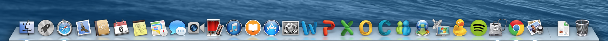
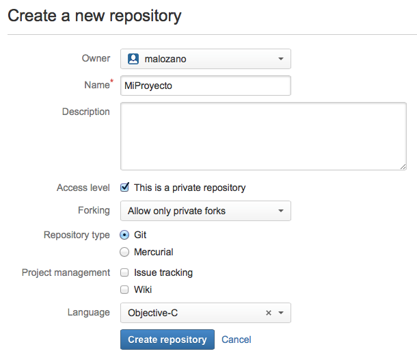
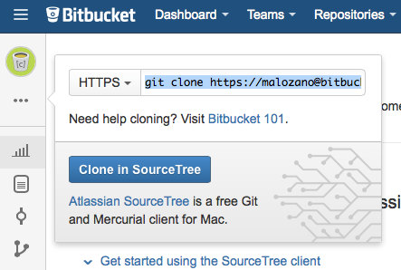
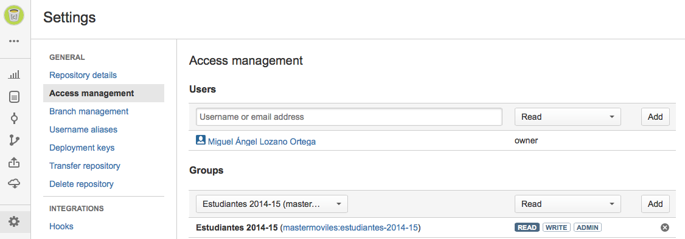

# Guía de laboratorio

## Inicio del sistema desde un disco externo en Mac

Con el máster se proporciona un disco externo con el sistema MacOS Mavericks y con todo el software que utilizaremos durante el curso preinstalado en dicho sistema operativo.

Se trata de discos de arranque externos, que **sólo podrán ser utilizados desde ordenadores Mac**. Para iniciar el sistema desde estos discos deberemos seguir los siguientes pasos:

1. Conectar el disco externo a un puerto USB
2. Encender el ordenador y mantener pulsada la tecla `alt`
3. Cuando aparezca la pantalla de selección de disco de arranque, seleccionar el disco _Master Móviles_

Es importante destacar que los discos están preparados para funcionar en los ordenadores iMac del laboratorio. Puede que no funcionen en todos los ordenadores Mac.

Estos discos permitirán mantener el software actualizado y configurado, sin necesidad de depender de la instalación local del laboratorio ni de tener que introducir la configuración personal al comienzo de cada clase.

## Guía básica de MacOS

Dado que durante todo el máster trabajaremos sobre el sistema MacOS, vamos a repasar los fundamentos básicos del uso de este sistema operativo.

### Barra de menú

En MacOS la barra de menú siempre está fija en la parte superior de la pantalla, a diferencia de _Windows_ que incorpora dicha barra en cada ventana.

El primer elemento de la barra es el icono de la _"manzana"_, pulsando sobre el cual desplegaremos un menú con opciones importantes como las siguientes:

* _Preferencias del Sistema ..._
* _Forzar salida ..._
* _Reiniciar ..._
* _Apagar equipo ..._


Con _Preferencias del Sistema ..._ abriremos el panel que nos da acceso a todos los elementos de configuración del sistema.


Si en algún momento alguna aplicación queda bloqueada, podemos _matarla_ con _Forzar salida ..._.

### Uso del ratón

En MacOS es habitual tener un único botón del ratón, teniéndose que pulsar la combinación `ctrl+click` para obtener el efecto del _click_ secundario.

Si estamos acostumbrados al funcionamiento del ratón en _Windows_ o _Linux_ podemos configurar el sistema de forma similar. Para hacer esto entraremos en _Preferencias del sistema ..._, y dentro de este panel en _Ratón_. Aquí podremos especificar que pulsando sobre el lado derecho del ratón se produzca el efecto de _click secundario_.

### Acceso a ficheros

Podemos navegar por el sistema de ficheros mediante la aplicación _Finder_.


Dentro de esta aplicación tenemos un panel a la izquierda con la ubicaciones favoritas. Podemos modificar este lista entrando en el menú _Finder > Preferencias ..._.

Hay que remarcar que la barra de menús cambia según la aplicación que tenga el foco en un momento dado. La opción _Finder_ aparecerá junto a la _"manzana"_ cuando la aplicación _Finder_ esté en primer plano.

Mientras navegamos por los ficheros podemos ver una vista previa rápida pulsando la tecla `espacio`.

### Compresión de ficheros

Para **comprimir** ficheros simplemente seleccionaremos los ficheros en el escritorio o en el _Finder_, haremos _click secundario_, y seleccionaremos la opción _Comprimir_. Esto comprimirá los ficheros seleccionados en `zip` con el compresor integrado en el sistema.

Podremos **descomprimir** ficheros `zip` simplemente haciendo doble _click_ sobre ellos.

Para descomprimir otros tipos de ficheros (+7z+, +rar+, etc) se incluye la herramienta gratuita _Stuffit Expander_.

### Abrir aplicaciones con _spotlight_

La forma más sencilla de abrir aplicaciones en MacOS es mediante el _Spotlight_ (el icono de la lupa de la esquina superior derecha de la pantalla).


Deberemos pulsar sobre este icono y empezar a escribir el nombre de la aplicación. La aplicación buscada aparecerá de forma rápida en la lista y podremos abrirla.

### Aplicaciones en el _Dock_

El _Dock_ es la barra que vemos en la parte inferior de la pantalla. Tenemos ahí los iconos de algunas de las aplicaciones instaladas, y de todas las aplicaciones abiertas actualmente.



Será recomendable dejar en el _Dock_ de forma fija los iconos de las aplicaciones que más utilicemos. Para hacer esto abriremos la aplicación, y una vez aparece su icono en el _Dock_, mantendremos el botón de ratón pulsado sobré él y seleccionaremos _Opciones > Mantener en el Dock_. Con esto, aunque cerremos la aplicación, su icono seguirá ahí, permitiéndonos abrirla de forma rápida.


### Aplicaciones a pantalla completa

Casi todas las aplicaciones pueden ponerse a pantalla completa mediante el icono que tienen en la esquina superior derecha. Cuando tengamos varias aplicaciones a pantalla completa podemos cambiar de una a otra mediante la combinación de teclas `ctrl + cursor izq./der.`.

Cuando una aplicación está a pantalla completa podemos cerrar la ventana pulsando la combinación `ctrl + W`. Esto es equivalente a cerrar la ventaa con el botón rojo de su esquina superior izquierda cuando estamos en modo ventana.

Es importante destacar que en MacOS las aplicaciones no se cierran al cerrar la ventana. Para cerrarlas tendremos que entrar en el menú con el nombre de la aplicación (el que aparece junto a la _"manzana"_) y pulsar sobre _Salir_.

Veremos las aplicaciones que están abiertas marcadas con una luz en la parte inferior del _Dock_.

### Montar discos externos

Al conectar un disco externo el sistema normalmente lo reconocerá automáticamente y podremos verlo en el escritorio y en el panel izquierdo del _Finder_.

Podremos utilizar discos con formato _MacOS_ y con formato _FAT32_. También podremos conectar discos _NTFS_, pero éstos serán de sólo lectura. Existen aplicaciones y formas de configurar el sistema para tener también la posibilidad de escribir en este tipo de sistemas de ficheros.

Para desmontar un disco podemos pulsar sobre el icono de expulsión en el _Finder_, o bien arrastrar el icono del disco a la papelera. Cuando hagamos esto veremos que la papelera cambia de aspecto y pasa a ser un icono de expulsión.

### Cuentas de usuario

Podemos configurar nuestras cuentas de usuario en _Preferencias del Sistema ... > Cuentas de Internet_.

Por ejemplo podríamos configurar aquí nuestra cuenta de Google. Una vez configurada la cuenta, podremos ver nuestro correo de Gmail en la aplicación _Mail_, nuestros calendarios de Google Calendar en la aplicación _Calendario_, nuestros contactos de Google en la aplicación _Contactos_, etc.

### Instalación de aplicaciones

Podemos instalar aplicaciones desde la _Mac App Store_. Necesitaremos configurar una cuenta de Apple para poder hacer esto.

También podemos instalar aplicaciones descargadas desde la web. Normalmente las aplicaciones de Mac vienen empaquetadas en ficheros `.dmg` que consisten en una imagen de disco que podemos montar en el sistema.

La *instalación* suele consistir únicamente en arrastrar un fichero al directorio `/Applications`.

De la misma forma, para *desinstalar* estas aplicaciones simplemente tendríamos que arrastrar dicho fichero a la papelera.

Otras aplicaciones que requieren una instalación más compleja proporcionan un instalador.

### Copiar, cortar y pegar

En MacOS podemos cortar, copiar y pegar como en otros Sistemas Operativos, pero es importante tener en cuenta que en lugar de usar la tecla `ctrl` se utiliza `cmd`. Es decir, copiaremos con ´cmd + C´, cortaremos con `cmd + X`, y pegaremos con `cmd + V`.

Esto será así para prácticamente todos los atajos de teclado. Aquellos que en Windows y Linux utilizan en la combinación la tecla `ctrl` en MacOS normalmente utilizan `cmd`.

## Repositorios git

El sistema de contron de versiones **git** realiza una gestión distribuida del código de nuestros proyectos. Tendremos un **repositorio remoto** donde se almacenarán las versiones de los artefactos de nuestros proyecto, y este repositorio remoto estará replicado en un **repositorio local** en nuestra máquina. De esta forma podremos realizar _commits_ con frecuencia en nuestra máquina sin que estos cambios afecten a otros usuarios del repositorio remoto. Cuando tras realizar una serie de cambios hayamos llegado a un estado estable de nuestro proyecto, podremos hacer _push_ para subir todos los _commits_ pendientes al repositorio remoto.

Para la creación de los repositorios remotos utilizaremos **bitbucket**. Vamos a ver en primer lugar cómo crear este repositorio remoto, y posteriormente veremos cómo crear una replica local.


### Creación de un repositorio remoto en bitbucket

Vamos a ver c&oacute;mo crear un repositorio privado en bitbucket (`bitbucket.org`) que vincularemos con nuestro repositorio local.

1. En primer lugar, deberemos crearnos una cuenta en bitbucket, si no disponemos ya de una: https://bitbucket.org

2. Creamos desde nuestra cuenta de bitbucket un repositorio (_Repositories > Create repository_).

3. Deberemos darle un nombre al repositorio. Ser&aacute; de tipo Git y como lenguaje especificaremos *Objective-C* o *Android* según la plataforma para la que vayamos a desarrollar.


4. Una vez hecho esto, veremos el repositorio ya creado, en cuya ficha podremos encontrar la ruta que nos dar&aacute;	acceso a &eacute;l.


Será útil copiar la dirección anterior para vincular con ella nuestro repositorio local al remoto. Veremos como hacer esto en el siguiente apartado.

### Creación del repositorio git local

Vamos a ver dos alternativas para crear una replica local del repositorio remoto:

* Clonar el repositorio remoto, lo cual inicializa un repositorio local en el que ya está configurado el vínculo con el remoto.
* Crear un repositorio local independiente, y vincularlo posteriormente con un repositorio remoto.

Si utilizamos un IDE como Eclipse o Xcode estos pasos los realiza automáticamente el entorno.

#### Creación a partir del repositorio remoto

La forma más sencilla de crear un repositorio Git local es hacerlo directamente a partir del repositorio remoto. Si ya tenemos un repositorio remoto (vacío o con contenido) podemos clonarlo en nuestra máquina local con:

```
git clone https://[usr]:bitbucket.org/[usr]/miproyecto-mastermoviles
```

Este comando podemos copiarlo directamente desde bitbucket, tal como hemos visto en el último paso del apartado anterior (opción _Clone_ de la interfaz del repositorio).

De esta forma se crea en nuestro ordenador el directorio `miproyecto-mastermoviles` y se descarga en él el contenido del proyecto, en caso de no estar vacío el repositorio remoto. Además, quedará configurado como repositorio Git local y conectado de forma automática con el repositorio git remoto del que lo hemos clonado.

#### Creación de un repositorio local y vinculación con el remoto

Esta forma es algo más compleja que la anterior, pero será útil si tenemos ya creado un repositorio Git local de antemano, o si queremos vincularlo con varios repositorios remotos.

Para la creación de un repositorio Git local seguiremos los siguientes pasos.

1. Crear un directorio local para el repositorio del m&oacute;dulo.

2. Inicializar el directorio anterior como un repositorio Git. Para ello, ejecuta en dicho directorio el comando.
```
$ git init
```

3. En bitbucket veremos la URL que identifica el repositorio, que será del tipo:
https://[usr]@bitbucket.org/[usr]/miproyecto-mastermoviles.git

4. Configurar el repositorio remoto. El repositorio remoto por defecto suele tomar como nombre `origin`. Desde el directorio ra&iacute;z del proyecto ejecutamos:
```
$ git remote add origin https://[usr]@bitbucket.org/[usr]/miproyecto-mastermoviles.git
```

Con esto habremos inicializado nuestro directorio como repositorio local Git y lo habremos conectado con el repositorio remoto de bitbucket.

### Registrar cambios en el repositorio

Independientemente de cuál de los métodos anteriores hayamos utilizado para inicializar nuestro repositorio Git local conectado con el repositorio remoto de bitbucket, vamos a ver ahora cómo trabajar con este repositorio.

En primer lugar será recomendable añadir un fichero `.gitignore` al directorio del proyecto, que dependerá del tipo de proyecto y que se encargará de excluir del control de versiones todos aquellos artefactos que sean generados automáticamente (por ejemplo las clases compiladas o el paquete de la aplicación). Podemos encontrar diferentes modelos de `.gitignore` en:
https://github.com/github/gitignore

Tras añadir el `.gitignore` correcto para nuestro tipo de proyecto podremos añadir nuevos artefactos y registrarlos en el sistema de control de versiones. Cada vez que queramos registrar cambios en el repositorio local deberemos:

1.  Si hemos añadido nuevos artefactos al proyecto, deberemos añadirlos al sistema de control de versiones con:
```
git add .
```

2.  Hacer el primer _commit_ desde el terminal o desde el IDE.
```
git commit -m "Versión inicial"
```

3. Ahora podemos hacer _commit_ cada vez que se haga alg&uacute;n otro cambio para registrarlo en el repositorio local:
```
$ git add .
$ git commit -a -m "Mensaje del commit"
$ git push origin master
```

4. Cada vez que el proyecto alcance un estado estable podremos hacer _push_ para subir los cambios a bitbucket, indicando el nombre del repositorio remoto (`origin`) y la rama a la que se subirá (`master` por defecto)
```
$ git push origin master
```

Con esto se subirán a bitbucket todos los _commits_ que estuviesen pendientes de enviar el repositorio remoto.


### Compartir el repositorio con grupos

Todos los alumnos y profesores del máster pertenecen al equipo _Master Moviles_ de bitbucket. Podremos crear y acceder a repositorios pertenecientes a nuestra cuenta personal o al equipo. Utilizaremos el equipo para las siguientes tareas:

* Los profesores publicaremos ejemplos y plantillas en el equipo _Master Moviles_, de forma que todos los alumnos podáis acceder a ellos y replicarlos en vuestras máquinas.
* Los alumnos podéis compartir los proyectos que realicéis en vuestras cuentas con el equipo _Master Moviles_, para que así los profesores tengamos acceso a ellos y podamos corregirlos. Esta será la forma de realizar las entregas.

Vamos ahora a ver cómo hacer estas tareas.

#### Compartir un repositorio con usuarios de bitbucket

Podemos compartir un repositorio bitbucket con un usuario o grupo dentro del equipo, de forma que dicho usuario o  todos los usuarios que pertenezcan al grupo puedan tener acceso al repositorio. Esto lo hacemos desde _Settings_ > _Access management_:



Los proyectos que realicéis en cada asignatura deberéis compartirlos con el/los profesor/es de la asignatura, dando permisos de lectura. Los profesores os aparecerán en la lista de usuarios como _TEAMMATES_.

#### Decarga de ejemplos y plantillas

Los ejemplos y plantillas se dejan como repositorios de sólo lectura en el grupo _Master Moviles_. Para que cada uno pueda tener una copia propia de lectura/escritura deberá hacer un _Fork_ en su cuenta personal de bitbucket.

Para ello se deberá entrar en el repositorio compartido de bitbucket y usar la opción _Fork_:


## Ejercicios

### Creación de una cuenta bitbucket

Crea un cuenta personal de bitbucket para utilizar en el máster (si no dispones ya de una). Utiliza como nombre de usuario el **nombre de usuario de Campus Virtual** o uno similar, para poder identificar correctamente los ejercicios que entregues.

### Creación de un repositorio Git

Vamos a crear un primer repositorio de prueba en bitbucket.

_a)_ Crea un repositorio en tu cuenta personal con el nombre `presentacion-mastermoviles`.

_b)_ Obten desde la web de bitbucket el comando necesario para clonar el repositorio en tu máquina local.

_c)_ Copia y pega el comando anterior en el terminal (aplicación _Terminal_ de MacOS) para clonar el repositorio en tu carpeta `$HOME`.

_d)_ Crea un fichero de texto en el directorio del proyecto al que llamaremos `README.md` con el siguiente texto.

```
# Primera version del proyecto
```

_e)_ Añade el fichero anterior al sistema de control de versiones y haz el primer _commit_ con mensaje _Initial commit_.

_f)_ Añade una segunda linea al fichero anterior, para que quede como se muestra a continuación:

```
# Primera version del proyecto
# Actualizado a la segunda version
```

_g)_ Haz otro _commit_ con el mensaje _Texto modificado_ y posteriormente haz un _push_ al servidor.

_h)_ Comprueba en bitbucket que el proyecto se ha subido. Explora desde la web los ficheros de fuentes y los diferentes _commits_ que se han realizado, viendo para cada uno la versión correspondiente del fichero de fuentes.

### Descarga de un repositorio existente

En el equipo _Master Moviles_ de bitbucket se ha dejado un proyecto llamado `presentacion-team-mastermoviles` que podéis copiar a vuestras cuentas y descargar. Dado que sólo tenemos permisos de lectura para dicho proyecto haremos lo siguiente:

_a)_ Hacemos un _fork_ del proyecto a nuestra cuenta personal. De esta forma seramos propietarios de la copia y por lo tanto tendremos permiso de escritura.

_b)_ Hacemos un _clone_ del proyecto en nuestra máquina aprovechando el comando que nos proporciona bitbucket.

_c)_ Nos habrá descargado un fichero. Vamos a modificar este fichero, hacer _commit_, y tras eso hacer _push_ para subirlo al servidor.

_d)_ Comparte este proyecto y el realizado en el ejercicio anterior con el usuario `malozano` de bitbucket con permiso de lectura para que pueda ver tu solución.


### Actualización del repositorio local

En caso de que estemos trabajando con un mismo repositorio remoto desde diferentes máquinas (bien por estar trabajando diferentes personas, o bien por estar la misma persona desde distintas máquinas) cuando enviemos cambios al repositorio remoto desde una, deberemos ser capaces de actualizar estos cambios en el resto.

Para actualizar en la máquina local los cambios que se hayan subido el repositorio remoto deberemos hacer un _pull_:

```
$ git pull origin master
```

Esto será especialmente útil si se trabaja en el proyecto o en los ejercicios desde los ordenadores del laboratorio y desde el ordenador personal. Cuando hayamos hecho cambios, antes de cerrar la sesión haremos _commit_ y _push_, y cuando vayamos a empezar a trabajar en otra máquina haremos un _pull_. De esta forma nos aseguramos de trabajar siempre con la versión actualizada de nuestros proyectos.
