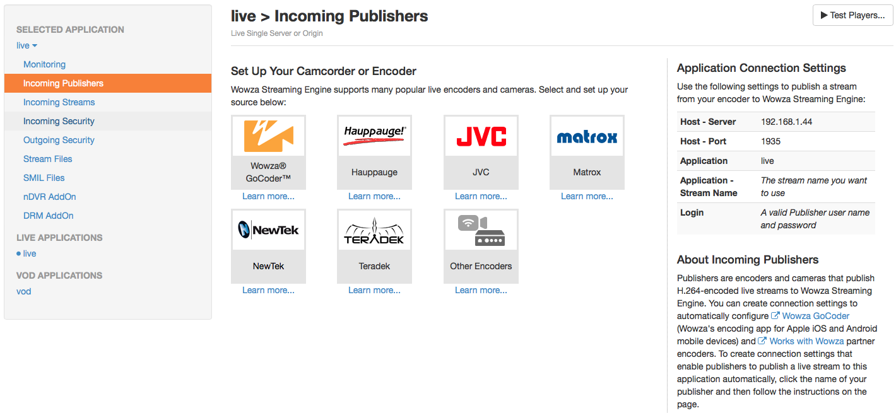

# Emisión de medios

Vamos a estudiar en esta sesión la forma en la que podemos emitir vídeo desde los dispositivos móviles a través de Internet o a otros dispositivos.

## Publicación en Wowza

El servidor Wowza, además de publicar contenido bajo demanda (VOD), nos permite realizar emisiones en directo. Para ello deberemos enviar desde el cliente un _stream_ RTSP o RTMP, y el servidor de encargará de difundirlo al igual que en el caso del VOD (con HLS para dispositivos iOS, y con RTSP para Android).

En la sección _Incoming Publishers_ de la aplicación _live_ de Wowza podemos ver los datos que deberemos utilizar en la aplicación de emisión para publicar vídeo en directo en Wowza:



De esta pantalla necesitaremos la siguiente información para poder publicar vídeo en el servidor:

* IP del servidor
* Puerto del servicio de _streaming_
* Nombre de la aplicación de _streaming_ (`live` por defecto)
* Usuario y password del usuario _publisher_ (deberemos recordar los datos del usuario que introdujimos al configurar Wowza).

A continuación veremos cómo podemos publicar en esta aplicación utilizando una aplicación Android.


## Tecnologías para la emisión de vídeo

Aunque el soporte para la emisión de medios de momento no forma parte de los SDKs de las principales plataformas móviles, podemos encontrar diferentes librerías y tecnologías que lo proporcionan. Vamos a revisar algunas de ellas:

* **_libstreaming_**: Librería _open source_ para Android que nos permite emitir vídeo vía RTSP.
> https://github.com/fyhertz/libstreaming
* **Media Library for iOS**: Librería _open source_ para iOS que nos permite emitir vídeo vía RTMP.
> https://github.com/slavavdovichenko/MediaLibDemos3x
* **Adobe AIR**: Esta tecnología nos proporciona un SDK con el que podemos crear aplicaciones multiplataforma. Dentro de dicho SDK contamos con clases para la reproducción y captura de vídeo, y además para su emisión de forma sencilla mediante RTMP.
> http://www.adobe.com/devnet/air.html
* **Kickflip**: Plataforma para la emisión de vídeo desde dispositivos iOS y Android. Nos proporciona un SDK _open source_ sencillo de utilizar que emite el vídeo a través de sus propios servidores y mediante sus propios protocolos.
> https://kickflip.io


## Emisión desde Android con _libstreaming_

Podemos utilizar la librería _libstreaming_ para emitir vídeo RTSP desde un dispositivo Android:

https://github.com/fyhertz/libstreaming

### Instalación y configuración de _libstreaming_

Seguiremos los siguientes pasos para importar la librería en Eclipse:

* Descargar la librería _libstreaming_.

* Seleccionar _Import … > Android > Existing Android Code into Workspace_.

* Seleccionar el directorio donde se encuentra _libstreaming_.

* Marcar la casilla _“Copy projects into workspace”_.

* Pulsar _Finish_.

Una vez tengamos la librería en el _workspace_, tendremos que añadirla al proyecto en el que queramos emitir vía _streaming_. Para ello seguiremos los siguientes pasos:

* Pulsamos con el botón derecho sobre el proyecto y seleccionamos _Properties_.
* Entramos en la sección _Android_.
* En la sección _Library_, pulsamos el botón _Add..._ y seleccionamos `libstreaming`.

Con esto ya podremos utilizar la librería _libstreaming_ desde nuestro proyecto. Al empaquetar la aplicación, la librería será incluida con ella.

Vamos a ver a continuación cómo utilizar esta librería en el código de nuestra aplicación.

### Uso de la librería _libstreaming_

En primer lugar, necesitaremos contar con una vista de tipo `SurfaceView` para poder realizar el _preview_ de la cámara. Suponemos que en el _layout_ de la actividad hemos incluido esta vista con un identificador `R.id.surfaceView`.

En el `onCreate` de nuestra actividad obtenemos el `SurfaceView` y el _holder_ de dicha superficie:

```java
mSurfaceView = (SurfaceView)findViewById(R.id.surfaceView);

mHolder = mSurfaceView.getHolder();
mHolder.addCallback(this);
```

La actividad deberá implementar la interfaz `SurfaceHolder.Callback`.

> **¡CUIDADO!** La vista `SurfaceView` que debemos utilizar no es la de Android, sino una versión alternativa suministrada por _libstreaming_, que se encuentra en el paquete `net.majorkernelpanic.streaming.gl`. Por lo tanto, para incluir esta vista en el _layout_ deberemos indicar su nombre completo:
```xml
<net.majorkernelpanic.streaming.gl.SurfaceView
    ...
/>
```

Tras la obtención de la superficie, creamos una sesión de captura que la utilice para mostrar el _preview_. La sesión será un objeto de tipo `Session` (pertenece a la librería _libstreaming_):

```java
mSession = SessionBuilder.getInstance()
        .setCallback(this)
        .setSurfaceView(mSurfaceView)
        .setPreviewOrientation(0)
        .setContext(getApplicationContext())
        .setAudioEncoder(SessionBuilder.AUDIO_AAC)
        .setAudioQuality(new AudioQuality(8000, 16000))
        .setVideoEncoder(SessionBuilder.VIDEO_H264)
        .setVideoQuality(new VideoQuality(640,480,30,600000))
                .build();
```

En la sesión configuramos los _codecs_ y la calidad del audio y del vídeo. Deberemos implementar en la actividad la interfaz `Session.Callback` para recibir los eventos de la sesión.

Por último, crearemos un cliente RTSP que se encargará de enviar el _stream_ de vídeo capturado en la sesión a Wowza. El cliente los crearemos con un objeto de la clase `RtspClient`, pasándole como parámetro los datos de acceso al servidor:

```java
mClient = new RtspClient();
mClient.setSession(mSession);
mClient.setCallback(this);

mClient.setCredentials("publisher", "mastermoviles");
mClient.setServerAddress("192.168.1.44", 1935);
mClient.setStreamPath("/live/canal1");
```

Es importante poner en la ruta el nombre de la aplicación configurada en Wowza, y tras él el nombre del _stream_. Por ejemplo, si tenemos la aplicación `live` en Wowza, podríamos crear el siguiente _stream_:

```
/live/canal1
```

Deberemos implementar en la actividad la interfaz `RtspClient.Callback` para tener constancia de los eventos de la conexión con el servidor de _streaming_.

Una vez terminado de configurar, podemos poner en marcha la captura y el envío de datos al servidor con:

```java
mClient.startStream();
```

En `onDestroy` deberíamos destruir todos los objetos que hemos construido en `onCreate`:

```java
@Override
protected void onDestroy() {
	super.onDestroy();
	mClient.release();
	mSession.release();
	mSurfaceView.getHolder().removeCallback(this);
}
```

Nos falta únicamente definir los métodos de las distintas interfaces que hemos tenido que implementar.

#### Métodos de `SurfaceHolder.Callback`


Cuando la superficie se crea podemos poner en marcha el _preview_ de la sesión de captura, y al destruirse podemos detenerlo:

```java
@Override
public void surfaceChanged(SurfaceHolder holder, int format, int width,
		int height) {
}


@Override
public void surfaceCreated(SurfaceHolder holder) {
	mSession.startPreview();
}


@Override
public void surfaceDestroyed(SurfaceHolder holder) {
	mSession.stop();
}
```

#### Métodos de `Session.Callback`

Nos obliga a definir los siguientes métodos:

```java
@Override
public void onBitrateUpdate(long bitrate) {
}

@Override
public void onSessionError(int reason, int streamType, Exception e) {
}

@Override
public void onPreviewStarted() {
}

@Override
public void onSessionConfigured() {
}

@Override
public void onSessionStarted() {
}

@Override
public void onSessionStopped() {
}
```

Con ellos podemos tener constancia de todos los cambios ocurridos en la sesión de captura. No es necesario introducir contenido en ellos para utilizar el _streaming_.

#### Métodos de `RtspClient.Callback`

Nos obliga a definir el método `onRtspUpdate`, que se invoca cuando hay algún evento en la comunicación por RTSP:

```java
@Override
public void onRtspUpdate(int message, Exception exception) {
}
```

No es necesario introducir ningún contenido en este método, pero puede ser de utilidad introducir algún mensaje de _log_ para depurar el funcionamiento de la conexión con el servidor (por ejemplo comprobar si los credenciales son correctos).


> Si al poner en marcha la emisión con _libstreaming_ tenemos un `IOException` (con mensaje _Try again_), puede que sea necesario aumentar el _timeout_ en la clase `net.majorkernelpanic.streaming.MediaStream`
```java
mReceiver.setSoTimeout(3000);
```

