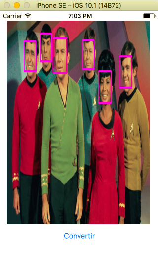

# Procesamiento de imágenes en iOS: OpenCV


En esta sección vamos a ver como llevar a cabo procesamiento de imágenes en iOS utilizando la librería de visión por computador **OpenCV**.

## OpenCV

[OpenCV](http://opencv.org/) es una librería de código abierto para visión por computador. El principal objetivo de esta librería es ofrecer algoritmos de visión artificial que funcionen en tiempo real. Originalmente OpenCV fue desarrollada por el departamento de investigación de Intel, pero más tarde recibió soporte de la empresa [Willow Garage](http://www.willowgarage.com/) y actualmente es mantenido por la empresa [Itseez](https://vk.com/itseez). Se trata de una librería multi-plataforma (Windows, Linux, MacOSX, iOS, Android, ... )y se puede utilizar libremente al ser desarrollada bajo una licencia de código abierto BSD. 

Áreas de aplicación librería OpenCV:
* Egomotion
* Sistema de detección/reconocimiento facial
* Reconocimiento de gestos
* Segmentación
* Calibración de cámaras
* Tracking
* Algoritmos estéreo
* Structure from Motion (SfM)
* Retoque de imágenes (Balance de blancos, HDR, constrate, etc)
* ...

Además, OpenCV cuenta con una librería de aprendizaje automático que contiene métodos tradicionales de clasificación y regresión:
* Arboles de decisión
* Redes neuronales artificiales
* k-vecinos más cercanos
* Random forest
* Support vector machine (SVM)
* ...

## OpenCV en iOS

OpenCV es una librería escrita en C/C++, por lo que utilizando Objective-C no hay mucho problema para su integración en iOS. Sin embargo, con Swift la cosa es ligeramente más complicada, y necesitaremos utilizar una cabecera puente en nuestro proyecto para acceder a funciones de OpenCV. Por ello tendremos que escribir un poco de Objective-C++ en nuestros proyectos.


### Enlazando la librería OpenCV en nuestro proyecto

Para utilizar OpenCV en iOS tendremos que descargarnos la versión correspondiente para esta plataforma de la web oficial. En concreto vamos a utilizar la versión 2.4.13 para iOS. [Enlace descarga](https://sourceforge.net/projects/opencvlibrary/files/opencv-ios/2.4.13/opencv2.framework.zip/download).

El siguiente paso será crear un nuevo proyecto en Xcode y añadir las librerías necesarias para usar OpenCV en nuestro proyecto. Creamos un proyecto nuevo (Single View) y simplemente arrastramos a la ventana donde se muestran los ficheros del proyecto el fichero `opencv2.framework`, al hacer esto nos aparecerá un diálogo para importarlo en el proyecto. Marcamos la opción copiar si es necesario.


Con este paso ya tendremos OpenCV añadido a nuestro proyecto, pero para poder utilizarlo tendremos que crear una cabecera puente (Bridging header), que nos permita utilizar código Objetive-C++ desde código Swift. Para crear la cabecera puente, vamos a File > New > File (⌘N) y en iOS > Source seleccionamos `Cocoa Touch Class`. Lo llamaremos OpenCVWrapper, en este fichero escribiremos el código que servirá de envoltorio para utilizar funciones OpenCV en Objective-C++. Al crear este fichero Xcode nos sugerirá crear la cabecera puente: `nombreproyecto-Bridging-header.h`. Todas las librerías que incluyamos desde este fichero header, las clases y métodos definidas en las mismas serán accesibles desde nuestro código en Swift.

Con estos pasos habremos creados tres nuevos ficheros en nuestro proyecto: `OpenCVWrapper.h`, `OpenCVWrapper.m` y `nombre-proyecto-Bridging-Header.h`. Como hemos comentado, la cabecera puente será nuestra interfaz para usar funciones de OpenCV, por lo tanto tenemos que añadir el envoltorio que hemos creado: 

```
#import "OpenCVWrapper.h"
```

### Primer ejemplo: Conversión imagen a escala de grises
Con esto ya estamos listos para empezar a utilizar OpenCV en nuestro proyecto, por ello vamos a crear una sencilla aplicación que cargue una imagen y convierta la imagen a escala de grises utilizando la función predefinida en OpenCV `cv::cvtColor(imageMat, gray, CV_RGBA2GRAY);``

Añadimos un ImageView (cargar imagen) y un botón a la interfaz de la apliación que creamos anteriormente. Al pulsar el botón convertiremos la imágen a escala de grises. Para ello, en la clase OpenCVWrapper que creamos anteriormente para utilizar la funcionalidad de la librería escribimos nuestra propia función para convertir a escala de grises. La función tomará como entrada una imagen en formato UIImage, la convertirá a formato OpenCV, cv::Mat, y finalmente se convertirá de vuelta al formato UIImage para su visualizaión.
Para convertir imágenes entre UIImage y el formato de OpenCV, utilizaremos los métodos definidos en las cabeceras:
 * `#import "opencv2/highgui/ios.h"`
 * `#import <opencv2/highgui/cap_ios.h>`

En estas cabeceras se encuentran definidos métodos para interoperar con tipos de datos propios de iOS.

Convertir una imagen a formato cv::Mat:

`UIImageToMat(image,imageMat);`

Convertir formato cv::Mat a UIImage

`MatToUIImage(gray);`

Finalmente crearemos una función `convertImageToGrayScale`en la clase `OpenCVWrapper`. Esta clase nos servirá de interfaz con OpenCV y la utilizaremos desde nuestro código en Swift

**( OpenCVWrapper.mm )**
```
#import "OpenCVWrapper.h"

@implementation OpenCVWrapper

+(UIImage *) convertImageToGrayscale: (UIImage *)image
{
 cv::Mat imageMat;
 UIImageToMat(image,imageMat);
 if(imageMat.channels() == 1){ return image; }
 cv::Mat gray;
 // Convert the image to grayscale
 cv::cvtColor(imageMat, gray, CV_RGBA2GRAY);
 return MatToUIImage(gray);
}
@end

```

**( OpenCVWrapper.h )**
```
#import <Foundation/Foundation.h>

#import <UIKit/UIKit.h>

// Need this ifdef, so the C++ header won't confuse Swift
#ifdef __cplusplus
 #import <opencv2/opencv.hpp>
 #import "opencv2/highgui/ios.h"
 #import <opencv2/highgui/cap_ios.h>
#endif

@interface OpenCVWrapper : NSObject

+(UIImage *) convertImageToGrayscale: (UIImage *)Image;

@end

```

Finalmente, desde nuestro código Swift llamaremos a la función `convertImageToGrayscale` al accionar el botón 'convertir':

```
@IBAction func botonConvertirGrises(_ sender: UIButton) 
{
    imagen.image = OpenCVWrapper.convertImage(toGrayscale: imagen!.image)
}
```


### Otros ejemplos

A continuación vamos a ver como aplicar a nuestra imagen otros filtros típicos en procesamiento de imagen. Por ejemplo, un filtro de emborronamiento, del inglés, blur. De igual manera que hicimos anteriormente, creamos una nuevo método en nuestra interfaz `OpenCVWrapper`. En este caso usaremos una de las funciones de filtrado de OpenCV, se trata de un método para emborronar la imagen: 

```+(UIImage *) blurImage: (UIImage *)Image;```

El nuevo método quedaría de la siguiente forma:

```
+(UIImage *) blurImage: (UIImage *)image
{
     cv::Mat imageMat;
     UIImageToMat(image,imageMat);
     cv::Mat blurImage;
     cv::GaussianBlur( imageMat, blurImage, cv::Size( 3, 3 ), 0, 0 );
     return MatToUIImage(blurImage);
}

```

A continuación vamos a ver otro filtro un poco más complejo, en concreto un filtro detector de bordes, [algoritmo de Canny](https://es.wikipedia.org/wiki/Algoritmo_de_Canny). Este filtro se encuentra implementado en OpenCV y por lo tanto podemos usarlo para procesar nuestras imágenes. 

```
 cv::Canny(gray, edges, 0, 50, 3);
```

Los argumentos que recibe este método son los siguientes:

* Imagen origen en escala de grises
* Imagen salida con los bordes detectados
* lowThreshold: umbral inferior para la detección de bordes
* highThreshold: umbral superior para la detección de bordes
* kernel_size: tamaño de la convolución 2D en las dimensiones X e Y. Por defecto 3.


En OpenCV encontramos muchos otras funciones de procesamiento de imágen y visión por computador que podemos utilizar en nuestra aplicación, toda la documentación sobre la librería y métodos disponibles se puede encontrar [online](http://docs.opencv.org/2.4/index.html).

### Detector de caras

A continuación, vamos a ver como utilizar OpenCV para poner en funcionamiento un detector de caras en nuestra aplicación móvil. OpenCV implementa clasificadores en cascada para detectar múltiples objetos. En nuestro caso vamos a cargar un modelo para el clasificador que esta entrenado para detectar caras. En concreto usaremos el clasificador basado en las características de Haar. Podeis encontrar más información sobre la implementación de este método en el siguiente [enlace](http://docs.opencv.org/2.4/modules/objdetect/doc/cascade_classification.html). El trabajo original se basa en el siguiente artículo científico:

```
[Viola01] Paul Viola and Michael J. Jones. Rapid Object Detection using a Boosted Cascade of Simple Features. IEEE CVPR, 2001. 
```

Para utilizar este método en nuestro proyecto vamos a crear un nuevo wrapper que nos sirva de interfaz para el objeto `cv::CascadeClassifier`. Este objeto OpenCV nos permitirá cargar un modelo entrenado para la detección de caras así como la detección en sí. Crearemos un método para inicializar el clasificador con el modelo detector de caras.

```
NSString* cascadePath = [[NSBundle mainBundle] pathForResource:@"haarcascade_frontalface_alt2" ofType:@"xml"];
faceDetector.load([cascadePath UTF8String]);
```

Podremos descargas este modelo y otros previamente entrenados desde el [repositorio](https://github.com/opencv/opencv/tree/master/data/haarcascades) oficial de la librería  OpenCV. Encontramos otros modelos para detectar ojos, personas, tronco superior, etcétera. 

Crearemos otro método dentro de nuestro wrapper para llevar a cabo la detección de caras dada una imagen de entrada.

```
-(UIImage *) detectFaces: (UIImage *)image
```

Este método contiene toda la lógica necesaria para detectar caras en una imagen utilizando la función 

```
faceDetector.detectMultiScale(gray, faces, 1.1, 2, 0|CV_HAAR_SCALE_IMAGE, cv::Size(30, 30));
```

El método `detectFaces` contendría el siguiente código (Se ha eliminado el código para interoperar con UIImage y convertir a escala de grises por claridad):

```
// Detect faces
std::vector<cv::Rect> faces;
faceDetector.detectMultiScale(gray, faces, 1.1, 2, 0|CV_HAAR_SCALE_IMAGE, cv::Size(30, 30));

// Draw all detected faces
for(unsigned int i = 0; i < faces.size(); i++)
{
    const cv::Rect& face = faces[i];
    // Get top-left and bottom-right corner points
    cv::Point tl(face.x, face.y);
    cv::Point br = tl + cv::Point(face.width, face.height);
    // Draw rectangle around the face
    cv::Scalar magenta = cv::Scalar(255, 0, 255);
    cv::rectangle(cvImage, tl, br, magenta, 4, 8, 0);
}
```

Como podemos apreciar arriba, una vez detectadas las caras, utilizando funciones OpenCV dibujamos gráficos sobre la imagen que posteriormente visualizaremos en el ImageView de nuestra app móvil.


