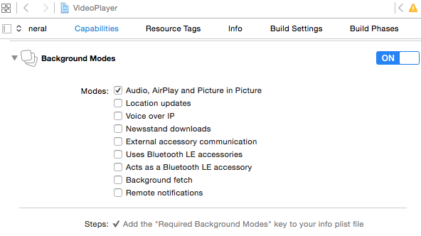
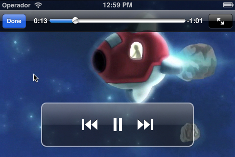
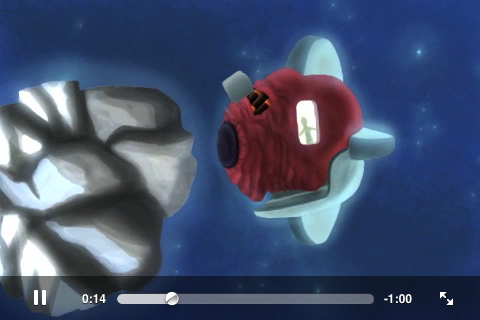
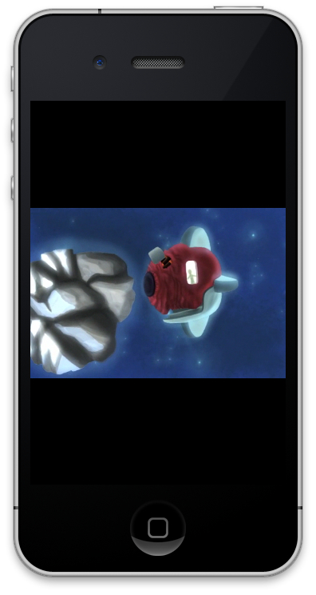

# Reproducción de medios en iOS

En esta sesión veremos las diferentes APIs de las que disponemos en iOS para
introducir y manipular contenidos multimedia en nuestras aplicaciones. En primer
lugar repasaremos las APIs disponibles y sus principales características. Tras
esto, pasaremos a ver cómo reproducir audio y video en las aplicaciones, y por
último estudiaremos cómo capturar audio, video y fotografías, y cómo procesar
estos medios.

## APIs multimedia en iOS

En el SDK de iOS encontramos un gran número de _frameworks_ que nos
permiten reproducir y manipular contenido multimedia. Según las necesidades de
nuestra aplicación, deberemos seleccionar uno u otro. A continuación mostramos
los más destacados y sus características:

* **Media Player (MP)**: Nos da acceso a la librería multimedia del iPod. Con esta librería podemos
reproducir medios de forma sencilla incrustando el reproductor de medios del dispositivo en nuestra
aplicación, y personalizándolo para que se adapte a nuestra interfaz y quede integrado correctamente.
* **AV Foundation (AV)**: Esta librería nos permite controlar la reproducción y captura de audio y vídeo
a bajo nivel. Con ella por ejemplo podremos tener acceso a los fotogramas capturados por la cámara en tiempo
real, permitiendo implementar aplicaciones basadas en visión artificial.
* **Audio Toolbox (AU)**: Se trata de una librería de manipulación de audio, que nos permite capturar,
reproducir, y convertir el formato del audio.
* **OpenAL framework (AL)**: Nos da un gran control sobre la reproducción de audio. Por ejemplo,
nos permite reproducir audio posicional, es decir, nos dará control
sobre la posición en la que se encuentra la fuente de audio, para que así cada sonido se oiga con más fuerza
por el altavoz que corresponda. Esto es especialmente interesante para videojuegos, para implementar de esta forma
sonido en estéreo.
* **Assets Library (AL)**: Nos da acceso a nuestra librería multimedia de fotos y vídeos.
* **Core Image (CI)**: Es una API incorporada a partir de iOS 5. Permite procesar imágenes de forma
eficiente, aprovechando al máximo la arquitectura _hardware_ del dispositivo, y evitando que tengamos
que ir a programar a bajo nivel para implementar estas funcionalidades de forma óptima. Con estas funciones podremos
crear filtros para fotografía, o implementar procedimientos de visión artificial como por ejemplo el reconocimiento
de caras.


Vamos a centrarnos en esta sesión en el uso del reproductor de medios, para integrar vídeo en nuestras
aplicaciones de forma personalizada, y en la API para procesamiento de imágenes.


## Reproducción de audio

En primer lugar vamos a ver algunas formas de reproducir audio en dispositivos iOS. Debemos distinguir dos tipos de sonidos:

* **Sonidos del sistema**. Se reproducen mediante el servicio de sonidos del sistema (_System Sound Services_). Se debe utilizar únicamente para sonidos como _clicks_, alertas o notificaciones.
* **Sonidos de la aplicación**. Se reproduce mediante APIs como `AVAudioPlayer` (perteneciente a _AV Foundation_). Se utilizará para música de fondo o sonidos.


### Reproducción de sonidos del sistema

El servicio de sonidos del sistema (_System Sound Services_) nos permite reproducir sonidos sencillos. Este servicio está destinado a utilizarse para sonidos de la interfaz, como por ejemplo la pulsación de un botón o una alarma. Los sonidos que permite reproducir este servicio no pueden pasar de los 30 segundos de duración, y el formato sólo puede ser Linear PCM o IMA4, dentro de ficheros `.caf`, `.aif`, o `.wav`. También nos permite activar la vibración del dispositivo. No tenemos apenas ningún control sobre los sonidos reproducidos por este
servicio, ni siquiera podemos alterar su volumen, sonarán con el volumen que haya seleccionado el usuario en el dispositivo.

Los sonidos del sistema se representan con el tipo `SystemSoundID`. Se trata de una API C, por lo que
encontraremos una serie de funciones con las que crear y reproducir sonidos. Podemos crear un objeto de este
tipo a partir de la URL del fichero de audio, mediante la función `AudioServicesCreateSystemSoundID`.

```objectivec
SystemSoundID sonido;

NSURL *urlSonido = [[NSBundle mainBundle] URLForResource:@"alarma"                                    withExtension:@"caf"];
AudioServicesCreateSystemSoundID((CFURLRef)urlSonido, &sonido);
```

> En este caso la URL se debe indicar mediante el tipo `CFURLRef`. Este es un tipo de datos de Core Foundation. Se trata de una estructura de datos (no un objeto Objective-C), que está vinculada a la clase `NSURL`. Podemos encontrar diferentes tipos de Core Foundation (con prefijo `CF`) vinculados a objetos de Cocoa Touch. Estos objetos pueden convertirse directamente a su tipo Core Foundation correspondiente simplemente mediante un _cast_.

Tras hacer esto, el sonido queda registrado como sonido del sistema y se le asigna un identificador, que podemos almacenar en una
variable de tipo `SystemSoundID`.

Podemos reproducir el sonido que hemos creado con la función `AudioServicesPlaySystemSound`. Esto reproduce el sonido inmediatamente, sin ningún retardo, simplemente proporcionando el identificador del sonido a reproducir, ya que dicho
sonido se encuentra cargado ya como sonido del sistema.

```objectivec
AudioServicesPlaySystemSound(sonido);
```

En caso de que queramos que junto a la reproducción del audio también se active la vibración del dispositivo, llamaremos
a la función `AudioServicesPlayAlertSound`:

```objectivec
AudioServicesPlayAlertSound(sonido);
```

En este caso también debemos proporcionar el sonido a reproducir, pero además de reproducirlo también se activará la vibración. Si únicamente queremos activar la vibración, entonces podemos proporcionar como parámetro la constante `kSystemSoundID_Vibrate`.


### Reproducción de música

Si necesitamos que nuestra aplicación reproduzca música de cualquier duración, y no necesitamos tener un gran control sobre la forma en la que se reproduce el sonido (por ejemplo posicionamiento _stereo_), entonces podemos utilizar el reproductor de audio `AVAudioPlayer`. Con esto podremos reproducir ficheros de cualquier duración, lo cual nos será de utilidad para reproducir música de fondo en nuestra aplicación. Soporta todos los formatos vistos anteriormente, y su uso resulta muy sencillo:

```objectivec
NSError *error = nil;
NSURL *urlMusica = [[NSBundle mainBundle] URLForResource:@"musica"
                                           withExtension:@"mp3"];

AVAudioPlayer *player = [[AVAudioPlayer alloc]
    initWithContentsOfURL:urlMusica error:&error];

[player prepareToPlay];
[player play];
```

Una desventaja de este reproductor es que la reproducción puede tardar en comenzar, ya que la inicialización del _buffer_
es una operación lenta. Por ello tenemos el método `prepareToPlay` que nos permite hacer que se inicialicen todos los
recursos necesarios para que pueda comenzar la reproducción. Una vez hayamos hecho esto, al llamar a `play` la reproducción
comenzará de forma instantánea.

Con esta API, en el reproductor (objeto `AVAudioPlayer`) tenemos una serie de propiedades con las que podemos hacer que
la música se reproduzca de forma cíclica (`numberOfLoops`), o controlar su volumen (`volume`). También podemos definir un delegado
sobre el reproductor (`delegate`) de tipo `AVAudioPlayerDelegate`, para así poder controlar los eventos que ocurran en él, como
por ejemplo la finalización de la reproducción del audio. Podemos también saber en cualquier momento si se está reproduciendo audio
actualmente (`playing`), y podemos pausar, reanudar, o deterner la reproducción con los métodos `pause`,
`play` y `stop`.

Esta librería es adecuada para reproductores multimedia, en los que simplemente nos interese reproducir música y
poder controlar el estado de la reproducción. Si necesitamos tener un mayor control sobre el audio, como por ejemplo
reproducir varios efectos de sonido simultáneamente, con distintos niveles de volumen y posicionados de diferente forma, deberemos
utilizar una API como OpenAL. Esto será especialmente adecuado para videojuegos, en los que necesitamos disponer de este
control sobre el audio. Muchos motores para videojuegos incorporan librerías para gestión del audio basadas en OpenAL.

Si queremos reproducir música de la librería del iPod, podemos utilizar el objeto `MPMusicPlayerController`. La diferencia
entre `AVAudioPlayer` y `MPMusicPlayerController` radica en que el primero se encarga de reproducir audio
propio de nuestra aplicación, mientras que el segundo se encarga de reproducir medios de la librería del iPod, y nos permite hacerlo
tanto dentro de nuestra aplicación, como controlando el estado de reproducción de la aplicación del iPod.

### Sesiones de audio

La sesión de audio nos permite especificar el uso que nuestra aplicación quiere hacer del audio. Tendremos un objto `AVAudioSession` por cada aplicación, que podrá ser obtenido como un _singleton_:

```objectivec
AVAudioSession *audioSession = [AVAudioSession sharedInstance];
```

En la sesión podemos controlar diferentes aspectos:

* **¿Puede mezclarse el sonido con otras aplicaciones?**
* **¿El sonido se interrumpe cuando se silencia el teléfono o se bloquea la pantalla?**

Según el uso que vayamos a hacer del audio, podemos especificar diferentes categorías de sesiones, de las cuales destacamos las siguientes:

|Categoría                                                        |Mezcla |Silencio |
|-----------------------------------------------------------------|-------|---------|
|`AVAudioSessionCategorySoloAmbient` (categoría **por defecto**)  |No     |Si       |
|`AVAudioSessionCategoryAmbient`                                  |Si     |Si       |
|`AVAudioSessionCategoryPlayback`                                 |No     |No       |

Según la categoría que asignemos a la sesión el sonido se podrá mezclar con otras aplicaciones o se silenciará cuando se bloquee la pantalla o se silencie el dispositivo.

Podemos establecer y activar una determinada categoría de forma global para nuestra aplicación con:

```objectivec
AVAudioSession *audioSession = [AVAudioSession sharedInstance];

NSError *error = nil;
BOOL success;

success = [audioSession setCategory:AVAudioSessionCategoryPlayback error:&error];
success = [audioSession setActive:YES error:&error];
```

Normalmente bastará con establecer la categoría una única vez al iniciar la aplicación.

El _singleton_ `AVAudioSession` también nos proporciona información sobre si otra aplicación está reproduciendo audio actualmente mediante la propiedad `otherAudioPlaying`.

> A partir de iOS 8 se recomienda utilizar la propiedad `secondaryAudioShouldBeSilencedHint` que nos indica si otra actividad está reproduciendo audio no mezclable.

Mediante la propiedad anterior podemos tomar la decisión de reproducir música de fondo sólo en el caso de que otra aplicación no lo esté haciendo:

```objectivec
if ([self.audioSession isOtherAudioPlaying]) {
    [self.audioSession setCategory:AVAudioSessionCategoryAmbient error:&error];
} else {
    // El sonido de esta aplicación se mezcla con el de fondo
    [self.audioSession setCategory:AVAudioSessionCategorySoloAmbient error:&error];
    [self reproduceMusica];
}
```

Algunos escenarios típicos son los siguientes:

* **Aplicación donde el audio resulta imprescindible**, como por ejemplo un reproductor multimedia. En este caso la categoría adecuada será `AVAudioSessionCategoryPlayback`. No se mezclará con otras aplicaciones y podrá seguir reproduciéndose con la pantalla apagada.
* **Aplicación con audio secundario opcional**. En algunas aplicaciones puede interesarnos dar la opción de que el usuario pueda ponerse su música preferida de fondo. Por ejemplo en un videojuego podemos tener una banda sonora de fondo y efectos de sonido. Si el usuario ya está reproduciendo música en el móvil podemos tomar la decisión de mezclar dicha música con los efectos del juego, mientras que si no hay ninguna música reproduciéndose se puede utilizar la banda sonora por defecto del juego. Podemos utilizar `AVAudioSessionCategorySoloAmbient` en caso de que no haya música reproduciéndose (lo comprobaremos con la propiedad `isOtherAudioPlaying`), o `AVAudioSessionCategoryAmbient` en caso contrario.
* **Aplicación en la que resulte adecuado combinar el audio**. Aquí podemos encontrar como ejemplo alguna aplicación para crear música, en la que pueda ser interesante poner una música de fondo mientras tocamos un instrumento para acompañarla. En este caso siempre utilizaremos `AVAudioSessionCategoryAmbient`.

### Reproducción de audio en segundo plano

Aunque en iOS la multitarea está restringida a un limitado conjunto de funcionalidades, una de las funcionalidades que se permiten ejecutar en segundo plano es la reproducción de música. Para poder reproducir música aunque tengamos silenciado el móvil o la pantalla esté bloqueada deberemos reproducirla dentro de una sesión con categoría `AVAudioSessionCategoryPlayback`.

Además de esto, para poder continuar la reproducción con la aplicación cerrada deberemos declarar en `Info.plist` que uno de los modos el los que nuestra aplicación puede funcionar en segundo plano (_background_) es la reproducción de música, añadiendo el _item_ `audio` a la propiedad `UIBackgroundModes`.


Esto lo podemos hacer también desde la pestaña _Capabilities_ del nuestro _target_, activando los _Background Modes_, y dentro de estos el de _Audio, AirPlay and Picture in Picture_:




Esta reproducción en segundo plano también nos servirá para emitir la reproducción vía _AirPlay_.


### Metadatos del audio

Podemos establecer metadatos del medio que actualmente se esté reproduciendo con:

```objectivec
NSDictionary *info = @{
  MPMediaItemPropertyTitle : @"By the Throat",
  MPMediaItemPropertyArtist : @"CHVRCHES",
  MPMediaItemPropertyAlbumTitle : @"The Bones of What You Believe"
};
[[MPNowPlayingInfoCenter defaultCenter] setNowPlayingInfo: info];
```

Estos metadatos aparecerán también en la pantalla de bloqueo del teléfono mientras se reproduce el audio en segundo plano.

### Control remoto

Podemos permitir que la reproducción de nuestra aplicación se controle de forma remota. Posibles controles remotos son:

* Controles del audio en la pantalla de bloqueo del teléfono. Aparecerán siempre que estemos reproduciendo audio en segundo plano y hayamos introducido metadatos con `MPNowPlayingInfoCenter`.
* Botones presentes en el cable de los auriculares. Nos permiten pausar/reanudar la reproducción, y cambiar de pista.

Para utilizar estos controles remotos la aplicación debe ser capaz de recibir eventos de control:

```objectivec
[[UIApplication sharedApplication] beginReceivingRemoteControlEvents];
```

Estos eventos externos vienen de los auriculares, o de la pantalla de bloqueo, y permiten controlar la reproducción de audio de la aplicación.

Además, para controlar estos eventos, el controlador que reproduzca el audio debe pasar a ser el _first responder_:

```objectivec
[self becomeFirstResponder];
```

Será el _first responder_ el que recibirá el evento externo:

```objectivec
- (void)remoteControlReceivedWithEvent:(UIEvent *)event {
    if(event.type == UIEventTypeRemoteControl) {
        if(event.subtype == UIEventSubtypeRemoteControlTogglePlayPause) {
            if([self.player isPlaying]) {
                [self.player pause];
            } else{
                [self.player play];
            }
        } else if(event.subtype == UIEventSubtypeRemoteControlPause) {
            [self.player pause];
        } else if(event.subtype == UIEventSubtypeRemoteControlPlay) {
            [self.player play];
        }
    }
}
```


### Desconexión de los auriculares

Es recomendable que los reproductores multimedia respondan ante un cambio de dispositivo de reproducción (auriculares, altavoces externos). Por ejemplo, si desconectamos los auriculares durante la reproducción de música sería recomendable pausarla automáticamente. En otras aplicaciones, como los videojuegos, esto no es importante.

Podemos estar al tanto es estos cambios de _hardware_ de reproducción (_route change_) mediante la notificación `AVAudioSessionRouteChangeNotification`.

```objectivec
NSNotificationCenter *nc = [NSNotificationCenter defaultCenter];
[nc addObserver:self selector:@selector(routeChanged:) name:AVAudioSessionRouteChangeNotification object:nil];
```

Podemos responder a esta notificación deteniendo la reproducción:

```objectivec
- (void)routeChanged:(id)sender {
    if([self.player isPlaying]) {
        [self.player pause];
    }
}
```

## Reproducción de video

Vamos a ver ahora cómo reproducir video en dispositivos iOS. Para reproducir video podemos utilizar una interfaz sencilla proporcionada por el _framework Media Player_, o bien reproducirlo a bajo nivel utilizando las clases `AVPlayer` y `AVPlayerLayer` del _framework AV Foundation_. Vamos a centrarnos en principio en la reproducción de video mediante la interfaz sencilla, y más adelante veremos cómo realizar la captura mediante la API a bajo nivel.


### Reproductor multimedia

La reproducción de video puede realizarse de forma sencilla con la clase `MPMoviePlayerViewController`. Debemos
inicializar el reproductor a partir de una URL (`NSURL`). Recordemos que la URL puede referenciar tanto
un recurso local como remoto, por ejemplo podemos acceder a un video incluido entre los recursos de la aplicación
de la siguiente forma:

```objectivec
NSURL *movieUrl = [[NSBundle mainBundle] URLForResource:@"video" withExtension:@"m4v"];
```

Para reproducir el vídeo utilizando el reproductor nativo del dispositivo simplemente deberemos inicializar su
controlador y mostrarlo de forma modal. Podemos fijarnos en que tenemos un método específico para mostrar el controlador
de reproducción de video de forma modal:

```objectivec
MPMoviePlayerViewController *controller =
    [[MPMoviePlayerViewController alloc] initWithContentURL:movieUrl];
[self presentMoviePlayerViewControllerAnimated: controller];
[controller release];
```

Con esto iniciaremos la reproducción de video en su propio controlador, que incorpora un botón para cerrarlo y
controles de retroceso, avance y pausa. Cuando el vídeo finalice el controlador se cerrará automáticamente.
También podríamos cerrarlo desde el código con `dismissMoviePlayerViewController`. Estos métodos
específicos para mostrar y cerrar el controlador de reproducción se añaden cuando importamos los ficheros
de cabecera del _framework Media Player_, ya que se incorporan a `UIViewController`
mediante categorías de dicha librería.



Esta forma de reproducir vídeo es muy sencilla y puede ser suficiente para determinadas aplicaciones, pero
en muchos casos necesitamos tener un mayor control sobre el reproductor. Vamos a ver a continuación cómo podemos
ajustar la forma en la que se reproduce el vídeo.


### Personalización del reproductor

Para poder tener control sobre el reproductor de vídeo, en lugar de utilizar simplemente
`MPMoviePlayerViewController`, utilizaremos la clase `MPMoviePlayerController`. Debemos
remarcar que esta clase ya no es un `UIViewController`, sino que simplemente es una clase
que nos ayudará a controlar la reproducción del vídeo, pero deberemos utilizar nuestro propio controlador de
la vista (`UIViewController`).

En primer lugar, creamos un objeto `MPMoviePlayerController` a partir del a URL con el
vídeo a reproducir:

```objectivec
self.moviePlayer =
    [[MPMoviePlayerController alloc] initWithContentURL:movieUrl];
```




Ahora deberemos mostrar el controlador en algún sitio. Para ello deberemos añadir la vista de reproducción de
video (propiedad `view` del controlador de vídeo) a la jerarquía de vistas en pantalla. También deberemos
darle un tamaño a dicha vista. Por ejemplo, si queremos que ocupe todo el espacio de nuestra vista actual podemos
utilizar como tamaño de la vista de vídeo el mismo tamaño (propiedad `bounds`) de la vista actual, y
añadir el vídeo como subvista suya:

```objectivec
self.moviePlayer.view.frame = self.view.bounds;
[self.view addSubview: self.moviePlayer.view];
```

Si queremos que la vista del reproductor de vídeo cambie de tamaño al cambiar la orientación de la pantalla,
deberemos hacer que esta vista se redimensione de forma flexible en ancho y alto:

```objectivec
	self.moviePlayer.view.autoresizingMask =
    UIViewAutoresizingFlexibleHeight | UIViewAutoresizingFlexibleWidth;
```




Por último, comenzamos la reproducción del vídeo con `play`:

```objectivec
[self.moviePlayer play];
```

Con esto tendremos el reproductor de vídeo ocupando el espacio de nuestra vista y comenzará la reproducción.
Lo que ocurre es que cuando el vídeo finalice, el reproductor seguirá estando en pantalla. Es posible que nos
interese que desaparezca automáticamente cuando finalice la reproducción. Para hacer esto deberemos utilizar el
sistema de notificaciones de Cocoa. Concretamente, para este caso necesitaremos la notificación
`MPMoviePlayerPlaybackDidFinishNotification`, aunque en la documentación de la clase
`MPMoviePlayerController` podemos encontrar la lista de todos los eventos del reproductor que podemos
tratar mediante notificaciones. En nuestro caso vamos a ver cómo programar la notificación para ser avisados de
la finalización del vídeo:

```objectivec
[[NSNotificationCenter defaultCenter] addObserver: self
         selector: @selector(videoPlaybackDidFinish:)
             name: MPMoviePlayerPlaybackDidFinishNotification
           object: self.moviePlayer];
```

En este caso, cuando recibamos la notificación se avisará al método que hayamos especificado. Por ejemplo, si
queremos que el reproductor desaparezca de pantalla, podemos hacer que en este método se elimine como subvista,
se nos retire como observadores de la notificación, y se libere de memoria el reproductor:

```objectivec
-(void) videoPlaybackDidFinish: (NSNotification*) notification {
    [self.moviePlayer.view removeFromSuperview];

    [[NSNotificationCenter defaultCenter] removeObserver: self
           name: MPMoviePlayerPlaybackDidFinishNotification
         object: self.moviePlayer];

    self.moviePlayer = nil;
}
```

El reproductor mostrado anteriormente muestra sobre el vídeo una serie de controles predefinidos para
retroceder, avanzar, pausar, o pasar a pantalla completa, lo cual muestra el vídeo en la pantalla
predefinida del sistema que hemos visto en el punto anterior. Vamos a ver ahora cómo personalizar este
aspecto. Para cambiar los controles mostrados sobre el vídeo podemos utilizar la propiedad
`controlStyle` del controlador de vídeo, y establecer cualquier de los tipos definidos en la
enumeración `MPMovieControlStyle`. Si queremos que el reproductor de vídeo quede totalmente
integrado en nuestra aplicación, podemos especificar que no se muestre ningún control del sistema:


```objectivec
self.moviePlayer.controlStyle = MPMovieControlStyleNone;
```

Cuando el tamaño del vídeo reproducido no se ajuste totalmente a la relación de aspecto de la pantalla,
veremos que algunas zonas quedan en negro. Podemos observar esto por ejemplo en la imagen en la que
reproducimos vídeo desde la orientación vertical del dispositivo. Para evitar que la pantalla quede vacía
podemos incluir una imagen de fondo, que se verá en todas aquellas zonas que no abarque el vídeo.
Para ello podemos utilizar la vista de fondo del video (`backgroundView`). Cualquier subvista que
añadamos a dicha vista, se mostrará como fondo del vídeo. Por ejemplo podemos motrar una imagen con:


```objectivec
[self.moviePlayer.backgroundView addSubview: [[[UIImageView alloc]
                       initWithImage:[UIImage imageNamed:@"fondo.png"]];
```


### Reproducción con `AVPlayer`

A partir de iOS 4.0 tenemos la posibilidad de reproducir video con `AVPlayer` y
`AVPlayerLayer`. El primer objeto es el reproductor de vídeo, mientras que el segundo
es una capa (es un subtipo de `CALayer`) que podemos utilizar para mostrar la reproducción.
Este tipo de reproductor nos da un mayor control sobre la forma en la que se muestra el vídeo,
desacoplando la gestión del origen del vídeo y la visualización de dicho vídeo en pantalla.

```objectivec
AVPlayer *player = [AVPlayer playerWithUrl: videoUrl];

AVPlayerLayer *playerLayer = [AVPlayerLayer playerLayerWithPlayer:player];
[self.view.layer addSublayer:playerLayer];
```

A partir de iOS 8 aparece además la clase `AVPlayerViewController`, que nos proporciona un controllador que permite reproducir vídeo de forma sencilla mediante un objeto `AVPlayer` a pantalla completa o en PiP (_Picture in Picture_):

```objectivec
AVPlayerViewController *controller = [[AVPlayerViewController alloc] init];
AVPlayer *player = [AVPlayer playerWithURL:videoUrl];
controller.player = player;
    
[self presentViewController:controller animated:YES completion:nil];
```

A partir de iOS 9 esta es la forma recomendada de reproducir vídeo, quedando desaprobado el uso de `MPMoviePlayerViewController`. Utilizaremos éste último únicamente si necesitamos tener compatibilidad con versiones de iOS previas a la 8.

La nueva clase `AVPlayerViewController` nos permitirá también poner una vista superpuesta sobre el vídeo, o controlar la zona de la pantalla en la que se mostrará el vídeo, al igual que en el caso del componente ahora desaprobado. 

Para tener control sobre el estado del vídeo en reproducción podemos utilizar KVO sobre propiedades del objeto `AVPlayer`, o podemos suscribirlos a la notificación `AVPlayerItemDidPlayToEndTimeNotification` del _item_ que se esté reproduciendo actualmente para estar al tanto de su finalización:

```objectivec
[[NSNotificationCenter defaultCenter]
        addObserver:self
        selector:@selector(reproduccionFinalizada:)
        name:AVPlayerItemDidPlayToEndTimeNotification
        object:[player currentItem]];
```

Para utilizar PiP (disponible únicamente en iPad a partir de iOS 9) deberemos activar el modo _Audio, AirPlay and Picture in Picture_ como _Background Modes_, en la pestaña _Capabilities_ de nuestro _target_, y además configurar la sesión de audio de forma apropiada, como hemos visto anteriormente.


## Ejercicios

### Reproducción de vídeo

Vamos en primer lugar a ver cómo crear un reproductor de vídeo en iOS. Tenemos una plantilla en el
proyecto `VideoPlayer`. Vemos que tiene un botón _Reproducir vídeo_, y un fichero `video.m4v`. La reproducción de vídeo deberá comenzar en el método `playVideo:`, que es el que se ejecuta al pulsar el botón anterior. Se pide:


_a)_ Reproducir el vídeo con la pantalla de reproducción predefinida (`MPMoviePlayerViewController`).

_b)_ Comentar el código implementado en el punto anterior. Ahora vamos a crear un reproductor propio
mediante `MPMoviePlayerController`. Crearemos un reproductor de este tipo, haremos que su tamaño sea
el mismo tamaño de la vista principal, añadiremos el reproductor a dicha vista como subvista, y comenzaremos la reproducción.
_c)_ Con el reproductor anterior tenemos el problema de que al finalizar el vídeo el reproductor
se queda en pantalla y no hay forma de salir de él. Vamos a escuchar la notificación de reproducción finalizada para que cuando esto ocurra el reproductor sea eliminado de pantalla. Cuando recibamos esta notificación llamaremos al método `videoPlaybackDidFinish:`, que ya se encuentra implementado.

_d)_ Si giramos el dispositivo veremos que el vídeo no se adapta de forma correcta a la pantalla.
Ajustar su propiedad `autoresizingMask` para que sea flexible tanto de ancho como de alto.
Comprobar ahora que al girar la pantalla el vídeo se adapta correctamente.

_e)_ Al reproducir el vídeo en vertical gran parte de la pantalla queda en negro. Vamos a decorar
el fondo para darle un mejor aspecto. Crearemos una vista que muestre la imagen `fondo.png`, y
la mostraremos como subvista de la vista de fondo del vídeo.

_f)_ Por último, para que el reproductor quede totalmente integrado en nuestra aplicación, eliminaremos los controles de reproducción que incorpora por defecto. De esta forma el usuario no podrá saltar el vídeo, ni volver atrás en él.

_g)_ Modifica el código anterior para utilizar `AVPlayerViewController` y `AVPlayer`. Ten en cuenta que deberás incluir los _frameworks_ `AVFoundation` y `AVKit`, y sus _imports_ correspondientes.
