# Sistemas de difusión de medios

En los dispositivos móviles podemos reproducir tanto medios almacenados localmente en el dispositivos, como medios a los que accedemos de forma remota. Para tener vídeo local podemos copiarlo directamente al espacio de almacenamiento del dispositivo o bien distribuirlo junto con nuestras aplicaciones. Esto puede ser conveniente para vídeos de escaso tamaño que no van a cambiar a lo largo del tiempo, pero en el resto de casos será más apropiado contar con sistemas que suministren de forma remota estos contenidos multimedia a nuestros dispositivos. Vamos a estudiar los siguientes mecanismos:

* _Podcasts_
* Descarga progresiva
* _Streaming_

## _Podcast_

Los _podcasts_ surgieron como el mecanismo de difusión de medios para el iPod. De hecho, su nombre viene de iPod + _broadcast_.

Un _podcast_ se define como un canal que contiene contenido episódico multimedia. Estos episodios pueden ser audios, vídeos, o incluso libros. El creados del _podcast_ podrá añadir nuevos episodios al canal en cualquier momento.

Como usuarios podemos suscribirnos a un _podcast_ en nuestros dispositivos. Esto hará que cuando se publique un nuevo episodio éste se descargue de forma automática en nuestro dispositivo en el momento que el que contemos con una conexión Wi-Fi o por cable. De esta forma podremos reproducirlo _offline_ posteriormente, sin necesidad de consumir datos móviles.


### Formatos de un _podcast_

En un _podcast_ podemos publicar medios en diferentes formatos. En el caso del audio los formatos soportados son:

* `.m4a`  (audio/x-m4a)
* `.mp3`  (audio/mpeg)

Para el vídeo tenemos:

* `.mov`  (video/quicktime)
* `.mp4`  (video/mp4)
* `.m4v`  (video/x-m4v)

Y por último, en el caso de libros y documentos encontramos:

* `.pdf`  (application/pdf)
* `.epub` (document/x-epub)

### Creación de un _podcast_

Un _podcast_ se define como un fichero XML con formato de _feed_ RSS. En este fichero la etiqueta principal es `<channel>`, que define el propio canal del _podcast_. Dentro de esta etiqueta tendremos información general sobre el canal, y contendrá un conjunto de episodios, cada uno de ellos definido mediante la etiqueta `<item>`:

```xml
<?xml version="1.0" encoding="UTF-8"?>
<rss xmlns:itunes="http://www.itunes.com/dtds/podcast-1.0.dtd" version="2.0">
<channel>
    <!-- Informacion del canal -->
    <item>
    <!-- Informacion del item -->
    </item>
    <item>
    <!-- Informacion del item -->
    </item>
    ...
</channel>
</rss>
```

La información general que debemos proporcional del canal es la siguiente:

```xml
    <title>Servicios Multimedia para Dispositivos Móviles</title>
    <link>http://jtech.ua.es/podcast/index.html</link>
    <language>en-us</language>
    <copyright>&#x2117; &amp; &#xA9; 2012 Miguel Ángel Lozano</copyright>
    <itunes:subtitle>Podcast sobre dispositivos móviles</itunes:subtitle>
    <itunes:author>Miguel Ángel Lozano</itunes:author>
    <itunes:summary>Resumen</itunes:summary>
    <description>Descripción</description>
    <itunes:owner>
        <itunes:name>Miguel Ángel Lozano</itunes:name>
        <itunes:email>malozano@ua.es</itunes:email>
    </itunes:owner>
    <itunes:image href="http://jtech.ua.es/podcast/ios.jpg" />
    <itunes:category text="Technology">
        <itunes:category text="Gadgets"/>
    </itunes:category>
    <itunes:category text="TV &amp; Film"/>
```

De cada _item_ deberemos proporcionar la siguiente información:

```xml
<item>

  <title>Episodio 1</title>

  <itunes:author>Miguel Ángel Lozano</itunes:author>
  <itunes:subtitle>Características de los dispositivos</itunes:subtitle>
  <itunes:summary>
    Redes de telefonía móvil. Tipos de dispositivos. Plataformas de desarrollo
  </itunes:summary>
  <itunes:image href="http://www.jtech.ua.es/images/logo-especialista-moviles_mini.png" />

  <enclosure url="http://localhost/~malozano/episodio1.mp3" length="169608456" type="audio/mpeg" />
  <guid>http://localhost/~malozano/episodio1.mp3</guid>

  <pubDate>Mon, 5 Mar 2012 19:00:00 GMT</pubDate>
  <itunes:duration>1:28:20</itunes:duration>
  <itunes:keywords>dispositivos, moviles, redes, desarrollo</itunes:keywords>

</item>
```

Debemos prestar especial atención a `<enclosure>` y `<guid>`. En el primero especificaremos la URL donde está publicado el contenido multimedia y sus datos (tipo y longitud del contenido). En el segundo deberemos indicar un identificador único para cada episodio. Si introducimos dos episodios con el mismo _guid_ las aplicaciones pensarán que se trata del mismo episodio, y no lo mostrarán correctamente. Una buena práctica es utilizar la URL del medio como _guid_.

### Subscripción a un _podcast_

Existen diferentes aplicaciones en las que podemos suscribirnos a _podcasts_, aunque la principal de ellas es iTunes. Con la opción _Archivo > Suscribirse a un podcast ..._ podremos introducir la URL del _feed_ del _podcast_ al que nos queremos suscribir.

Encontramos otras aplicaciones como iVoox en las que también podemos suscribirnos a _podcasts_ desde cualquier dispositivo.

Una vez hemos creado un _podcast_ podemos enviar la URL del _feed_ a Apple para solicitar que lo incluya en el catálogo de _iTunes Store_.

## Descarga progresiva

Mediante _podcasts_ podemos suministrar vídeo a dispositivos móviles para ser reproducido _offline_ en cualquier momento. Sin embargo muchas veces necesitaremos reproducir de forma _online_ vídeos que no hayan sido descargados previamente. Una forma sencilla de hacer esto es simplemente publicar el vídeo en un servidor web y descargarlo mediante HTTP.

Al ser los vídeos ficheros de gran tamaño, la descarga puede durar un tiempo considerable. Esta espera para empezar a reproducir el vídeo puede resultar algo prohibitivo para el uso de nuestra aplicación. Para evitar este problema lo que podemos hacer es reproducir el vídeo durante la descarga. Esto es lo que se conoce como descarga progresiva o _pseudostreaming_.

Para utilizar descarga progresiva normalmente basta con publicar los vídeos en un servidor web. Sin embargo, para garantizar máxima compatibilidad deberemos tener en cuenta algunos factores sobre la estructura del fichero.

### Átomos del fichero de vídeo

Para poder reproducir el vídeo de forma progresiva el reproductor debe tener la información sobre el vídeo (índice del fichero) antes de empezar a recibir el contenido.

Los formatos de fichero `mov` y `mp4` constan de una serie de partes o átomos:

* `ftyp`: Formato de la película
* `moov`: Contiene metadatos
* `wide`: Permite ampliar `moov`
* `mdat`: Contiene datos de la película

Es importante que el bloque de metadatos `moov` se obtanga antes de empezar a leer el bloque de datos `mdat` para así poder reproducir el vídeo durante la descarga, pero no siempre el átomo `moov` está antes que `mdat` en el fichero. Muchas aplicaciones al guardar este formato esperan al final para escribir el índice del fichero, cuando ya está todo el contenido almacenado, y por lo tanto dejan `moov` al final.

Para la mayoría de reproductores actuales tener el bloque `moov` al final del fichero no supone un problema, ya que son capaces de solicitar al servidor que les devuelva en primer lugar los últimos bloques del fichero, para así poder reproducir el vídeo en descarga progresiva.

Sin embargo, para algunos reproductores no es posible hacer esto. Para que la descarga progresiva funcione en estos casos deberemos mover el bloque `moov` al principio del fichero. Esto es lo que se conoce como _Faststart_.

Si no realizamos la reordenación, en estos reproductores (normalmente de versiones antiguas de Android) nos aparecerá un mensaje como el siguiente:


Al no poder reproducir el vídeo durante la descarga nos pregunta si queremos descargarlo para reproducirlo en local.

### _Faststart_

_Faststart_ consiste en mover el átomo `moov` al comienzo de un fichero de vídeo para poderlo reproducir en descarga progresiva en cualquier navegador.

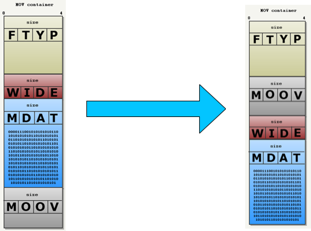


Es posible aplicar _faststart_ sin tener que recodificar el vídeo, simplemente tenemos que reordenar los datos. Podemos aplicarlo con `ffmpeg`:

```bash
ffmpeg -movflags faststart
```

También existen herramientas como _QT Index Swapper_ (http://renaun.com/blog/code/qtindexswapper/) que nos permiten realizar este cambio.

### Desventajas de la descarga progresiva

Con la descarga progresiva podemos reproducir un vídeo conforme se descarga del servidor, sin tener que esperar a que finalice la descarga, y pudiendo utilizar cualquier servidor web para su publicación.

Sin embargo, mientras estemos viendo el vídeo el fichero se descargará normalmente a una velocidad mayor a la velocidad de reproducción. Esto puede suponer que viendo unos pocos segundos de vídeo hayamos descargado una gran cantidad de datos. Esto puede ser un problema importante cuando accedamos a vídeo desde la red de datos móviles, que tiene un límite de descarga acotado. Por lo tanto, para vídeos de gran tamaño deberemos evitar este práctica.

Por ejemplo, aquellas aplicaciones iOS que accedan mediante descarga progresiva a vídeos de más de 10 minutos o más de 5Mb a través de la red de datos móviles serán rechazadas por Apple y no podrán ser publicadas en la App Store. En estos casos deberemos acceder a los vídeos mediante _streaming_

## _Streaming_

Los sistemas de _streaming_ consisten en enviar al cliente pequeños fragmentos de vídeo conforme estos se necesiten para la reproducción. En el cliente se recibirán y se reproducirán estos fragmentos pero, al contrario que en el caso de la descarga progresiva, el vídeo completo no se descargará en el dispositivo. Los fragmentos se irán desechando conforme no se necesiten. De este modo el dispositivo descargará sólo los datos de vídeo que se estén reproduciendo, y no el fichero entero.

Deberemos utilizar un sistema de _streaming_ en los siguientes casos:

* Cuando tengamos **Vídeo Bajo Demanda (VOD)** con ficheros de gran tamaño. Servirlos mediante _streaming_ hará que sólo se descargue lo que se vaya a reproducir. Si no se reproduce el vídeo entero, no tendrá que bajar todo el fichero.
* Cuando tengamos emisiones de **vídeo en directo**. En este caso es imposible enviar el vídeo mediante un fichero, ya que el fichero se está grabando en este momento. Lo único que se puede enviar son los fragmentos del vídeo conforme estos son capturados.

### Protocolos de _streaming_

Existen diferentes protocolos para ofrecer vídeo mediante _streaming_:

* RTSP (_Real Time Streaming Protocol_): Funciona como un reproductor de vídeo, con comandos para reproducir, pausar y parar. En lugar de tener comandos como `GET` o `POST` de HTTP, tenemos otros comandos como `PLAY`, `PAUSE` o `STOP``. Fue desarrollado por _RealNetworks_.
* RTMP: Protocolo propietario desarrollado por Macromedia/Adobe, e implementado en _Flash Media Server_. La especificación hizo pública en 2009, permitiendo así integrarlo en otras redes de distribución de contenidos (CDNs). Este protocolo fue diseñado para emitir vídeo Flash, y se utiliza por ejemplo en aplicaciones como YouTube. Encapsula vídeo FLV y audio MP3 o AAC.
* HLS (_HTTP Live Streaming_): Procolo desarrollado por Apple. Es el sistema que Apple recomienda y el que debemos utilizar en las aplicaciones iOS. Se basa en particionar los vídeos en una serie de pequeños fragmentos, y publicarlos en un servidor web HTTP convecional.

La mayor diferencia entre los protocolos anteriores es que tanto RTSP como RTMP requieren servidores especiales, sin embargo, HLS puede funcionar sobre cualquier servidor web al funcionar sobre HTTP. Esto tiene también la ventaja de que HLS tendrá una mayor compatibilidad con los distintos nodos de la red (_gateways_, _routers_, etc).

RTMP tiene la ventaja de que soporta _multicast_ (un mismo _stream_ sirve para varios clientes), cosa que HTTP lo permite. Además, RTMP es más granular. Envía pequeños paquetes, y permite reanudar el vídeo en el lugar que se quedó con mayor precisión. Para utilizar RTMP será recomendable utilizar las tecnlogías Adobe Air.

A continuación mostramos la compatibilidad de cada protocolo con las diferentes plataformas móviles:

* HLS: iOS y Android 3.0 o superior.
* RTSP: Android.
* RTMP: Adobe Air (multiplataforma)

### _HTTP Live Streaming_

_HTTP Live Streaming_ es un protocolo de _streaming_ desarrollado por Apple que se basa en segmentar el vídeo en pequeños fragmentos, y publicarlos en un servidor web ordinario para su descarga mediante HTTP.

Podrá utilizarse tanto para VOD como para emisiones en directo. Simplemente necesitaremos una aplicación que codifique y segmente el vídeo. En caso del VOD, podremos segmentar el vídeo _offline_ y copiar los fragmentos al servidor web. El caso de tener vídeo en directo, deberemos codificar, generar segmentos, y publicarlos en el servidor conforme se realiza la captura del vídeo.

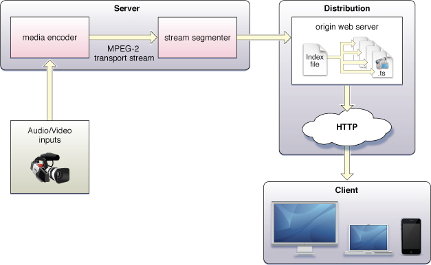


Apple nos proporciona las herramientas `mediafilesegmenter` y `mediastreamsegmenter` que nos permiten segmentar VOD y vídeo en directo respectivamente. También podremos hacerlo mediante aplicaciones como VLC o `ffmpeg`.

### Formato de vídeo en HLS

En HLS el vídeo se particiona en una serie de segmentos con las siguientes características:

* Formato de fichero `.ts`
* Vídeo H.264
* Audio AAC

Todos estos segmentos se integran mediante un índice (_playlist_) con formato `M3U8`. Esta _playlist_ tiene la siguiente estructura:

```
#EXTM3U
#EXT-X-TARGETDURATION:10
#EXT-X-MEDIA-SEQUENCE:1
#EXTINF:10,
http://media.example.com/segment0.ts
#EXTINF:10,
http://media.example.com/segment1.ts
#EXTINF:10,
http://media.example.com/segment2.ts
#EXT-X-ENDLIST
```

En este caso tenemos un vídeo con 3 segmentos, cada uno de ellos de 10 segundos de duración. Para publicar el vídeo, tendremos que publicar en el servidor web los segmentos y la _playlist_:

* segment0.ts
* segment1.ts
* segment2.ts
* video.m3u8

El vídeo completo tendrá por lo tanto una duración se 30 segundos. Para reproducir el vídeo deberemos especificar la dirección donde está el _playlist_. Por ejemplo, si tenemos la _playlist_ publicada en `http://media.example.com/video.m3u8`, bastará con introducir esta URL en Safari para reproducirlo.

En caso de tener VOD bastará con segmentar el vídeo con alguna herramienta y publicar los ficheros generados en un servidor web. Para emisiones en directo deberemos tener ejecutándose la herramienta de segmentación, que irá generando segmentos del vídeo capturado y los irá publicando en el servidor, modificando la _playlist_ en cada momento.

### Generación de HLS con `ffmpeg`

Podemos utilizar la herramienta `ffmpeg` para generar vídeo HLS. A continuación mostramos ejemplos para generar vídeo con diferentes perfiles de calidad.

Perfil bajo:

```bash
ffmpeg -i entrada.mp4 -c:a aac -ac 1 -b:a 32k -ar 22050
       -c:v h264 -profile:v baseline -level 3.0 -b:v 200K -r 12 -g 36
       -f hls -hls_time 10 -hls_list_size 999 -s 320x180 low.m3u8
```

Perfil medio:

```bash
ffmpeg -i entrada.mp4 -c:a aac -ac 2 -b:a 64k -ar 44100
       -c:v h264 -profile:v baseline -level 3.1 -b:v 600K -r 24 -g 72
       -f hls -hls_time 10 -hls_list_size 999 -s 640x360 medium.m3u8
```

Perfil alto:

```bash
ffmpeg -i entrada.mp4 -c:a aac -ac 2 -b:a 96k -ar 44100
       -c:v h264 -profile:v main -level 3.1 -b:v 1500K -r 24 -g 72
       -f hls -hls_time 10 -hls_list_size 999 -s 1280x720 high.m3u8
```

### _Bitrate_ adaptativo (ABR)

En el caso anterior hemos creado diferentes versiones del vídeo HLS dirigidas a distintos anchos de banda. Este protocolo nos permite integrar todas estas versiones en una única _playlist_, para que así el sistema seleccione la más adecuada en función del ancho de banda disponible. De esta forma, si empezamos con un perfil de alta calidad y a mitad se produce una caída del ancho de banda en la conexión, automáticamente saltará a una versión con una calidad adecuada al nuevo ancho de banda disponible.

Tendremos lo que se conoce como una _variant playlist_. En ella indicamos las distintas _playlists_ disponibles para las diferentes versiones, y el ancho de banda mínimo necesario para cada una de ellas:

```
#EXTM3U

#EXT-X-STREAM-INF:PROGRAM-ID=1,BANDWIDTH=200000
low.m3u8

#EXT-X-STREAM-INF:PROGRAM-ID=1,BANDWIDTH=600000
medium.m3u8

#EXT-X-STREAM-INF:PROGRAM-ID=1,BANDWIDTH=1500000
high.m3u8
```


Podemos generar con `ffmpeg` directamente una _variant playlist_ a partir de un vídeo de la siguiente forma:

```bash
VIDSOURCE="video.mp4"
RESOLUTION="854x480"
BITRATE1="800000"
BITRATE2="600000"
BITRATE3="400000"

AUDIO_OPTS="-c:a libfaac -b:a 160000 -ac 2"
VIDEO_OPTS1="-s $RESOLUTION -c:v libx264 -b:v $BITRATE1 -vprofile baseline -preset medium -x264opts level=41"
VIDEO_OPTS2="-s $RESOLUTION -c:v libx264 -b:v $BITRATE2 -vprofile baseline -preset medium -x264opts level=41"
VIDEO_OPTS3="-s $RESOLUTION -c:v libx264 -b:v $BITRATE3 -vprofile baseline -preset medium -x264opts level=41"
OUTPUT_HLS="-hls_time 3 -hls_list_size 10 -hls_wrap 30 -start_number 1"

ffmpeg -i "$VIDSOURCE" -y -threads 4 \
       $AUDIO_OPTS $VIDEO_OPTS1 $OUTPUT_HLS alto.m3u8 \
       $AUDIO_OPTS $VIDEO_OPTS2 $OUTPUT_HLS medio.m3u8 \
       $AUDIO_OPTS $VIDEO_OPTS3 $OUTPUT_HLS bajo.m3u8
```


## Servidores de _streaming_

Existen diferentes servidores y servicios en la nube que nos permiten emitir vídeo bajo demanda y en directo en diferentes formatos, dando soporte a la práctica totalidad de dispositivos actuales.

Encontramos por ejemplo servicios en la nube como Zencoder (http://zencoder.com) y VideoCloud (http://videocloud.brightcove.com/).

También encontramos servidores que podemos instalar en nuestro propio equipo como Wowza Media Server (http://wowza.com/). Vamos a centrarnos en estudiar el uso de este servidor.

### Configuración de Wowza Media Server

Para poder utilizar Wowza Media Server deberemos seguir los siguientes pasos:

* El primer lugar debemos configurar un usuario y password para acceder al servidor. Para ello editamos el fichero `/Library/WowzaStreamingEngine/conf/admin.password` y añadimos la siguiente linea:
```
admin mastermoviles
```
Con esto habremos creado un usuario `admin` con _password_ `mastermoviles`.

* Iniciamos el servidor, entrando en _Aplicaciones > Wowza Streaming Engine_ y seleccionando _Start Standalone Mode_

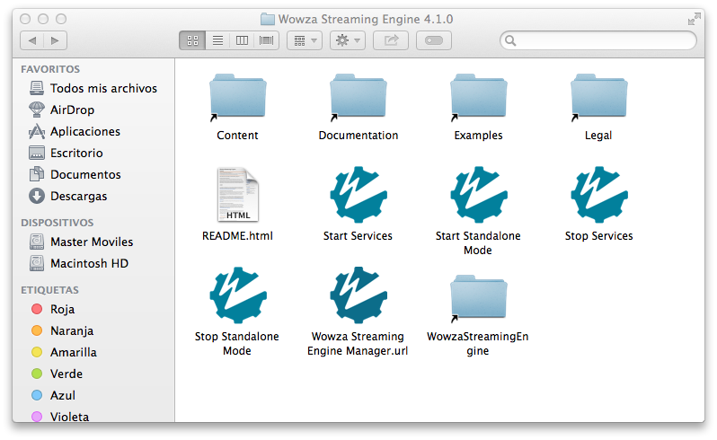

* Podremos acceder al servidor desde un navegador utilizando la dirección `http://localhost:8088`. La primera vez que accedamos veremos la siguiente pantalla de bienvenida:

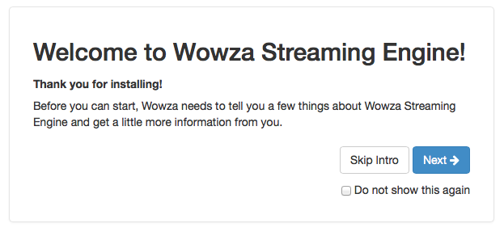

* Pulsamos en _Next_, y nos mostrará el _workflow_ del servidor:

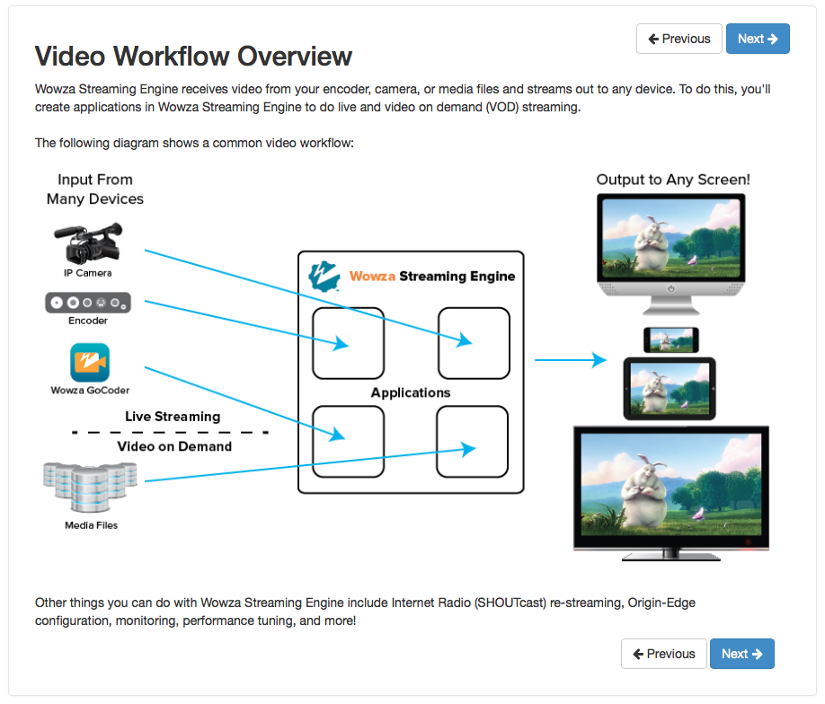

* Pulsamos de nuevo en _Next_, y nos pedirá que introduzcamos los datos del usuario administrador del servidor. Introduciremos los datos que configuramos en el primer paso:

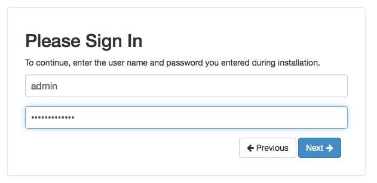

* A continuación nos pedirá que demos de alta un usuario con perfil de _publisher_. Este usuario será necesario para poder emitir video en directo a través del servidor:

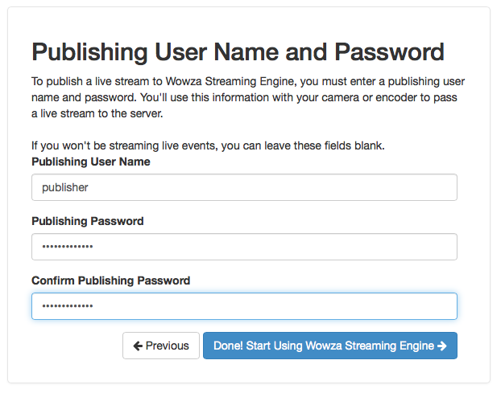

* Una vez creado ese usuario, veremos la pantalla principal de Wowza. Esto es lo que veremos las próximas veces que arranquemos Wowza, al estar ya configurado:

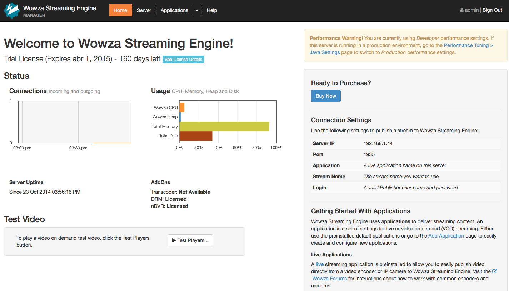

### Publicación de contenido VOD

Una vez configurado el servidor podremos añadir tanto emisiones en directo como contenido bajo demanda (VOD). Vamos a centrarnos en primer lugar en la forma de añadir contenido VOD.

Para añadir este tipo de contenido simplemente tenemos que copiar los videos que queramos publicar a la carpeta de contenido (_Content_) del servidor.

* Tenemos un enlace a esta carpeta desde el directorio principal de la aplicación:


* Entramos en la carpeta `Content`, y copiaremos en ella todos los vídeos que queramos publicar:

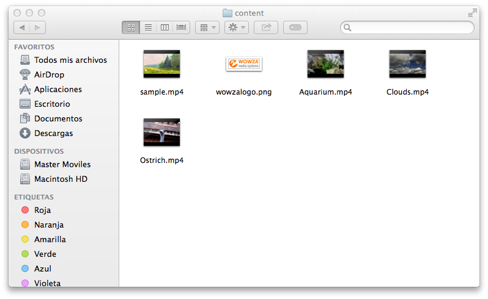

* Una vez hecho esto, podremos acceder al contenido desde la web de Wowza. Para ello desde la página principal del servidor pulsaremos sobre _Applications > vod_:

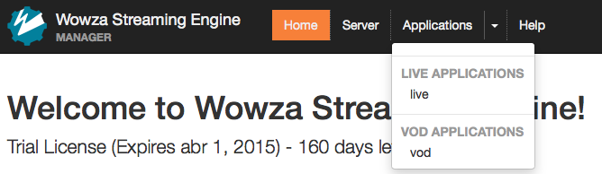

* Con esto entraremos en la aplicación de VOD. En esta aplicación veremos un botón con el texto _Test Players_ que nos permitirá acceder a una serie de reproductores de prueba para los vídeos publicados en la aplicación de VOD. Pulsando sobre este botón accederemos a ellos, y por ejemplo entraremos en el reproductor _Apple HLS_. Aquí introducir el nombre del fichero que queramos reproducir y verlo en el reproductor de prueba:

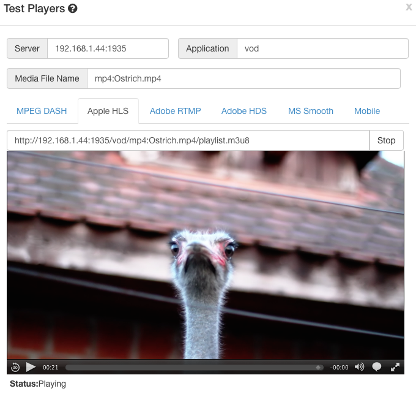

* En la pestaña _Mobile_ el servidor nos mostrará los enlaces mediante los cuales podríamos reproducir los vídeos vía _streaming_ en dispositivos móviles iOS y Android, mediante HLS y RTSP respectivamente:

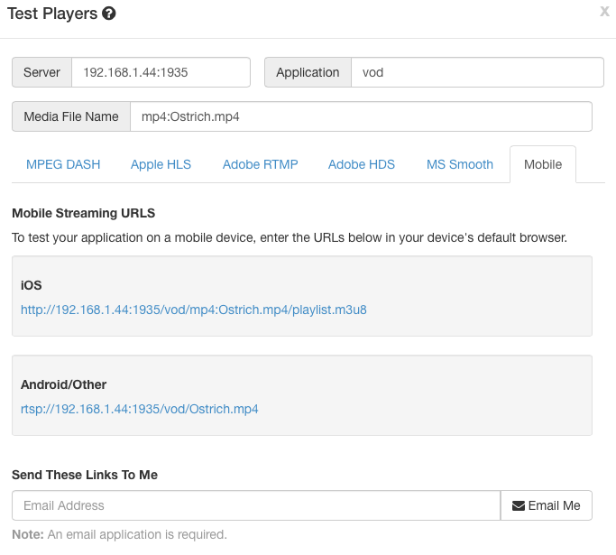

Si abrimos estos enlaces desde el navegador de dispositivos que estén en una red desde la que tengan visibilidad de la IP del servidor podremos ver los vídeos publicados.

### Acceso a Wowza mediante SSL

A partir de iOS 9 sólo se permite establecer conexiones mediante SSL (`https`) por motivos de seguridad. Aunque podemos añadir excepciones en nuestra aplicaciones para poder seguir accediendo mediante `http`, no es recomendable hacerlo. Vamos a ver a continuación la forma de configurar Wowza para poder acceder a los contenidos multimedia mediante SSL tal como se recomienda a partir de iOS 9.

Para poder configurar `https` en Wowza deberemos crearnos un certificado cuyo nombre (`CN`) coincida con el dominio a proteger. Por ejemplo, si nuestro contenido va a estar en `eps.ua.es`, deberemos crear un certificado con `CN=eps.ua.es`. Esto nos serviará para aseguramos de que no se está suplantando al servidor. Además, nuestro certificado deberá estar firmado por una autoridad de certificación (CA), como por ejemplo Verisign o Thawte. 
Como alternativa, veremos también la posibilidad de convertirnos nosotros mismos en "autoridad de certificación", aunque en ese caso deberemos proporcionar al usuario nuestro certificado raíz para que lo instale en su dispositivo como certificado de confianza.

Una vez creado el certificado, se incluirá en Wowza y se habilitará un puerto de acceso mediante SSL utilizando dicho certificado. 

Vamos a ver a continuación cómo realizar esta configuración paso a paso:

#### Creación del certificado

En primer lugar debemos crear el certificado para nuestro sitio web. Imaginemos que queremos proteger el sitio `mastermoviles.eps.ua.es`, donde tendremos instalado un servidor Wowza, y acceder a él mediante SSL garantizando que no ha sido suplantado por otro. Crearemos un par de claves pública-privada para Wowza de la siguiente forma:

```bash
keytool -genkey -keysize 2048 -alias wowza -keyalg RSA -keystore mastermoviles.eps.ua.es.jks
```

En el asistente para la creación de las claves, cuando nos pregunte por el _Common Name_ (CN) es importante indicar `mastermoviles.eps.ua.es`, ya que debe coincidir con el dominio del sitio web a proteger. 

Una vez hecho esto, crearemos una solicitud de certificado (CSR) para nuestra clave:

```bash
keytool -certreq -file mastermoviles.eps.ua.es.csr -alias wowza -keyalg RSA -keystore mastermoviles.eps.ua.es.jks
```

Esta solicitud podrá ser enviada a una autoridad de certificación para que nos proporcionen un certificado firmado por ellos correspondiente a nuestro par de claves. Como alternativa, vamos a ver cómo convertirnos en "autoridad de certificación" creando un certificado raíz autofirmado.

#### Autofirmar nuestro certificado

Si optamos por solicitar nuestro certificado firmado a una autoridad de certificación (CA) existente no será necesario realizar este paso. 

En caso de trabajar en un ámbito de pruebas, o en un proyecto de ámbito cerrado, puede ser conveniente firmar nosotros mismos nuestro certificado, en lugar de solicitarlo a una CA, aunque en este caso a quienes conecten a nuestro sitio web les aparecerá como "No seguro", a no ser que se instalen y confíen en nuestro certificado raíz autofirmado.

Para crear este certificado autofirmado en primer lugar creamos el par de claves:

```bash
openssl genrsa -out eps.ua.es.key 2048
```

Tras esto, generamos el certificado autofirmado:

```bash
openssl req -x509 -sha256 -new -key eps.ua.es.key -out eps.ua.es.cer -days 730 -subj /CN=“eps.ua.es”
```

Este certificado deberá difundirse entre todos los que vayan a utilizar nuestra aplicación, para que lo instalen en sus dispositivos como certificado raíz de confianza. De no ser así, los certificados que firmemos con él tampoco serán validos.

Una vez tenemos el certificado raíz autofirmado, podemos firmar con él el certificado para nuestro sitio web:

```bash
openssl x509 -req -in mastermoviles.eps.ua.es.csr -out mastermoviles.eps.ua.es.cer -CAkey eps.ua.es.key -CA eps.ua.es.cer -days 365 -CAcreateserial -CAserial serial
```

Con esto obtenemos un certificado firmado por nosotros mismos. Si hubiésemos recurrido a una CA, nos habría proporcionado también este mismo fichero `cer`, pero en ese caso firmado por un certificado raíz en el que ya confían los diferentes dispositivos. 

####

Una vez tenemos nuestro certificado firmado por una CA (o por un certificado raíz nuestro autofirmado), deberemos importar el certificado de la CA y nuestro certificado firmado por ella en nuestro almacén de claves. 

En caso de haber creado un certificado raíz autofirmado, lo importamos en nuestro almacén de claves. En caso de haber obtenido el certificado de una CA, en su lugar importaremos el certificado puente de dicha CA:

```bash
keytool -import -alias root -trustcacerts -file eps.ua.es.cer -keystore mastermoviles.eps.ua.es.jks
```


## Ejercicios

### Creación e un _podcast_

Para publicar el podcast puedes utilizar el servidor web Apache incluido en MacOS. Para arrancar el servidor introduciremos el siguiente comando en un _Terminal_:

```bash
sudo -s launchctl load -w /System/Library/LaunchDaemons/org.apache.httpd.plist
```

Podemos comprobar que el servidor está en marcha accediendo en un navegador a la dirección http://localhost. Veremos el texto _It works!_.

Los contenidos deberán publicarse en el directorio `/Library/WebServer/Documents`. Podemos abrirlo desde Finder con _Ir > Ir a la carpeta …_.

Una vez hayamos terminado de trabajar con el servidor podemos pararlo con:

```bash
sudo -s launchctl unload -w /System/Library/LaunchDaemons/org.apache.httpd.plist
```

Para la realización puedes partir de la plantilla que encontrarás en la documentación oficial:   http://www.apple.com/es/itunes/podcasts/specs.html

Se pide:

* Crea un podcast con sólo el primer episodio que encontrarás en los recursos de la sesión (o cualquier otro fichero). Pon tu nombre como autor/a, y modifica el título del _podcast_ y del episodio. Publica el _podcast_ en Jetty y accede a él con iTunes.

* Añade al podcast dos episodios más (puedes utilizar los ficheros proporcionados o recursos propios). Comprueba ahora cómo se actualiza la información del _podcast_ en iTunes.

### Prueba de _faststart_

Vamos a probar el efecto de utilizar o no _faststart_ en un vídeo MP4. Se pide:

* Descarga de los recursos de la sesión el fichero _Video sin faststart_ y publícalo en el servidor web que utilizaste en el ejercicio anterior.

* Abre el fichero con un editor de texto o hexadecimal. ¿Dónde está el bloque `moov`? Si cuentas con un dispositivo móvil Android o emulador con una versión previa a la 2.2, accede a la URL del vídeo desde su navegador. ¿Qué ocurre?

* Modificar el vídeo con `ffmpeg` para añadir _faststart_.
```bash
ffmpeg -i video.mp4 -c:a copy -c:v copy -movflags faststart video_fs.mp4
```

* Abre el fichero con un editor y busca el bloque `moov` de nuevo. ¿Dónde está ahora? Publica el vídeo modificado y vuelve a probarlo desde el navegador del móvil. ¿Qué ocurre ahora?


