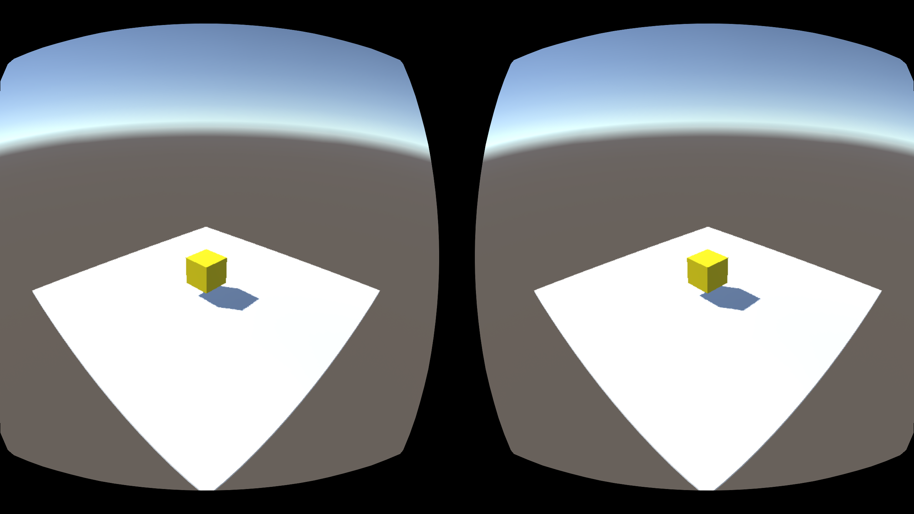

# El motor Unity

**Unity** es un motor genérico para la creación de videojuegos 2D y 3D enfocado hacia el desarrollo casual. La curva de aprendizaje del motor es bastante suave, especialmente si lo comparamos con motores más complejos como Unreal Engine 4, y nos permitirá realizar un desarrollo rápido de videojuegos. Esta característica hace este motor muy apropiado también para crear rápidamente prototipos de nuestros juegos.

A partir de la versión Unity 5, existen dos ediciones: _Personal_ y _Profesional_. La primera es gratuita e incluye todas las funcionalidades del motor. La segunda incluye funcionalidades adicionales de soporte (construcción en la nube, herramientas de trabajo en equipo, etc), y es de pago (suscripción de $75 o pago único de $1.500). La versión _Personal_ podrá ser utilizada por cualquier individuo o empresa cuyas ganancias anuales no superen los $100.000.

Uno de los puntos fuertes de Unity es la posibilidad de exportar a gran cantidad de plataformas. Soporta las **plataformas móviles iOS, Android, Windows Phone y Blackberry**, y además también permite exportar a web (WebGL), a videoconsolas (PS4, PS3, PS Vita, Xbox One, Xbox 360, Wii U, etc) y a ordenadores (Mac, Windows y Linux). 


## Introducción a Unity

### El editor de Unity

Unity incorpora su propia herramienta integrada para la creación de videojuegos, que nos permite incluso crear algunos videojuegos de forma visual sin la necesidad de programar. 

Dentro del entorno del editor de Unity encontramos diferentes paneles, de los cuales destacamos los siguientes:

* **Project**: Encontramos aquí todos los recursos (_assets_) que componen nuestro proyecto. Estos recursos pueden ser por ejemplo texturas, _clips_ de audio, _scripts_, o escenas. Destacamos aquí el _asset_ de tipo **escena**, que es el componente que nos permite definir cada estado (pantalla) del juego. Al hacer doble _click_ sobre una escena se abrirá para trabajar con ella desde el editor.
* **Hierarchy**: La escena está formada por una serie de nodos (_game objects_) organizados de forma jerárquica. En este panel vemos el árbol de objetos que contiene la escena abierta actualmente. Podemos seleccionar en ella cualquier objeto pulsando sobre su nombre.
* **Scene**: En este panel vemos de forma visual los elementos de la escena actual. Podremos movernos libremente por el espacio 3D de la escena para ubicar de forma correcta cada _game object_ y tener una previsualización del escenario del juego.
* **Inspector**: Muestra las propiedades del _game object_ o el _asset_ seleccionado actualmente en el entorno. 
 
 

 
### Arquitectura Orientada a Componentes

Como hemos comentado, **todos** los elementos de la escena son objetos de tipo `GameObject` organizados de forma jerárquica. Todos los objetos son del mismo tipo, independientemente de la función que desempeñen en el juego. Lo que diferencia a unos de otros son los _componentes_ que incorporen. Cada objeto podrá contener varios componentes, y estos componentes determinarán las funciones del objeto.

Por ejemplo, un objeto que incorpore un componente `Camera` será capaz de renderizar en pantalla lo que se vea en la escena desde su punto de vista. Si además incorpora un componente `Light`, emitirá luz que se proyectará sobre otros elementos de la escena, y si tiene un componente `Renderer`, tendrá un contenido gráfico que se renderizará dentro de la escena. 

Esto es lo que se conoce como **Arquitectura Basada en Componentes**, que nos proporciona la ventaja de que las funcionalidades de los componentes se podrán reutilizar en diferentes tipos de entidades del juego. Es especialmente útil cuando tener un gran número de diferentes entidades en el juego, pero que comparten módulos de funcionalidad.

En Unity esta arquitectura se implementa mediante agregación. Si bien en todos los objetos de la escena son objetos que heredan de `GameObject`, éstos podrán contener un conjunto de componentes de distintos tipos (`Light`, `Camera`, `Renderer`, etc) que determinarán el comportamiento del objeto.

En el inspector podremos ver la lista de componentes que incorpora el objeto seleccionado actualmente, y modificar sus propiedades:


En esta figura anterior podemos observar que el objeto (`GameObject`) que contiene la cámara del juego contiene los siguientes componentes:

* `Transform`: Le da a la cámara una posición y orientación en la escena.
* `Camara`: Hace que se comporte como cámara. Capta lo que se ve en la escena desde su posición y lo renderiza en pantalla o en una textura.
* `GUILayer`: Permite introducir sobre la imagen renderizada elementos de la GUI (etiquetas de texto, botones, etc).
* `FlareLayer`: Permite crear sobre la imagen renderizada un efecto de _destello_.
* `AudioListener`: Escucha lo que se oye en la escena desde la posición de la cámara y lo reproduce a través de los altavoces.

Podemos modificar los componentes, añadiendo o eliminando según nos convenga. Podemos **eliminar** un componente pulsando sobre su cabecera en el inspector con el botón derecho y seleccionando _Remove Component_. También podemos añadir componentes pulsando sobre el botón _Add Component_ que encontramos en la parte inferior del inspector. Por ejemplo, podríamos añadir a la cámara un componente que haga que podamos moverla por el escenario pulsando determinadas teclas, o podríamos eliminar el componente _Audio Listener_ para no escuchar por los altavoces lo que se oiga en el lugar de la cámara (en su lugar podríamos optar por ponerle este componente a nuestro personaje, para reproducir lo que se oiga desde su posición en la escena).


## La escena 3D

El el editor de Unity veremos la escena con la que estemos trabajando actualmente, tanto de forma visual (_Scene_) como de forma jerárquica (_Hierarchy_). Nos podremos mover por ella y podremos añadir diferentes tipos de objetos. 

### Posicionamiento de los objetos en la escena

Todos los _game objects_ incorporan al menos un componente `Transform` que nos permite situarlo en la escena, indicando su traslación, orientación y escala. Podremos introducir esta información en el editor, para así poder ajustar la posición del objeto de forma precisa. 

También podemos mover un objeto de forma visual desde la vista _Scene_. Al seleccionar un objeto, bien en _Scene_ o en _Hierarchy_, veremos sobre él en _Scene_ una serie de ejes que nos indicarán que podemos moverlo. El tipo de ejes que se mostrarán dependerá del tipo de transformación que tengamos activa en la barra superior:


Las posibles transformaciones son:

* **Traslación**: Los ejes aparecerán como flechas y nos permitirán cambiar la posición del objeto.
* **Rotación**: Veremos tres círculos alrededor del objeto que nos pemtirán rotarlo alrededor de sus ejes _x_, _y_, _z_. 
* **Escalado**: Veremos los ejes acabando en cajas, indicando que podemos escalar el objeto en _x_, _y_, _z_.

Si pinchamos sobre uno de los ejes y arrastramos, trasladaremos, rotaremos, o escalaremos el objeto sólo en dicha eje. Si pinchamos sobre el objeto, pero no sobre ninguno de los ejes, podremos trasladarlo, rotarlo y escalarlo en todos los ejes al mismo tiempo.

### Añadir _game objects_ a la escena

Podemos añadir a la escena nuevos _game objects_ seleccionando en el menú la opción _GameObject > Create Empty_, lo cual creará un nuevo objeto vacío con un único componente `Transform`, al que le deberíamos añadir los componentes que necesitásemos, o bien podemos crear objetos ya predefinidos mediante _GameObject > Create Other_. 

Entre los tipos de objetos predefinidos que nos permite crear, encontramos diferentes formas geométricas como _Cube_, _Sphere_, _Capsule_ o _Plane_ entre otras. Estas figuras pueden resultarnos de utilidad como objetos _impostores_ en primeras versiones del juego en las que todavía no contamos con nuestros propios modelos gráficos. Por ejemplo, podríamos utilizar un cubo que de momento haga el papel de nuestro personaje hasta que contemos con su modelo 3D.


Podremos **organizar de forma jerárquica** los objetos de la escena mediante la vista _Hierarchy_. Si arrastramos un _game object_ sobre otro en esta vista, haremos que pase a ser su hijo en el árbol de la escena. Los objetos vacíos con un único componente `Transform` pueden sernos de gran utilidad para agrupar dentro de él varios objetos. De esta forma, moviendo el objeto padre podremos mover de forma conjunta todos los objetos que contiene. De esta forma estaremos creando objetos compuestos.

También resulta de utilidad **dar nombre** a los objetos de la escena, para poder identificarlos fácilmente. Si hacemos _click_ sobre el nombre de un objeto en la vista _Hierarchy_ podremos editarlo y darle un nombre significativo (por ejemplo _Suelo_, _Pared_, _Enemigo_, etc).


### Navegación en la escena

Además de podemos añadir objetos a la escena y moverlos a diferentes posiciones, deberemos poder movernos por la escena para posicionarnos en los puntos de vista que nos interesen para crear el contenido. Será importante conocer una serie de atajos de teclado para poder movernos con fluidez a través de la escena.

Encontramos tres tipos de movimientos básicos para movernos por la escena en el editor:

* **Traslación lateral**: Hacemos _click_ sobre la escena y arrastramos el ratón.
* **Giro**: Pulsamos _Alt + click_ y arrastramos el ratón para girar nuestro punto de vista.
* **Avance**: Pultamos _Ctrl + click_ y arrastramos el ratón, o bien movemos la rueda del ratón para avanzar hacia delante o hace atrás en la dirección en la que estamos mirando.

Con los comandos anteriores podremos desplazarnos libremente sobre la escena, pero también es importante conocer otras forma más directas de movernos a la posición que nos interese:

* **Ver un objeto**: Si nos interesa ir rápidamente a un punto donde veamos de cerca un objeto concreto de la escena, podemos hacer doble _click_ sobre dicho objeto en la vista _Hierarchy_.
* **Alineación con un objeto**: Alinea la vista de la escena con el objeto seleccionado. Es especialmente útil cuando se utiliza con la cámara, ya que veremos la escena tal como se estaría bien desde la camara. Para hacer esto, seleccionaremos el _game object_ con el que nos queramos alinear y seleccionaremos la opción del menú _GameObject > Align View To Selected_.

## Interfaz de usuario

El sistema con el que cuenta Unity para crear la interfaz de usuario se introdujo a partir de la versión 4.6. Se trata de un sistema bastante versátil, que utilizado de forma adecuada nos permite crear interfaces como por ejemplo los menús o el HUD del juego que se adapten a diferentes tamaños y formas de pantalla.

Todo el contenido de la interfaz de usuario estará contenido en nuestra escena dentro de un elemento tipo `Canvas` (es decir, un _game object_ que cuente con un componente `Canvas`). Dentro de él ubicaremos todos los componentes de la interfaz, como por ejemplo imágenes, etiquetas de texto o botones. 

### Canvas

El `Canvas` será el panel 2D (_lienzo_) donde podremos crear el contenido de la interfaz de usuario. Los componentes de la interfaz siempre deberán estar dentro de un `Canvas` en la jerarquía de la de escena. Si intentamos arrastrar sobre la escena un componente de la UI sin un `Canvas`, el `Canvas` se creará de forma automática.


Una propiedad importante del componente `Canvas` es _Render Mode_, que podrá tomar 3 valores:

* **Screen Space - Overlay**: El `Canvas` se dibuja sobre el contenido que aparece en pantalla, ajustándose siempre al tamaño de la misma.
* **Screen Space - Camera**: Similar a la anterior, pero en este caso debemos vincularlo a una cámara, indicando la distancia a la que estará el `Canvas` de la cámara seleccionada, y el `Canvas` se ajustará al tamaño que tenga el tronco de la cámara a dicha distancia. Se aplicarán sobre el `Canvas` los parámetros de la cámara seleccionada.
* **World Space**: En este caso el `Canvas` se comportará como cualquier otro objeto 3D en la escena. Le daremos un tamaño fijo al panel y lo situaremos en una posición del mundo. Así podremos tener interfaces con las que podamos interactuar en nuestro mundo 3D.

> En la previsualización de la escena, cuando tengamos un `Canvas` de tipo _Screen Space_ es posible que lo veamos de un tamaño mucho mayor que el resto de elementos de la escena. Esto se debe a que las unidades con las que trabaja internamente el `Canvas` son _pixels_ en pantalla, mientras que es habitual que los elementos de la escena tengan dimensiones de alrededor de una unidad. Al ejecutar el juego no habrá ningún problema ya que el `Canvas` se ajustará al tamaño de la pantalla o de la cámara.

### Elementos de la UI


### Posicionamiento en el espacio de la UI


### Escalado del Canvas

Normalmente en nuestro `Canvas` encontraremos un componente adicional que es el `CanvasScaler`. Se trata de un elemento importante a la hora de conseguir interfaces adaptables, ya que nos permite personalizar la forma en la que se escala el contenido del `Canvas` a distintos tamaños de pantalla.

Podemos optar por tres modos:

* **Constant Pixel Size**
* **Scale With Screen Size**
* **Constant Physical Size**


## Realidad Virtual

Existen diferentes dispositivos de realidad virtual, que nos proporcionan una inmersión casi total en la escena, reflejando en la cámara los movimientos de nuestra cabeza, y proporcionando una visión estereoscópica de la escena. Entre los dispositivos más famosos se encuentran Oculus Rift, Samsung Gear VR y Google Cardboard. Aunque todos estos dispositivos proporcionan su propio SDK que podemos integrar en las plataformas nativas de desarrollo, es de especial interés su integración en el entorno Unity, que nos permitirá realizar aplicaciones que los soporten de forma casi inmediata. A continuación veremos cómo utilizarlos con este entorno.

### Oculus Rift / Samsung Gear VR

A partir de Unity 5.1 encontramos en este entorno soporte nativo para los dispositivos Oculus Rift y Samsung Gear VR. Ambos utilizan el mismo SDK y herramientas, con la diferencia de que Oculus Rift funciona sobre plataformas de sobremesa, mientras que Samsung Gear VR funciona sobre móviles Samsung. 

Para activar el soporte para estos dispositivos en Unity simplemente tendremos que entrar en _Player Settings_ (_Edit > Project Settings > Player_) y bien dentro de la plataforma _Standalone_ (para Oculus Rift) o _Android_ (para Samsung Gear VR) marcar la casilla _Virtual Reality Supported_, dentro de la sección _Other Settings > Rendering_.


Una vez hecho esto, automáticamente la cámara de la escena se comportará como una cámara VR, girando cuando giremos la cabeza y renderizando una imagen para cada ojo, para así proporcionar visión estéreo. 

#### Despliegue de la aplicación en un dispositivo de prueba

Antes de desplegar la aplicación en un dispositivo de prueba, deberemos añadir una firma que nos deberá proporcionar Oculus para nuestro dispositivo concreto. Dicha firma sólo se necesitará durante el desarrollo, cuando la aplicación se publique ya no hará falta.

Para conseguir la firma en primer lugar necesitamos obtener el ID de nuestro dispositivo. Para ello lo conectaremos al sistema y ejecutaremos el comando:

```bash
adb devices
```

En la lista de dispositivos en la primera columna veremos los IDs que buscamos, con el siguiente formato:

```
* daemon started successfully *
1235ba5e7a311272	device
```

En este caso, el ID que buscamos sería `1235ba5e7a311272`. Una vez localizado dicho ID, iremos a la siguiente página para solicitar la firma e introduciremos el ID (necesitaremos registrarnos previamente como usuarios de Oculus Developer, si no tenemos cuenta todavía):

[https://developer.oculus.com/osig/](https://developer.oculus.com/osig/)

Una vez introducido el ID nos descargará un fichero `.osig` que deberá ser introducido en nuestro proyecto de Unity en el siguiente directorio:

```
Assets/Plugins/Android/assets
```

Esto lo que hará será colocar dicho fichero en el directorio `assets` del proyecto Unity resultante. Una vez hecho esto ya podremos probar la aplicación en un dispositivo Samsung con Gear VR seleccionando la plataforma _Android_ y pulsando sobre _Build & Run_. 

Al desplegar la aplicación en el móvil Samsung, veremos que al ejecutarla nos pide conectar el dispositivo Gear VR al móvil. Una vez conectado, se ejecutará la aplicación y podremos ver nuestra escena de Unity de forma inmersiva.


Sin embargo, veremos que la imagen aparece algo distorsionada al verla a través de las lentes del Gear VR. Esto se debe a que aunque la cámara renderiza en estéreo y responde al movimiento de la cabeza, no se realiza la corrección adecuada a la imagen para verla a través de las lentes del Gear VR.

#### Utilidades de Oculus

Aunque la cámara de Unity puede ser utilizada para aplicaciones de VR, hemos visto que tiene algunas carencias como por ejemplo el no realizar una corrección de la distorsión que realiza la lente. 



Para poder resolver estas carencias y tener la posibilidad de configurar e implementar diferentes componentes de la aplicación VR, Oculus proporciona una serie de utilidades en forma de paquete de _assets_ para Unity que podemos descargar desde su web:

[https://developer.oculus.com/downloads/](https://developer.oculus.com/downloads/)

Desde esta página podremos bajar tanto versiones actualizadas del _plugin_ de Oculus/Gear para Unity (_OVR Plugin for Unity 5_) como las utilidades adicionales (_Oculus Utilities for Unity 5_). 

Para instalar el _plugin_ simplemente tendremos que buscar dentro del directorio de instalación de Unity el directorio `VR` (en caso de MacOS tendremos que mirar dentro del contenido del paquete `Unity` para localizar dicho directorio), y dentro de él sustituir el directorio `oculus` y todo su contenido por el proporcionado por el _plugin_.

Una vez actualizado el _plugin_ podremos añadir las _utilities_ cargándolo en el proyecto como paquete de _assets_. 

Uno de los _assets_ más útiles es el _prefab_ `OVRCameraRig`. Podemos utilizarlo en la escena en lugar de la cámara de Unity, y nos permitirá configurar diferentes propiedades de la cámara en la escena 3D, como por ejemplo la distancia entre los ojos. Además, aplicará de forma correcta la corrección a la distorsión introducida por las lentes.


#### Modo de desarrollador

En los casos anteriores hemos probado la aplicación con el dispositivo Gear VR. Sin embargo, durante el desarrollo nos podría interesar poder probar la aplicación en el móvil sin la necesidad de tener que conectarlo al Gear VR.

Podemos conseguir esto activando el modo desarrollador de Gear VR en el dispositivo móvil Samsung. Para poder hacer esto antes deberemos haber instalado alguna aplicación nuestra con la firma `osig`, en caso contrario no nos permitirá activarlo.

Para activar el modo de desarrollador de Gear VR deberemos entra en _Ajustes > Aplicaciones > Administrador de aplicaciones > Gear VR Service > Almacenamiento > Administrar almacenamiento_ y pulsar repetidas veces sobre _VR Service Version_. Tras hacer esto nos aparecerán opciones para activar el modo de desarrollador.


Con este modo activo podremos lanzar la aplicación en el móvil sin tener que conectar el dispositivo Gear VR, lo cual agilizará el desarrollo. Esta forma de probar la aplicación tendrá la limitación de que no reconocerá el giro de la cámara, ya que los sensores que utilizan estas aplicaciones para obtener la inclinación de la cabeza van integrados en el dispositivo Gear VR.


### Google Cardboard

Unity no incluye soporte nativo para Google Cardboard, pero podemos encontrar un _plugin_ muy sencillo de utilizar en la web oficial:

[https://developers.google.com/cardboard/unity](https://developers.google.com/cardboard/unity)

El plugin consiste en un paquete de _assets_ que podemos incluir en nuestro proyecto (deberemos añadir todo su contenido).

La forma más sencilla de añadir soporte para Cardboard es añadir a nuestra cámara el _script_ `StereoController`:


<!--
## Assets

### Prefabs

### Paquetes de assets

### Asset Store

## Scripting

### Creación de scripts

### Estructura de un script

### Ciclo del juego

### Acceso a los componentes y polimorfismo

### Interfaz pública del script

### Búsqueda de objetos

### Creación y destrucción de objetos

### Corrutinas

## Controles multiplataforma

### Controles predefinidos en pantalla

## Patrones de diseño

### Controlador de la escena

### Comunicación entre componentes

### Patrón delegado

### Sistema de eventos

### Patrón singleton

-->