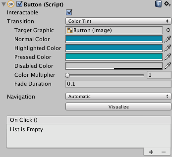

IOS.# El motor Unity

**Unity** es un motor genérico para la creación de videojuegos 2D y 3D enfocado hacia el desarrollo casual. La curva de aprendizaje del motor es bastante suave, especialmente si lo comparamos con motores más complejos como Unreal Engine 4, y nos permitirá realizar un desarrollo rápido de videojuegos. Esta característica hace este motor muy apropiado también para crear rápidamente prototipos de nuestros juegos.

A partir de la versión Unity 5, existen dos ediciones: _Personal_ y _Profesional_. La primera es gratuita e incluye todas las funcionalidades del motor. La segunda incluye funcionalidades adicionales de soporte (construcción en la nube, herramientas de trabajo en equipo, etc), y es de pago (suscripción de $75 o pago único de $1.500). La versión _Personal_ podrá ser utilizada por cualquier individuo o empresa cuyas ganancias anuales no superen los $100.000.

Uno de los puntos fuertes de Unity es la posibilidad de exportar a gran cantidad de plataformas. Soporta las **plataformas móviles iOS, Android, Windows Phone y Blackberry**, y además también permite exportar a web (WebGL), a videoconsolas (PS4, PS3, PS Vita, Xbox One, Xbox 360, Wii U, etc) y a ordenadores (Mac, Windows y Linux). 


## Introducción a Unity

### El editor de Unity

Unity incorpora su propia herramienta integrada para la creación de videojuegos, que nos permite incluso crear algunos videojuegos de forma visual sin la necesidad de programar. 

Dentro del entorno del editor de Unity encontramos diferentes paneles, de los cuales destacamos los siguientes:

* **Project**: Encontramos aquí todos los recursos (_assets_) que componen nuestro proyecto. Estos recursos pueden ser por ejemplo texturas, _clips_ de audio, _scripts_, o escenas. Destacamos aquí el _asset_ de tipo **escena**, que es el componente que nos permite definir cada estado (pantalla) del juego. Al hacer doble _click_ sobre una escena se abrirá para trabajar con ella desde el editor.
* **Hierarchy**: La escena está formada por una serie de nodos (_game objects_) organizados de forma jerárquica. En este panel vemos el árbol de objetos que contiene la escena abierta actualmente. Podemos seleccionar en ella cualquier objeto pulsando sobre su nombre.
* **Scene**: En este panel vemos de forma visual los elementos de la escena actual. Podremos movernos libremente por el espacio 3D de la escena para ubicar de forma correcta cada _game object_ y tener una previsualización del escenario del juego.
* **Inspector**: Muestra las propiedades del _game object_ o el _asset_ seleccionado actualmente en el entorno. 
 
 

 
### Arquitectura Orientada a Componentes

Como hemos comentado, **todos** los elementos de la escena son objetos de tipo `GameObject` organizados de forma jerárquica. Todos los objetos son del mismo tipo, independientemente de la función que desempeñen en el juego. Lo que diferencia a unos de otros son los _componentes_ que incorporen. Cada objeto podrá contener varios componentes, y estos componentes determinarán las funciones del objeto.

Por ejemplo, un objeto que incorpore un componente `Camera` será capaz de renderizar en pantalla lo que se vea en la escena desde su punto de vista. Si además incorpora un componente `Light`, emitirá luz que se proyectará sobre otros elementos de la escena, y si tiene un componente `Renderer`, tendrá un contenido gráfico que se renderizará dentro de la escena. 

Esto es lo que se conoce como **Arquitectura Basada en Componentes**, que nos proporciona la ventaja de que las funcionalidades de los componentes se podrán reutilizar en diferentes tipos de entidades del juego. Es especialmente útil cuando tener un gran número de diferentes entidades en el juego, pero que comparten módulos de funcionalidad.

En Unity esta arquitectura se implementa mediante agregación. Si bien en todos los objetos de la escena son objetos que heredan de `GameObject`, éstos podrán contener un conjunto de componentes de distintos tipos (`Light`, `Camera`, `Renderer`, etc) que determinarán el comportamiento del objeto.

En el inspector podremos ver la lista de componentes que incorpora el objeto seleccionado actualmente, y modificar sus propiedades:


En esta figura anterior podemos observar que el objeto (`GameObject`) que contiene la cámara del juego contiene los siguientes componentes:

* `Transform`: Le da a la cámara una posición y orientación en la escena.
* `Camara`: Hace que se comporte como cámara. Capta lo que se ve en la escena desde su posición y lo renderiza en pantalla o en una textura.
* `GUILayer`: Permite introducir sobre la imagen renderizada elementos de la GUI (etiquetas de texto, botones, etc).
* `FlareLayer`: Permite crear sobre la imagen renderizada un efecto de _destello_.
* `AudioListener`: Escucha lo que se oye en la escena desde la posición de la cámara y lo reproduce a través de los altavoces.

Podemos modificar los componentes, añadiendo o eliminando según nos convenga. Podemos **eliminar** un componente pulsando sobre su cabecera en el inspector con el botón derecho y seleccionando _Remove Component_. También podemos añadir componentes pulsando sobre el botón _Add Component_ que encontramos en la parte inferior del inspector. Por ejemplo, podríamos añadir a la cámara un componente que haga que podamos moverla por el escenario pulsando determinadas teclas, o podríamos eliminar el componente _Audio Listener_ para no escuchar por los altavoces lo que se oiga en el lugar de la cámara (en su lugar podríamos optar por ponerle este componente a nuestro personaje, para reproducir lo que se oiga desde su posición en la escena).


## La escena 3D

El el editor de Unity veremos la escena con la que estemos trabajando actualmente, tanto de forma visual (_Scene_) como de forma jerárquica (_Hierarchy_). Nos podremos mover por ella y podremos añadir diferentes tipos de objetos. 


### Añadir _game objects_ a la escena

Podemos añadir a la escena nuevos _game objects_ seleccionando en el menú la opción _GameObject > Create Empty_, lo cual creará un nuevo objeto vacío con un único componente `Transform`, al que le deberíamos añadir los componentes que necesitásemos, o bien podemos crear objetos ya predefinidos mediante _GameObject > Create Other_. 

Entre los tipos de objetos predefinidos que nos permite crear, encontramos diferentes formas geométricas como _Cube_, _Sphere_, _Capsule_ o _Plane_ entre otras. Estas figuras pueden resultarnos de utilidad como objetos _impostores_ en primeras versiones del juego en las que todavía no contamos con nuestros propios modelos gráficos. Por ejemplo, podríamos utilizar un cubo que de momento haga el papel de nuestro personaje hasta que contemos con su modelo 3D.


Si añadimos por ejemplo un _GameObject_ de tipo _Cube_ al seleccionarlo veremos sus propiedades en el inspector:


Como podemos ver, este tipo de objetos geométricos tienen los siguientes componentes:

* `Transform`: Posición, rotación y escalado del objeto en la escena 3D.
* `Renderer`: Hace que el objeto se renderice en pantalla como una maya 3D. Con este componente conseguimos que el objeto tenga una representación gráfica dentro de la escena. En este caso se representa con la forma de un cubo, tal como podemos ver indicado en el componente _Mesh Filter_, pero podría ser otra forma geométrica, o cualquier maya que hayamos creado con alguna herramienta de modelado como Autodesk Maya, 3DS Max o Blender. También vemos que el _Renderer_ lleva asociado un material, que se le aplicará a la maya al renderizarse. Podremos crear materiales e incluirlos como _assets_ del proyecto, para así poderlos aplicar a las mayas.
* `Collider`: Hace que el objeto tenga una geometría de colisión, que nos permita detectar cuando colisiona con otros objetos de la escena. En este caso la geometría de colisión es de tipo caja (_Box Collider_), para así ajustarse a la forma de la geometría de su representación gráfica. 


### Posicionamiento de los objetos en la escena

Todos los _game objects_ incorporan al menos un componente `Transform` que nos permite situarlo en la escena, indicando su traslación, orientación y escala. Podremos introducir esta información en el editor, para así poder ajustar la posición del objeto de forma precisa. 

También podemos mover un objeto de forma visual desde la vista _Scene_. Al seleccionar un objeto, bien en _Scene_ o en _Hierarchy_, veremos sobre él en _Scene_ una serie de ejes que nos indicarán que podemos moverlo. El tipo de ejes que se mostrarán dependerá del tipo de transformación que tengamos activa en la barra superior:


Las posibles transformaciones son:

* **Traslación**: Los ejes aparecerán como flechas y nos permitirán cambiar la posición del objeto.
* **Rotación**: Veremos tres círculos alrededor del objeto que nos pemtirán rotarlo alrededor de sus ejes _x_, _y_, _z_. 
* **Escalado**: Veremos los ejes acabando en cajas, indicando que podemos escalar el objeto en _x_, _y_, _z_.

Si pinchamos sobre uno de los ejes y arrastramos, trasladaremos, rotaremos, o escalaremos el objeto sólo en dicha eje. Si pinchamos sobre el objeto, pero no sobre ninguno de los ejes, podremos trasladarlo, rotarlo y escalarlo en todos los ejes al mismo tiempo.


### Jerarquía de objetos

Podremos **organizar de forma jerárquica** los objetos de la escena mediante la vista _Hierarchy_. Si arrastramos un _game object_ sobre otro en esta vista, haremos que pase a ser su hijo en el árbol de la escena. Los objetos vacíos con un único componente `Transform` pueden sernos de gran utilidad para agrupar dentro de él varios objetos. De esta forma, moviendo el objeto padre podremos mover de forma conjunta todos los objetos que contiene. De esta forma estaremos creando objetos compuestos.

También resulta de utilidad **dar nombre** a los objetos de la escena, para poder identificarlos fácilmente. Si hacemos _click_ sobre el nombre de un objeto en la vista _Hierarchy_ podremos editarlo y darle un nombre significativo (por ejemplo _Suelo_, _Pared_, _Enemigo_, etc).


### Navegación en la escena

Además de podemos añadir objetos a la escena y moverlos a diferentes posiciones, deberemos poder movernos por la escena para posicionarnos en los puntos de vista que nos interesen para crear el contenido. Será importante conocer una serie de atajos de teclado para poder movernos con fluidez a través de la escena.

Encontramos tres tipos de movimientos básicos para movernos por la escena en el editor:

* **Traslación lateral**: Hacemos _click_ sobre la escena y arrastramos el ratón.
* **Giro**: Pulsamos _Alt + click_ y arrastramos el ratón para girar nuestro punto de vista.
* **Avance**: Pultamos _Ctrl + click_ y arrastramos el ratón, o bien movemos la rueda del ratón para avanzar hacia delante o hace atrás en la dirección en la que estamos mirando.

Con los comandos anteriores podremos desplazarnos libremente sobre la escena, pero también es importante conocer otras forma más directas de movernos a la posición que nos interese:

* **Ver un objeto**: Si nos interesa ir rápidamente a un punto donde veamos de cerca un objeto concreto de la escena, podemos hacer doble _click_ sobre dicho objeto en la vista _Hierarchy_.
* **Alineación con un objeto**: Alinea la vista de la escena con el objeto seleccionado. Es especialmente útil cuando se utiliza con la cámara, ya que veremos la escena tal como se estaría bien desde la camara. Para hacer esto, seleccionaremos el _game object_ con el que nos queramos alinear y seleccionaremos la opción del menú _GameObject > Align View To Selected_.

## Assets

### Prefabs

### Paquetes de assets

### Asset Store

## Interfaz de usuario

El sistema con el que cuenta Unity para crear la interfaz de usuario se introdujo a partir de la versión 4.6. Se trata de un sistema bastante versátil, que utilizado de forma adecuada nos permite crear interfaces como por ejemplo los menús o el HUD del juego que se adapten a diferentes tamaños y formas de pantalla.

Todo el contenido de la interfaz de usuario estará contenido en nuestra escena dentro de un elemento tipo `Canvas` (es decir, un _game object_ que cuente con un componente `Canvas`). Dentro de él ubicaremos todos los componentes de la interfaz, como por ejemplo imágenes, etiquetas de texto o botones. 

### Canvas

El `Canvas` será el panel 2D (_lienzo_) donde podremos crear el contenido de la interfaz de usuario. Los componentes de la interfaz siempre deberán estar dentro de un `Canvas` en la jerarquía de la de escena. Si intentamos arrastrar sobre la escena un componente de la UI sin un `Canvas`, el `Canvas` se creará de forma automática.


Una propiedad importante del componente `Canvas` es _Render Mode_, que podrá tomar 3 valores:

* **Screen Space - Overlay**: El `Canvas` se dibuja sobre el contenido que aparece en pantalla, ajustándose siempre al tamaño de la misma.
* **Screen Space - Camera**: Similar a la anterior, pero en este caso debemos vincularlo a una cámara, indicando la distancia a la que estará el `Canvas` de la cámara seleccionada, y el `Canvas` se ajustará al tamaño que tenga el tronco de la cámara a dicha distancia. Se aplicarán sobre el `Canvas` los parámetros de la cámara seleccionada.
* **World Space**: En este caso el `Canvas` se comportará como cualquier otro objeto 3D en la escena. Le daremos un tamaño fijo al panel y lo situaremos en una posición del mundo. Así podremos tener interfaces con las que podamos interactuar en nuestro mundo 3D.

> En la previsualización de la escena, cuando tengamos un `Canvas` de tipo _Screen Space_ es posible que lo veamos de un tamaño mucho mayor que el resto de elementos de la escena. Esto se debe a que las unidades con las que trabaja internamente el `Canvas` son _pixels_ en pantalla, mientras que es habitual que los elementos de la escena tengan dimensiones de alrededor de una unidad. Al ejecutar el juego no habrá ningún problema ya que el `Canvas` se ajustará al tamaño de la pantalla o de la cámara.

### Elementos de la UI

Una vez contamos con un `Canvas`, podemos añadir dentro de él diferentes componentes de la interfaz. Encontramos diferentes tipos de componentes como etiquetas de texto, imágenes o botones que podremos incluir de forma sencilla.

#### Etiquetas de texto

Las etiquetas de texto serán objetos con un componente de tipo `Text`. Este componente nos permite indicar principalmente el texto a mostrar en la etiqueta, y también podemos especificar otras propiedades como la fuente, color, alineación o espaciado. 

Es de especial interés la propiedad _Best Fit_. Con ella podemos especificar un tamaño máximo y mínimo de la fuente, de forma que se ajuste de forma automática entre estos valores al tamaño máximo que podamos tener sin que el texto se salga de su espacio. Es interesante cuando el texto puede ser variable (por ejemplo diferentes idiomas) y hay riesgo de que en algún caso quede demasiado largo y pudiera mostrarse truncado.


#### Imágenes

Las imágenes son objetos con un componente `Image`. En este componente deberemos introducir principalmente la textura o sprite a mostrar como imagen, que deberemos haber introducido previamente entre los _assets_ del proyecto. 

Utilizaremos preferiblemente imágenes de tipo PNG, y las podremos incluir como _assets_ simplemente arrastrándolas sobre la sección _Project_ del editor (podemos organizarlas en carpetas).


#### Botones

Un botón es un objeto con un componente `Button`, que además contendrá como hijo un objeto de tipo _Text_ para mostrar la etiqueta del botón (se trata por separado el botón de su etiqueta). El botón tendrá una imagen que podremos mostrar como marco, y distintos colores con los que _tintar_ el botón según el estado en el que se encuentre:

* _Normal_: Botón activo pero sin pulsar ni seleccionar.
* _Highlighted_: Botón activo y seleccionado para que se pueda pulsar. Este estado será útil cuando utilicemos un control mediante _joystick_ o teclado: al pulsar los controles direccionales cambiaremos el botón seleccionado, y al pulsar la tecla de acción presionaremos el botón seleccionado actualmente.
* _Pressed_: Botón actualmente presionado. 
* _Disabled_: Indica que el botón está deshabilitado y que no puede ser presionado.

Además en la parte inferior podremos conectar el evento _On Click_ del botón con algún método de nuestro código, para que al pulsar sobre el botón se ejecute dicho método.




### Posicionamiento en el espacio de la UI

Todos los elementos de la UI de Unity se posicionan mediante un componente de tipo `RectTransform` (a diferencia del resto de objetos que tienen un componente `Tranform`). 

La principal diferencia de `RectTransform` sobre `Tranform` es que nos permite indicar el área rectangular que ocupará el componente dentro del `Canvas`, además de las propiedades de posición, rotación y escala que tenemos en todos los objetos. 


A la hora de definir el rectángulo que un componente de la UI ocupará en pantalla, lo primero que deberemos hacer es definir a qué posición de pantalla lo vamos a _anclar_ (es decir, qué posición de la pantalla tomaremos como referencia para posicionarlo). Si es un menú que queramos que aparezca centrado, lo deberemos anclar al centro de la pantalla, mientras que si es un marcador que queramos que aparezca en una esquina de la pantalla, lo conveniente será anclarlo a dicha esquina. Unity nos proporciona algunos valores predefinidos típicos para el anclaje (_Anchor Presets_):


La posición del objeto será relativa siempre al punto de anclaje. Además, con la propiedad _Pivot_ indicaremos el punto del objeto (rectángulo) que haremos coincidir con la posición especificada. El _Pivot_ se indicará siempre en coordenadas normalizadas, entre _(0,0)_ y _(1,1)_. Con _(0,0)_ indicamos la esquina inferior izquierda, con _(1,1)_ la esquina superior derecha, y con _(0.5,0.5)_ el centro del rectángulo. 

Por ejemplo, si queremos situar un botón centrado en pantalla, utilizaremos como punto de anclaje el centro de la pantalla, como posición _(0,0,0)_ para situarlo exactamente en el punto de anclaje, y como _pivot_ _(0.5,0.5)_ para que el botón aparezca centrado en dicho punto. A continuación vemos un ejemplo:


En caso de querer ubicar un marcador en la esquina superior derecha de la pantalla, en primer lugar deberemos establecer el anclaje en dicha esquina. Para que quede lo mejor ajustado posible es recomendable que el _pivot_ en este caso sea _(1,1)_, para que así lo que posicionemos sea la esquina superior derecha. De esta forma, si como posición indicamos _(0,0,0)_ el objeto quedará perfectamente ajustado a la esquina. Podríamos modificar la posición si queremos darle un margen respecto a la esquina, pero de esta forma siempre quedará bien ajustado a la esquina y no se nos saldrá de pantalla. A continuación vemos un ejemplo:


Un caso algo más complejo es aquel en el que queremos que un elemento pueda _estirarse_. En este caso, en lugar de tener un ancla única, podemos establecer un ancla para cada esquina del objeto. Podemos ver sobre la imagen una serie de _flechas blancas_ alrededor del título que definen los puntos de anclaje. Podemos arrastrar dichas flechas pulsando sobre ellas con el ratón para así modificar el anclaje:


Vemos que al tener este anclaje _abierto_ en lugar de dar una posición _(x,y,z)_ al objeto lo que debemos introducir son valores _Left_, _Right_, _Top_ y _Bottom_. Aquí introduciremos la distancia que debe haber entre los límites del objeto y la zona de anclaje. La zona de anclaje será siempre relativa al tamaño del `Canvas` (se estirará y se contraerá según la pantalla o ventana donde se ejecute el juego). De esta forma conseguimos que el rectángulo de nuestro componente se estire o se contraiga también según el espacio disponible, pudiendo hacer así por ejemplo que el título ocupe todo el espacio disponible.

### Escalado del Canvas

Normalmente en nuestro `Canvas` encontraremos un componente adicional que es el `CanvasScaler`. Se trata de un elemento importante a la hora de conseguir interfaces adaptables, ya que nos permite personalizar la forma en la que se escala el contenido del `Canvas` a distintos tamaños de pantalla.

Podemos optar por tres modos:

* **Constant Pixel Size**: Los tamaños de los objetos de la interfaz se especifican en píxels. Si la pantalla tiene más densidad los objetos se verán más pequeños (a no ser que los hagamos _estirables_ como hemos visto en el apartado anterior). 
* **Constant Physical Size**: En este caso, a diferencia del anterior, los objetos siempre ocuparán el mismo espacio físico, independientemente de la densidad de pantalla. El posicionamiento y tamaño de los objetos se especifican en píxeles, pero para una determinada densidad de referencia (indicada en _dpi_ dentro del componente `CanvasScaler`). Si la pantalla destino tiene una densidad diferente, todos los valores se actualizarán para que todo acabe teniendo las mismas dimensiones físicas (en _cm_ reales).
* **Scale With Screen Size**: Este último modo nos permite hacer que todo el contenido de la UI se escale según el tamaño de la pantalla destino. Diseñaremos la interfaz para un tamaño de pantalla (en pixeles) de referencia, indicado mediante una propiedad del componente `CanvasScaler`. Si la pantalla tiene diferente ancho o alto, todos los valores se escalarán de forma proporcional. Podemos indicar si queremos que se escale sólo según el ancho, sólo según el alto, o según una mezcla de ambos. 

El modo _Constant Pixel Size_ será poco adecuado cuando estemos destinando el juego a pantallas que puedan tener diferente densidad, pero en caso de que no sea así nos permitirá ajustar mejor los contenidos de la interfaz (por ejemplo en caso de PC o videoconsolas).

En caso de destinar nuestro juego a dispositivos móviles, lo recomendable será utilizar _Constant Physical Size_ o _Scale With Screen Size_. La primera nos puede venir bien por ejemplo para menús, donde nos interese que siempre los botones tengan siempre el mismo tamaño (suficiente para poder pulsar con el dedo sobre él, pero que no ocupe toda la pantalla en un dispositivos grande). Por otro lado, para elementos del HUD con los que no tenemos que interactuar nos puede venir bien la segunda opción, para así hacer que se escale según la pantalla y no ocupen demasiado espacio en dispositivos pequeños.


## Assets

### Prefabs

### Paquetes de assets

### Asset Store


## Realidad Virtual

Existen diferentes dispositivos de realidad virtual, que nos proporcionan una inmersión casi total en la escena, reflejando en la cámara los movimientos de nuestra cabeza, y proporcionando una visión estereoscópica de la escena. Entre los dispositivos más famosos se encuentran Oculus Rift, Samsung Gear VR y Google Cardboard. Aunque todos estos dispositivos proporcionan su propio SDK que podemos integrar en las plataformas nativas de desarrollo, es de especial interés su integración en el entorno Unity, que nos permitirá realizar aplicaciones que los soporten de forma casi inmediata. A continuación veremos cómo utilizarlos con este entorno.

### Oculus Rift / Samsung Gear VR

A partir de Unity 5.1 encontramos en este entorno soporte nativo para los dispositivos Oculus Rift y Samsung Gear VR. Ambos utilizan el mismo SDK y herramientas, con la diferencia de que Oculus Rift funciona sobre plataformas de sobremesa, mientras que Samsung Gear VR funciona sobre móviles Samsung. 

Para activar el soporte para estos dispositivos en Unity simplemente tendremos que entrar en _Player Settings_ (_Edit > Project Settings > Player_) y bien dentro de la plataforma _Standalone_ (para Oculus Rift) o _Android_ (para Samsung Gear VR) marcar la casilla _Virtual Reality Supported_, dentro de la sección _Other Settings > Rendering_.


Una vez hecho esto, automáticamente la cámara de la escena se comportará como una cámara VR, girando cuando giremos la cabeza y renderizando una imagen para cada ojo, para así proporcionar visión estéreo. 

#### Despliegue de la aplicación en un dispositivo de prueba

Antes de desplegar la aplicación en un dispositivo de prueba, deberemos añadir una firma que nos deberá proporcionar Oculus para nuestro dispositivo concreto. Dicha firma sólo se necesitará durante el desarrollo, cuando la aplicación se publique ya no hará falta.

Para conseguir la firma en primer lugar necesitamos obtener el ID de nuestro dispositivo. Para ello lo conectaremos al sistema y ejecutaremos el comando:

```bash
adb devices
```

En la lista de dispositivos en la primera columna veremos los IDs que buscamos, con el siguiente formato:

```
* daemon started successfully *
1235ba5e7a311272	device
```

En este caso, el ID que buscamos sería `1235ba5e7a311272`. Una vez localizado dicho ID, iremos a la siguiente página para solicitar la firma e introduciremos el ID (necesitaremos registrarnos previamente como usuarios de Oculus Developer, si no tenemos cuenta todavía):

[https://developer.oculus.com/osig/](https://developer.oculus.com/osig/)

Una vez introducido el ID nos descargará un fichero `.osig` que deberá ser introducido en nuestro proyecto de Unity en el siguiente directorio:

```
Assets/Plugins/Android/assets
```

Esto lo que hará será colocar dicho fichero en el directorio `assets` del proyecto Unity resultante. Una vez hecho esto ya podremos probar la aplicación en un dispositivo Samsung con Gear VR seleccionando la plataforma _Android_ y pulsando sobre _Build & Run_. 

Al desplegar la aplicación en el móvil Samsung, veremos que al ejecutarla nos pide conectar el dispositivo Gear VR al móvil. Una vez conectado, se ejecutará la aplicación y podremos ver nuestra escena de Unity de forma inmersiva.


Sin embargo, veremos que la imagen aparece algo distorsionada al verla a través de las lentes del Gear VR. Esto se debe a que aunque la cámara renderiza en estéreo y responde al movimiento de la cabeza, no se realiza la corrección adecuada a la imagen para verla a través de las lentes del Gear VR.

#### Utilidades de Oculus

Aunque la cámara de Unity puede ser utilizada para aplicaciones de VR, hemos visto que tiene algunas carencias como por ejemplo el no realizar una corrección de la distorsión que realiza la lente. 


Para poder resolver estas carencias y tener la posibilidad de configurar e implementar diferentes componentes de la aplicación VR, Oculus proporciona una serie de utilidades en forma de paquete de _assets_ para Unity que podemos descargar desde su web:

[https://developer.oculus.com/downloads/](https://developer.oculus.com/downloads/)

Desde esta página podremos bajar tanto versiones actualizadas del _plugin_ de Oculus/Gear para Unity (_OVR Plugin for Unity 5_) como las utilidades adicionales (_Oculus Utilities for Unity 5_). 

Para instalar el _plugin_ simplemente tendremos que buscar dentro del directorio de instalación de Unity el directorio `VR` (en caso de MacOS tendremos que mirar dentro del contenido del paquete `Unity` para localizar dicho directorio), y dentro de él sustituir el directorio `oculus` y todo su contenido por el proporcionado por el _plugin_.

Una vez actualizado el _plugin_ podremos añadir las _utilities_ cargándolo en el proyecto como paquete de _assets_. 

Uno de los _assets_ más útiles es el _prefab_ `OVRCameraRig`. Podemos utilizarlo en la escena en lugar de la cámara de Unity, y nos permitirá configurar diferentes propiedades de la cámara en la escena 3D, como por ejemplo la distancia entre los ojos. Además, aplicará de forma correcta la corrección a la distorsión introducida por las lentes.


#### Modo de desarrollador

En los casos anteriores hemos probado la aplicación con el dispositivo Gear VR. Sin embargo, durante el desarrollo nos podría interesar poder probar la aplicación en el móvil sin la necesidad de tener que conectarlo al Gear VR.

Podemos conseguir esto activando el modo desarrollador de Gear VR en el dispositivo móvil Samsung. Para poder hacer esto antes deberemos haber instalado alguna aplicación nuestra con la firma `osig`, en caso contrario no nos permitirá activarlo.

Para activar el modo de desarrollador de Gear VR deberemos entra en _Ajustes > Aplicaciones > Administrador de aplicaciones > Gear VR Service > Almacenamiento > Administrar almacenamiento_ y pulsar repetidas veces sobre _VR Service Version_. Tras hacer esto nos aparecerán opciones para activar el modo de desarrollador.


Con este modo activo podremos lanzar la aplicación en el móvil sin tener que conectar el dispositivo Gear VR, lo cual agilizará el desarrollo. Esta forma de probar la aplicación tendrá la limitación de que no reconocerá el giro de la cámara, ya que los sensores que utilizan estas aplicaciones para obtener la inclinación de la cabeza van integrados en el dispositivo Gear VR.


### Google Cardboard

Unity no incluye soporte nativo para Google Cardboard, pero podemos encontrar un _plugin_ muy sencillo de utilizar en la web oficial:

[https://developers.google.com/cardboard/unity](https://developers.google.com/cardboard/unity)

El plugin consiste en un paquete de _assets_ que podemos incluir en nuestro proyecto (deberemos añadir todo su contenido).

La forma más sencilla de añadir soporte para Cardboard es añadir a nuestra cámara el _script_ `StereoController`:


## Realidad Aumentada

Realidad aumentada es la expresión que usamos para referirnos a las tecnologías que nos permiten superponer modelos virtuales en el mundo real. La mayor diferencia con el término realidad virtual es que la realidad aumentada mezcla el mundo virtual y el real, mientras que en la realidad virtual no percibimos el mundo real y estamos immersos en un mundo virtual (no hay percepción del entorno en el que estamos).

Si pensamos en la expresión "realidad aumentada" aplicada a dispositivos móviles, se traduce a la capacidad de superponer contenido en el mundo real a través de la cámara del dispositivo. Esto nos permite "mejorar" el mundo real superponiendo información o contenido multimedia. Por ejemplo, apuntar con la cámara de nuestro teléfono a una foto y que nos muestre una ventana 3D a través de la pantalla de nuestro teléfono donde podemos reproducir un vídeo. Cientos de aplicaciones relacionadas se estan utilizando en museos de todo el mundo para mostrar información tridimensional y aportar información adicional de objetos que se exhiben en los museos. Gracias a las pantallas táctiles de nuestros teléfonos, la realidad aumentada también nos proporciona cierta capaz de interacción entre el contenido virtual y el mundo real. 

Actualmente la mayoría de tecnologías que permiten "aumentar la realidad" utilizan marcadores con una forma conocida a priori, plano, cubo, cilindro, etcétera, de forma que el software utilizado es capaz de detectar dicho marcador y mostrar el contenido alrededor del mismo. Pese a que la mayoría utilizan marcadores, cabe destacar que en los últimos años con la aparición de sensores 3D como el dispositivo Kinect de Microsoft, la utilización de marcadores se ha reducido, ya que tenemos información geométrica del entorno (mundo real) y por lo tanto podemos superponer información 3D de forma precisa. Debido a que la mayoría de dispositivos móviles no disponen de sensores 3D, la mayoría de tecnologías para "aumentar la realidad" en estos dispositivos se basan en la utilización de marcadores. En él ultimo año, han aparecido varios dispositivos móviles con capacidad de aumentar la realidad, el primero de ellos es un proyecto de la empresa Google, conocido como project Tango, el cual propone un disposito móvil con cámara 3D capaz de mapear el entorno y superponer contenido. El otro proyecto a destacar ha sido desarrollado por la empresa Microsoft y se llama HoloLens. Este es un casco de realidad aumentada o realidad mixta como ellos lo denominan. Este dispositivo móvil es capaz de mapear el entorno y visualizar contenido tridimensional en nuestro entorno como si de verdad estuviera ahí.

Por último mencionar que existen otras tecnologías de realidad virtual basadas en posicionamiento GPS, de forma que utilizando las coordenadas proporcionadas por un sistema GPS habilitan en ciertos lugares la visualización de cierta información adicional utilizando la cámara del dispositivo móvil.


### Librerías de realidad aumentada

Actualmente existen varias librerías de realidad aumentada que nos permiten desarrollar aplicaciones para smartphones, tablets e incluso gafas de realidad aumentada. A continuación vamos a revisar las características de algunas de estas librerías.

#### DroidAR

[DroidAR](https://github.com/bitstars/droidar) es una librería open-source para Android que nos ofrece funcionalidades de realidad aumentada mediante la detección de puntos de interés (basada en localización GPS) así como la detección de marcadores. Mediante el uso de la librería **[libGLX](https://github.com/libgdx/libgdx/)** además permite cargar modelos 3D y animaciones para visualizar mediante marcadores o la localización del dispositivo. Destacar que la documentación de esta librería no es demasiado extensa y no aporta mucha información útil. En los últimos dos años no se ha actualizado mucho, de hecho basado en DroidAR ha aparecido la librería DroidAR 2 de código cerrado que ofrece nuevas y mejoradas funcionalidades respecto al proyecto original. 

#### Vuforia

[Vuforia](https://www.vuforia.com/) es otra librería de realidad aumentada desarrollada por la empresa Qualcomm. En 2015 Qualcomm vendió la plataforma a otra empresa estadounidense que ha continuado desarrollando la misma. Vuforia proporciona múltiples formas de ofrecer realidad aumentada a través de marcadores 2D/3D, múltiple detección de marcadores de forma simultánea, posicionamiento, etcétera. Vuforia ofrece soporte para las plataformas iOS y Android de forma nativa, a su vez ofrece un plugin para Unity de forma que podemos desarrollar nuestra aplicación de realidad aumentada en Unity y posteriormente desplegarla en aplicaciones de Escritorio, MACOSX, Windows 10, Android e iOS. Además ofrece soporte para otros dispositivos móviles, como las gafas de realidad aumentada de EPSON (Epson Moverio BT-200), gafas de realidad virtual Samsung GearVR e incluso recientemente han dado soporte para el dispositivo de realidad aumentada Microsoft HoloLens. Vuforia ofrece licencias para desarrollar proyectos personales sin fines comerciales, de forma que podemos crear facilmente apps con funcionalidades de realidad aumentada. Si queremos comercializar nuestra app tendremos que adquirir una licencia.

#### Wikitude AR

[Wikitude AR](http://www.wikitude.com/products/wikitude-sdk/) es una librería comercial (ofrece período de prueba) de realidad aumentada. Permite el reconocimiento de imagenes y seguimiento de las mismas, así como visualización de modelos 3D y animaciones. También ofrece detección basada en la geolocalización del dispositivo. Wikitude AR SDK esta disponible para Android, iOS, Unity, Google Glass, Epson Moverio, Vuzix M-100, plugin para la librería PhoneGap y también un componente de Xamarin.  

### Desarrollando una aplicación de Realidad aumentada con Vuforia

En este curso vamos a centrarnos en la librería Vuforia, ya que además de ofrecer compatibilidad con múltiples plataformas, su integración con Unity es muy sencilla y nos permite facilmente crear aplicaciones de realidad aumentada. Además, dispone de licencias personales que podemos utilizar sin restricciones para el desarrollo de nuestras aplicaciones.

Lo primero que tenemos que hacer para empezar el desarrollo de una aplicación de realidad aumenta con Vuforia es registrarnos en su [página web](https://developer.vuforia.com/) ([https://developer.vuforia.com/](https://developer.vuforia.com/)). 


Una vez registrados recibiremos un correo electrónico para confirmar la cuenta que acabamos de crear. Al identificarnos en el portal de la plataforma veremos varias secciones. Primero debemos ir a la sección "Downloads" para descargar el SDK. En esta sección podemos ver una descripción de las distintas características que el SDK de Vuforia nos ofrece, así como las distintas version para múltiples plataformas. En nuestro caso vamos a descargar la versión para Unity. Al descargar el SDK para Unity nos encontramos un paquete que podemos importar en nuestro proyecto mediante la opción de Unity "import package" o bien simplemente hacer doble click sobre el fichero y se importara en el proyecto que tengamos abierto en ese momento. A continuación mostramos las características que ofrece el SDK de Vuforia.


* **Image Targets**: Detección y seguimiento de marcadores 2D.
* **VuMark**: VuMark es un marcador propio de Vuforia al estilo de códigos QR o similares. La ventaja es que el tracking es más robusto y estable en comparación a utilizar Image Targets.
* **Object Recognition**: Utilización de marcadores 3D: cubos, esferas, cilindros, como objeto a detectar para superponer contenido.
* **Multi Targets**: Detección de múltiples marcadores de forma simultáena permitiendo detectar y seguir varios modelos de forma independiente.
* **User Defined Targets**: Permite crear marcadores 2D personalizados basados en imágenes que el usuario puede subir a la plataforma.
* **Smart Terrain (Unity only)**: Permite crear fácilmente escenarios con múltiples marcadores para ofrecer experiencias de realidad aumentada muy vistosas. Esta enfocado a la creación de videojuegos y permite crear fácilmente distintos niveles dentro de nuestro juego o aplicación.
* **Cloud Recognition**: Permite almacenar los marcadores en la nube de forma que no tienen que almacenarse en el dispositivo móvil.
* **Text Recognition**: Utilización de texto como marcador.
* **Frame Markers**: Utilización de marcadores 2D convencionales también conocidos como marcadores fiduciales. Cada marcador codifica un patrón binario que corresponde a un identificador único.

Una vez descargado el SDK e importado en Unity, podemos añadir una cámara de Realidad Aumentada a la escena, de forma que cuando usemos este objeto nos va a permitir detectar y hacer el seguimiento de los marcadores.

Creamos un nuevo proyecto, hacemos doble click sobre el SDK que hemos descargado previamente y a continuación aceptamos que se importe el SDK en el proyecto que acabamos de crear.


Una vez importamos el SDK dispondremos de una carpeta con el nombre "Vuforia" dentro de los Assets de nuestro proyecto. Esta carpeta contiene una serie de objetos que podemos añadir a nuestra escena. Entre estos objetos encontramos la cámara de realidad virtual que mencionamos anteriormente. Lo primero que tenemos que hacer para habilitar la funcionalidad de realidad aumentada en nuestra aplicación es eliminar la cámara principal que se crea en la escena por defecto al crear un proyecto. Una vez eliminada hacemos click sobre la carpeta Vuforia y nos digirimos a la subcarpeta Prefabs. Esta carpeta contiene el objeto ARCamera que podemos arrastar en nuestra escena.

<!--


## Scripting

### Creación de scripts

### Estructura de un script

### Ciclo del juego

### Acceso a los componentes y polimorfismo

### Interfaz pública del script

### Búsqueda de objetos

### Creación y destrucción de objetos

### Corrutinas

## Controles multiplataforma

### Controles predefinidos en pantalla

## Patrones de diseño

### Controlador de la escena

### Comunicación entre componentes

### Patrón delegado

### Sistema de eventos

### Patrón singleton

-->